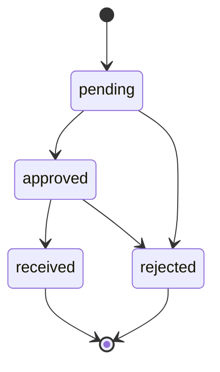
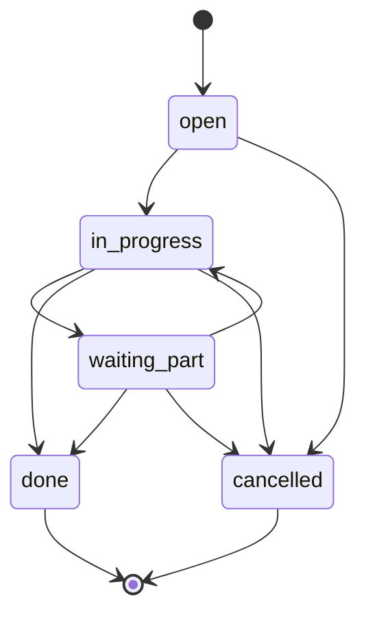

# API Reference

Base URL: `http://localhost:3000/api`
ทุก endpoint ยกเว้น `POST /login` ต้องส่ง Header `Authorization: Bearer <token>`

## สิทธิ์

| ระดับ | ค่า | ทำอะไรได้ |
|---|---|---|
| 1 | `viewer` | อ่านอย่างเดียว + เปิดใบแจ้งซ่อมได้ |
| 2 | `technician` | เพิ่ม/แก้ทรัพย์สิน เดินเอกสารรับ-ส่งมอบและงานซ่อม |
| 3 | `admin` | ทุกอย่าง |

ระดับสูงกว่าทำสิ่งที่ระดับต่ำกว่าทำได้เสมอ (ตรวจใน `server/auth.js` → `requireRole`)

## เข้าสู่ระบบ

| Method | Path | สิทธิ์ | หมายเหตุ |
|---|---|---|---|
| POST | `/login` | — | Body `{username, password}` → `{token, user}` อายุ 8 ชั่วโมง |
| GET | `/me` | viewer | คืน payload ของ token ปัจจุบัน |

`POST /login` เรียก `bcrypt.compare` เสมอแม้ไม่พบชื่อผู้ใช้ เพื่อไม่ให้เดาได้จากเวลาตอบกลับ

## ทรัพย์สิน — `/assets`

| Method | Path | สิทธิ์ | หน้าที่ |
|---|---|---|---|
| GET | `/assets` | viewer | รายการ + ค้นหา + กรอง + เรียง + แบ่งหน้า |
| GET | `/assets/summary` | viewer | ตัวเลขสรุปของแผงด้านขวา คิดจากเงื่อนไขที่กรองอยู่จริง |
| GET | `/assets/lookups` | viewer | ตัวเลือกทั้งหมดสำหรับ dropdown ในฟอร์ม |
| GET | `/assets/:key` | viewer | อ่านรายตัว — รับได้ทั้ง `id` และ `asset_code` จึงใช้กับ QR ได้ตรง ๆ พร้อมประวัติ/งานซ่อม/ใบส่งมอบ |
| GET | `/assets/:code/qr.svg` | viewer | QR เป็น SVG พิมพ์ได้คมทุกขนาด (Cache 1 วัน) |
| GET | `/assets/:id/software` | viewer | ซอฟต์แวร์ที่ติดตั้งบนเครื่อง |
| POST | `/assets` | technician | สร้างใหม่ รองรับหลายเครื่องในคำขอเดียว ออกรหัสให้อัตโนมัติ |
| PATCH | `/assets/:id` | technician | แก้ไขรายตัว |
| PATCH | `/assets` | technician | แก้ไขหลายรายการพร้อมกัน |
| POST | `/assets/tags` | technician | ติด/ถอดป้ายกำกับเป็นกลุ่ม |

### Query parameter ที่ใช้ร่วมกันทุกตาราง

| Parameter | ความหมาย | ตัวอย่าง |
|---|---|---|
| `q` | ค้นหารวมหลายคอลัมน์ | `q=Dell` |
| `f_<column>` | กรองเฉพาะคอลัมน์ | `f_department_name=บัญชี` |
| `sort` / `dir` | คอลัมน์ที่เรียง / `asc`\|`desc` | `sort=book_value&dir=desc` |
| `page` / `perPage` | หน้าที่ / จำนวนต่อหน้า (สูงสุด 200) | `page=2&perPage=50` |

ชื่อคอลัมน์ทุกตัวถูกตรวจกับ allowlist ใน `server/query-builder.js` ก่อนต่อเข้า SQL
ค่าที่ผู้ใช้ส่งมาถูกผูกเป็น `$1..$n` เสมอ — ชื่อคอลัมน์นอกรายการจะถูกเมินเงียบ ๆ ไม่ใช่ error

### `GET /assets/:id/software`

| Parameter | ค่า | ผล |
|---|---|---|
| `section` | `installations` (ค่าตั้งต้น) \| `updates` | `updates` คืนเฉพาะรายการที่ `outdated = true` |
| `types` | `standard,dependency,service` คั่นด้วยจุลภาค | กรองตามประเภทการติดตั้ง ค่าที่ไม่รู้จักถูกทิ้ง |
| `q`, `f_*`, `sort`, `dir`, `page`, `perPage` | เหมือนตารางอื่น | |

ตอบกลับ:

```json
{
  "rows": [ { "id": 31, "software_name": "7-Zip", "publisher": "Igor Pavlov",
              "market_version": "24.07", "reported_version": "24.0",
              "outdated": true, "install_type": "standard", "licensed": true,
              "is_authorized": true, "user_account": "All Users" } ],
  "total": 32,
  "section": "installations",
  "stat": { "total": 32, "outdated": 10, "unauthorized": 1,
            "unlicensed": 3, "dependency": 6 }
}
```

`stat` คิดจากทั้งเครื่องเสมอ ไม่ขึ้นกับตัวกรองที่เปิดอยู่ จึงใช้เป็นตัวเลขบนแท็บได้

## รับ-ส่งมอบ — `/transfers`

| Method | Path | สิทธิ์ |
|---|---|---|
| GET | `/transfers` | viewer |
| GET | `/transfers/:id` | viewer |
| POST | `/transfers` | viewer |
| PATCH | `/transfers/:id/status` | technician |

Body ตอนสร้าง: `{asset_id, kind, from_person_id?, to_person_id?, to_location_id?, note?}`
เลขที่เอกสารออกให้อัตโนมัติ

สถานะเดินได้ตามนี้เท่านั้น (บังคับฝั่งเซิร์ฟเวอร์):



เมื่อเปลี่ยนเป็น `received` ระบบย้ายผู้ครอบครอง สถานที่ และแผนกของทรัพย์สินให้ใน transaction เดียวกัน

## ซ่อมบำรุง — `/maintenance`

| Method | Path | สิทธิ์ |
|---|---|---|
| GET | `/maintenance` | viewer |
| GET | `/maintenance/:id` | viewer |
| POST | `/maintenance` | technician |
| PATCH | `/maintenance/:id/status` | technician |

Body ตอนสร้าง: `{asset_id, issue, priority?, assignee_person_id?}`



เปิดใบแจ้งซ่อม → ทรัพย์สินเปลี่ยนเป็นสถานะ `repair` อัตโนมัติ (ยกเว้นเครื่องที่เป็น `broken` อยู่แล้ว)
ปิดงานเป็น `done` → กลับเป็น `active`

## อื่น ๆ

| Method | Path | สิทธิ์ | หน้าที่ |
|---|---|---|---|
| GET | `/dashboard` | viewer | ตัวเลขรวม แยกตามสถานะ/ประเภท งานซ่อมค้าง และความเคลื่อนไหวล่าสุด |
| GET | `/activity` | viewer | Audit trail ทั้งระบบ แบ่งหน้าได้ |
| GET | `/scan/:code` | viewer | ใช้ตอนสแกน QR — คืนทรัพย์สินจากรหัส |

## รูปแบบ Error

```json
{ "error": "ข้อความภาษาไทยที่แสดงให้ผู้ใช้อ่านได้เลย" }
```

| HTTP | เมื่อไร |
|---|---|
| 400 | ข้อมูลที่ส่งมาไม่ครบหรือผิดรูปแบบ / เปลี่ยนสถานะข้ามขั้น |
| 401 | ไม่มี token หรือ token หมดอายุ |
| 403 | สิทธิ์ไม่พอ |
| 404 | ไม่พบข้อมูล |
| 500 | ข้อผิดพลาดฝั่งเซิร์ฟเวอร์ (รายละเอียดจริงอยู่ใน log ไม่ส่งออกไปหาผู้ใช้) |
