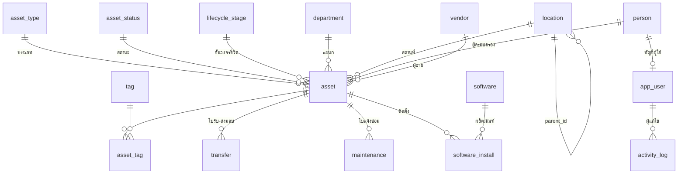

# โครงสร้างฐานข้อมูล (Data Model)

ดึงจากฐานข้อมูลจริงที่รันอยู่ ไม่ได้เขียนจากความจำ
ที่มา: `db/schema.sql` + `db/migrate-002-software.sql`

## แนวคิดหลัก

| หลักการ | ทำไม |
|---|---|
| ประเภททรัพย์สินเป็น **แถวข้อมูล** ไม่ใช่ตารางแยก | เพิ่มประเภทใหม่ได้โดยไม่ต้องแก้ Schema — เลียนแนวคิด CI ของต้นแบบ |
| สถานที่เป็น **ลำดับชั้น** (`location.parent_id`) | รองรับ สาขา › อาคาร › ชั้น › ห้อง ได้ไม่จำกัดระดับ ผ่าน Recursive CTE |
| Audit trail อยู่ที่ **ระดับฐานข้อมูล** | Trigger เทียบ `to_jsonb(OLD)` กับ `to_jsonb(NEW)` ทีละฟิลด์ ต่อให้แก้ผ่าน SQL ตรง ๆ ก็ยังถูกบันทึก |
| ค่าที่คำนวณได้อยู่ใน **VIEW** ไม่เก็บซ้ำ | อายุการใช้งาน มูลค่าคงเหลือ สถานะประกัน คำนวณสด ไม่มีข้อมูลค้าง |
| สถานะเอกสารคุมด้วย **State machine ฝั่งเซิร์ฟเวอร์** | ข้ามขั้นตอนอนุมัติไม่ได้แม้ยิง API ตรง |

## ความสัมพันธ์

## ตารางทั้งหมด

### `asset`

ทะเบียนทรัพย์สินหลัก — หนึ่งแถวต่อหนึ่งเครื่อง

| คอลัมน์ | ชนิดข้อมูล | บังคับกรอก | ค่าตั้งต้น | อ้างอิงไปยัง |
|---|---|---|---|---|
| `id` | integer | ✓ | `auto` |  |
| `asset_code` | text | ✓ |  |  |
| `asset_type_id` | integer | ✓ |  | `asset_type` |
| `name` | text | ✓ |  |  |
| `brand` | text |  |  |  |
| `model` | text |  |  |  |
| `serial_no` | text |  |  |  |
| `status_id` | integer | ✓ |  | `asset_status` |
| `lifecycle_id` | integer |  |  | `lifecycle_stage` |
| `owner_person_id` | integer |  |  | `person` |
| `department_id` | integer |  |  | `department` |
| `location_id` | integer |  |  | `location` |
| `hostname` | text |  |  |  |
| `ip_address` | inet |  |  |  |
| `mac_address` | macaddr |  |  |  |
| `cpu` | text |  |  |  |
| `ram_gb` | integer |  |  |  |
| `storage` | text |  |  |  |
| `os` | text |  |  |  |
| `antivirus_ok` | boolean |  |  |  |
| `firewall_ok` | boolean |  |  |  |
| `vendor_id` | integer |  |  | `vendor` |
| `po_no` | text |  |  |  |
| `purchase_date` | date |  |  |  |
| `purchase_price` | numeric(14,2) |  |  |  |
| `depreciation_years` | integer |  | `5` |  |
| `warranty_end` | date |  |  |  |
| `note` | text |  |  |  |
| `created_at` | timestamp with time zone | ✓ | `now()` |  |
| `updated_at` | timestamp with time zone | ✓ | `now()` |  |

### `asset_type`

ประเภททรัพย์สิน (โน้ตบุ๊ก เครื่องพิมพ์ เซิร์ฟเวอร์ ฯลฯ) ใช้เป็นข้อมูล ไม่ใช่ตารางแยก

| คอลัมน์ | ชนิดข้อมูล | บังคับกรอก | ค่าตั้งต้น | อ้างอิงไปยัง |
|---|---|---|---|---|
| `id` | integer | ✓ | `auto` |  |
| `code` | text | ✓ |  |  |
| `name_th` | text | ✓ |  |  |
| `icon` | text | ✓ | `'box'::text` |  |
| `is_active` | boolean | ✓ | `true` |  |
| `sort_order` | integer | ✓ | `100` |  |

### `asset_status`

สถานะทรัพย์สิน พร้อมสีที่ใช้แสดงผล

| คอลัมน์ | ชนิดข้อมูล | บังคับกรอก | ค่าตั้งต้น | อ้างอิงไปยัง |
|---|---|---|---|---|
| `id` | integer | ✓ | `auto` |  |
| `code` | text | ✓ |  |  |
| `name_th` | text | ✓ |  |  |
| `tone` | text | ✓ | `'mute'::text` |  |
| `sort_order` | integer | ✓ | `100` |  |

### `lifecycle_stage`

ขั้นวงจรชีวิต (จัดซื้อ ใช้งาน ปลดระวาง)

| คอลัมน์ | ชนิดข้อมูล | บังคับกรอก | ค่าตั้งต้น | อ้างอิงไปยัง |
|---|---|---|---|---|
| `id` | integer | ✓ | `auto` |  |
| `code` | text | ✓ |  |  |
| `name_th` | text | ✓ |  |  |
| `sort_order` | integer | ✓ | `100` |  |

### `location`

สถานที่แบบลำดับชั้น (parent_id ชี้ตัวเอง)

| คอลัมน์ | ชนิดข้อมูล | บังคับกรอก | ค่าตั้งต้น | อ้างอิงไปยัง |
|---|---|---|---|---|
| `id` | integer | ✓ | `auto` |  |
| `parent_id` | integer |  |  | `location` |
| `code` | text | ✓ |  |  |
| `name_th` | text | ✓ |  |  |
| `kind` | text | ✓ | `'other'::text` |  |

### `department`

แผนก

| คอลัมน์ | ชนิดข้อมูล | บังคับกรอก | ค่าตั้งต้น | อ้างอิงไปยัง |
|---|---|---|---|---|
| `id` | integer | ✓ | `auto` |  |
| `code` | text | ✓ |  |  |
| `name_th` | text | ✓ |  |  |

### `person`

พนักงาน / ผู้ครอบครองทรัพย์สิน

| คอลัมน์ | ชนิดข้อมูล | บังคับกรอก | ค่าตั้งต้น | อ้างอิงไปยัง |
|---|---|---|---|---|
| `id` | integer | ✓ | `auto` |  |
| `emp_code` | text | ✓ |  |  |
| `full_name` | text | ✓ |  |  |
| `email` | text |  |  |  |
| `position` | text |  |  |  |
| `department_id` | integer |  |  | `department` |
| `location_id` | integer |  |  | `location` |
| `is_active` | boolean | ✓ | `true` |  |

### `vendor`

ผู้ขาย / ผู้ให้บริการ

| คอลัมน์ | ชนิดข้อมูล | บังคับกรอก | ค่าตั้งต้น | อ้างอิงไปยัง |
|---|---|---|---|---|
| `id` | integer | ✓ | `auto` |  |
| `code` | text | ✓ |  |  |
| `name_th` | text | ✓ |  |  |
| `category` | text |  |  |  |
| `contact` | text |  |  |  |
| `tel` | text |  |  |  |
| `email` | text |  |  |  |
| `is_active` | boolean | ✓ | `true` |  |

### `tag`

ป้ายกำกับ

| คอลัมน์ | ชนิดข้อมูล | บังคับกรอก | ค่าตั้งต้น | อ้างอิงไปยัง |
|---|---|---|---|---|
| `id` | integer | ✓ | `auto` |  |
| `name` | text | ✓ |  |  |
| `color` | text | ✓ | `'#0b6e80'::text` |  |
| `is_smart` | boolean | ✓ | `false` |  |
| `rule` | jsonb |  |  |  |

### `asset_tag`

ตารางเชื่อมทรัพย์สินกับป้ายกำกับ (many-to-many)

| คอลัมน์ | ชนิดข้อมูล | บังคับกรอก | ค่าตั้งต้น | อ้างอิงไปยัง |
|---|---|---|---|---|
| `asset_id` | integer | ✓ |  | `asset` |
| `tag_id` | integer | ✓ |  | `tag` |

### `transfer`

ใบรับ-ส่งมอบอุปกรณ์

| คอลัมน์ | ชนิดข้อมูล | บังคับกรอก | ค่าตั้งต้น | อ้างอิงไปยัง |
|---|---|---|---|---|
| `id` | integer | ✓ | `auto` |  |
| `doc_no` | text | ✓ |  |  |
| `kind` | text | ✓ |  |  |
| `asset_id` | integer | ✓ |  | `asset` |
| `from_person_id` | integer |  |  | `person` |
| `to_person_id` | integer |  |  | `person` |
| `from_location_id` | integer |  |  | `location` |
| `to_location_id` | integer |  |  | `location` |
| `transfer_date` | date | ✓ | `CURRENT_DATE` |  |
| `status` | text | ✓ | `'pending'::text` |  |
| `note` | text |  |  |  |
| `requested_by` | integer |  |  | `person` |
| `approved_by` | integer |  |  | `person` |
| `approved_at` | timestamp with time zone |  |  |  |
| `created_at` | timestamp with time zone | ✓ | `now()` |  |

### `maintenance`

ใบแจ้งซ่อม / งานบำรุงรักษา

| คอลัมน์ | ชนิดข้อมูล | บังคับกรอก | ค่าตั้งต้น | อ้างอิงไปยัง |
|---|---|---|---|---|
| `id` | integer | ✓ | `auto` |  |
| `ticket_no` | text | ✓ |  |  |
| `asset_id` | integer | ✓ |  | `asset` |
| `issue` | text | ✓ |  |  |
| `detail` | text |  |  |  |
| `priority` | text | ✓ | `'medium'::text` |  |
| `status` | text | ✓ | `'open'::text` |  |
| `reported_by` | integer |  |  | `person` |
| `assigned_to` | integer |  |  | `person` |
| `vendor_id` | integer |  |  | `vendor` |
| `reported_at` | timestamp with time zone | ✓ | `now()` |  |
| `started_at` | timestamp with time zone |  |  |  |
| `closed_at` | timestamp with time zone |  |  |  |
| `cost` | numeric(14,2) |  |  |  |
| `resolution` | text |  |  |  |

### `software`

ทะเบียนซอฟต์แวร์ (หนึ่งแถวต่อหนึ่งผลิตภัณฑ์)

| คอลัมน์ | ชนิดข้อมูล | บังคับกรอก | ค่าตั้งต้น | อ้างอิงไปยัง |
|---|---|---|---|---|
| `id` | integer | ✓ | `auto` |  |
| `name` | text | ✓ |  |  |
| `publisher` | text |  |  |  |
| `category` | text |  |  |  |
| `license_type` | text |  |  |  |
| `market_version` | text |  |  |  |
| `is_authorized` | boolean | ✓ | `true` |  |

### `software_install`

การติดตั้งซอฟต์แวร์ (หนึ่งแถวต่อหนึ่งเครื่องต่อหนึ่งซอฟต์แวร์)

| คอลัมน์ | ชนิดข้อมูล | บังคับกรอก | ค่าตั้งต้น | อ้างอิงไปยัง |
|---|---|---|---|---|
| `id` | integer | ✓ | `auto` |  |
| `asset_id` | integer | ✓ |  | `asset` |
| `software_id` | integer | ✓ |  | `software` |
| `reported_version` | text |  |  |  |
| `install_date` | date |  |  |  |
| `install_type` | text | ✓ | `'standard'::text` |  |
| `licensed` | boolean | ✓ | `false` |  |
| `user_account` | text |  | `'All Users'::text` |  |
| `last_used_at` | date |  |  |  |

### `activity_log`

Audit trail — บันทึกทุกการเปลี่ยนแปลงระดับฟิลด์ เขียนโดย Trigger

| คอลัมน์ | ชนิดข้อมูล | บังคับกรอก | ค่าตั้งต้น | อ้างอิงไปยัง |
|---|---|---|---|---|
| `id` | bigint | ✓ | `auto` |  |
| `entity` | text | ✓ |  |  |
| `entity_id` | integer | ✓ |  |  |
| `entity_ref` | text |  |  |  |
| `action` | text | ✓ |  |  |
| `field` | text |  |  |  |
| `old_value` | text |  |  |  |
| `new_value` | text |  |  |  |
| `changed_by` | integer |  |  | `app_user` |
| `changed_at` | timestamp with time zone | ✓ | `now()` |  |

### `app_user`

บัญชีผู้ใช้ระบบ (viewer / technician / admin)

| คอลัมน์ | ชนิดข้อมูล | บังคับกรอก | ค่าตั้งต้น | อ้างอิงไปยัง |
|---|---|---|---|---|
| `id` | integer | ✓ | `auto` |  |
| `person_id` | integer |  |  | `person` |
| `username` | text | ✓ |  |  |
| `password_hash` | text | ✓ |  |  |
| `role` | text | ✓ | `'viewer'::text` |  |
| `is_active` | boolean | ✓ | `true` |  |
| `last_login_at` | timestamp with time zone |  |  |  |

### `code_counter`

ตัวนับเลขที่เอกสารและรหัสทรัพย์สิน กันเลขซ้ำแบบ atomic

| คอลัมน์ | ชนิดข้อมูล | บังคับกรอก | ค่าตั้งต้น | อ้างอิงไปยัง |
|---|---|---|---|---|
| `prefix` | text | ✓ |  |  |
| `last_no` | integer | ✓ | `0` |  |

## VIEW ที่หน้าเว็บเรียกใช้

| VIEW | ให้อะไรเพิ่ม |
|---|---|
| `v_asset` | รวมชื่อประเภท/สถานะ/แผนก/ผู้ครอบครอง/เส้นทางสถานที่ + `age_years`, `book_value` (ค่าเสื่อมเส้นตรง ไม่ต่ำกว่า 0), `warranty_expired`, `tags` เป็น JSON |
| `v_location_path` | เส้นทางแบบ `สำนักงานใหญ่ › อาคาร A › ชั้น 3` จาก Recursive CTE |
| `v_transfer` | ใบรับ-ส่งมอบ พร้อมชื่อคน/สถานที่ต้นทาง-ปลายทาง |
| `v_maintenance` | ใบแจ้งซ่อม พร้อมชื่อผู้แจ้ง/ผู้รับผิดชอบ/ทรัพย์สิน |
| `v_software_install` | การติดตั้งซอฟต์แวร์ + คอลัมน์คำนวณ `outdated` (เวอร์ชันบนเครื่อง ≠ เวอร์ชันในตลาด) |

## ฟังก์ชันและ Trigger

| ชื่อ | หน้าที่ |
|---|---|
| `audit_trigger()` | Trigger กลาง ใช้ร่วมกันทุกตาราง เทียบ JSONB ทีละฟิลด์แล้วเขียนลง `activity_log` |
| `next_code(prefix)` | ออกเลขที่เอกสารแบบ atomic ผ่าน `code_counter` (ใช้ `UPDATE ... RETURNING` จึงไม่ชนกันแม้หลาย session) |
| `next_asset_code(type_id)` | ต่อยอดจาก `next_code` ให้เป็น `TRR-<ประเภท>-<ปี พ.ศ.>-<ลำดับ>` |

## เรื่องที่ต้องระวังเมื่อพัฒนาต่อ

1. **ผู้แก้ไขใน Audit trail** มาจาก `current_setting('app.user_id')` — ทุก transaction ที่เขียนข้อมูลต้องเรียก `SET LOCAL app.user_id` ก่อน (ฟังก์ชัน `tx()` ใน `server/db.js` ทำให้แล้ว) ถ้าเขียนผ่าน psql ตรง ๆ ช่องผู้แก้ไขจะว่าง
2. **Seed ซอฟต์แวร์จุด Trigger** ทำให้ `activity_log` บวมหลายร้อยแถว — ท้ายไฟล์ `db/seed-software.sql` จึงลบแถวเหล่านั้นทิ้ง ถ้าเขียนสคริปต์นำเข้าข้อมูลจำนวนมากในอนาคต ต้องคิดเรื่องนี้ด้วย
3. **Delegation ไม่ใช่ปัญหาที่นี่** (ต่างจาก SharePoint List) เพราะกรอง/เรียง/แบ่งหน้าทำที่ PostgreSQL ทั้งหมด แต่ต้องเพิ่ม Index เมื่อข้อมูลเกินหลักแสนแถว
