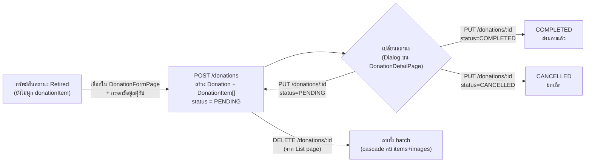
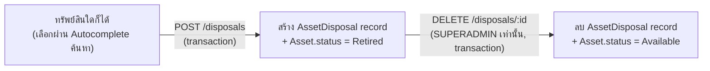

# MODULE: Donation & Disposal (บริจาค & จำหน่ายทรัพย์สิน)

## Module Profile

| หัวข้อ | รายละเอียด |
|---|---|
| **Module ID** | `donation-disposal` |
| **วัตถุประสงค์** | จัดการวงจรสุดท้าย (end-of-life) ของทรัพย์สิน 2 เส้นทาง: (1) **บริจาค** ทรัพย์สินที่ปลดระวาง (`Retired`) ให้หน่วยงานภายนอกแบบเป็นชุด (batch) พร้อมเอกสาร/รูปหลักฐาน และ (2) **บันทึกการจำหน่าย** ทรัพย์สินออกจากระบบแบบรายชิ้นด้วยวิธีอื่น (ขาย/ทำลาย/คืน vendor/โอนย้าย) |
| **Business Objective** | ให้มีหลักฐาน audit trail ของทรัพย์สินที่ออกจากการครอบครองขององค์กร ทั้งเชิงเอกสารอนุมัติ (approvalRef) และเชิงภาพถ่าย (evidence photo) เพื่อรองรับการตรวจสอบบัญชี/พัสดุ |
| **Users** | เจ้าหน้าที่ IT/พัสดุที่มีสิทธิ์ IT_ADMIN หรือ SUPERADMIN |
| **Roles** | `IT_ADMIN`, `SUPERADMIN` — ทุกหน้าและ API ถูกจำกัดด้วย 2 role นี้เท่านั้น (การลบ disposal จำกัดเฉพาะ `SUPERADMIN`) |
| **Parent Menu** | เมนู "จำหน่ายทรัพย์สินออก" (`section: 'จำหน่ายทรัพย์สินออก'`) — มี 2 เมนูย่อย: "จำหน่ายออก/บริจาค" (`/donations`) และ "บันทึกการจำหน่ายทรัพย์สิน" (`/disposals`) — หลักฐาน: `frontend/src/navigation/nav.tsx:140-148` |
| **Related Modules** | Asset Registry (ทรัพย์สินต้นทาง — เฉพาะสถานะ `Retired`), Notification (ไม่พบการเรียกใช้ในโมดูลนี้ — ดูหัวข้อ Notifications) |

## Page Inventory

### หน้า: รายการบริจาค (Donation List)
- **Page ID**: `donation-list`
- **Route**: `/donations`
- **Component**: `frontend/src/pages/donations/DonationListPage.tsx`
- **Parent Module**: Donation & Disposal
- **Purpose**: แสดงตาราง batch การบริจาคทั้งหมด พร้อมสรุปสถิติ (ทั้งหมด/รอส่งมอบ/ส่งมอบแล้ว), ค้นหา, กรองสถานะ, และลบ
- **Role required**: `IT_ADMIN`, `SUPERADMIN` — `frontend/src/App.tsx:165`
- **Evidence**: `frontend/src/pages/donations/DonationListPage.tsx:1-324`

### หน้า: สร้างรายการบริจาค (Donation Form)
- **Page ID**: `donation-form`
- **Route**: `/donations/new`
- **Component**: `frontend/src/pages/donations/DonationFormPage.tsx`
- **Parent Module**: Donation & Disposal
- **Purpose**: กรอกข้อมูลหน่วยงานผู้รับบริจาค, เลือกทรัพย์สินที่ปลดระวาง (multi-select), ระบุสภาพต่อรายการ, แนบรูปหลักฐานระดับ batch และระดับรายการ แล้วสร้าง Donation ใหม่
- **Role required**: `IT_ADMIN`, `SUPERADMIN` — `frontend/src/App.tsx:166`
- **Evidence**: `frontend/src/pages/donations/DonationFormPage.tsx:1-583`

### หน้า: รายละเอียดการบริจาค (Donation Detail)
- **Page ID**: `donation-detail`
- **Route**: `/donations/:id`
- **Component**: `frontend/src/pages/donations/DonationDetailPage.tsx`
- **Parent Module**: Donation & Disposal
- **Purpose**: แสดงรายละเอียดเต็มของ batch บริจาค (ผู้รับ, วันที่, เลขอนุมัติ, มูลค่ารวม), gallery รูปหลักฐาน level-batch, ตารางรายการทรัพย์สินพร้อมรูป level-item, เปลี่ยนสถานะ, พิมพ์เอกสาร (print-friendly layout)
- **Role required**: `IT_ADMIN`, `SUPERADMIN` — `frontend/src/App.tsx:167`
- **Evidence**: `frontend/src/pages/donations/DonationDetailPage.tsx:1-683`

### หน้า: บันทึกการจำหน่ายทรัพย์สิน (Disposals)
- **Page ID**: `disposals-list`
- **Route**: `/disposals`
- **Component**: `frontend/src/pages/disposals/DisposalsPage.tsx`
- **Parent Module**: Donation & Disposal
- **Purpose**: บันทึกและแสดงรายการจำหน่ายทรัพย์สินออกแบบรายชิ้น ด้วยวิธี DONATE/SELL/DESTROY/RETURN/TRANSFER, กรองตามวิธี, ยกเลิกรายการ (SUPERADMIN เท่านั้น)
- **Role required**: `IT_ADMIN`, `SUPERADMIN` — `frontend/src/App.tsx:168`; ปุ่มลบ (undo) แสดงเฉพาะ `user.role === 'SUPERADMIN'` — `frontend/src/pages/disposals/DisposalsPage.tsx:83,133`
- **Evidence**: `frontend/src/pages/disposals/DisposalsPage.tsx:1-193`

ไม่มีการ import shared component เฉพาะทางจาก `components/` หรือ `pages/*/components` ในทั้ง 4 หน้านี้ — ทุกหน้าประกอบด้วย MUI primitives และ inline component ที่ประกาศในไฟล์เดียวกัน (`StatCard` ใน DonationListPage, `InfoCard`/`Lightbox` ใน DonationDetailPage)

## UI Components & Buttons/Actions

| Button | Page | onClick action | Permission | API called | Result |
|---|---|---|---|---|---|
| "สร้างรายการบริจาค" (header) | DonationListPage | `navigate('/donations/new')` | IT_ADMIN/SUPERADMIN | — | ไปหน้าฟอร์มสร้าง — `DonationListPage.tsx:135` |
| "สร้างรายการแรก" (empty state) | DonationListPage | `navigate('/donations/new')` | IT_ADMIN/SUPERADMIN | — | ไปหน้าฟอร์มสร้าง — `DonationListPage.tsx:245` |
| Filter chips (ALL/PENDING/COMPLETED/CANCELLED) | DonationListPage | `setFilter(f.key)` | — | client-side filter | กรองตาราง — `DonationListPage.tsx:187-197` |
| แถวตาราง (row click) | DonationListPage | `navigate(`/donations/${d.id}`)` | IT_ADMIN/SUPERADMIN | — | ไปหน้ารายละเอียด — `DonationListPage.tsx:261` |
| ไอคอน "ดูรายละเอียด" | DonationListPage | `navigate(`/donations/${d.id}`)` | IT_ADMIN/SUPERADMIN | — | ไปหน้ารายละเอียด — `DonationListPage.tsx:280` |
| ไอคอน "ลบ" | DonationListPage | `setDeleteId(d.id)` → เปิด dialog | IT_ADMIN/SUPERADMIN | — | เปิด confirm dialog — `DonationListPage.tsx:285` |
| ปุ่ม "ลบ" ใน dialog | DonationListPage | `handleDelete()` | IT_ADMIN/SUPERADMIN | `donationAPI.delete(id)` → `DELETE /donations/:id` | ลบ donation, toast, refresh list — `DonationListPage.tsx:89-99,319` |
| "กลับ" | DonationFormPage | `navigate('/donations')` | IT_ADMIN/SUPERADMIN | — | กลับหน้ารายการ — `DonationFormPage.tsx:191` |
| Checkbox "เลือกทั้งหมด" (header) | DonationFormPage | `selectAll()` | — | client-side | toggle เลือกทุกแถวที่กรองอยู่ — `DonationFormPage.tsx:101-107,443-447` |
| แถวทรัพย์สิน (row click / checkbox) | DonationFormPage | `toggleSelect(a.id)` | — | client-side | เพิ่ม/ลบ asset ออกจาก selection — `DonationFormPage.tsx:93-99,491,496` |
| ไอคอนถังขยะในสรุป "รายการที่เลือกแล้ว" | DonationFormPage | `removeSelected(a.id)` | — | client-side | เอา asset ออกจาก selection — `DonationFormPage.tsx:109-111,360` |
| Dropzone รูป batch (คลิก/ลาก) | DonationFormPage | `addBatchFiles()` / `handleBatchDrop()` | — | client-side (เก็บ File ใน state) | เพิ่มพรีวิวรูป รอ upload ตอน submit — `DonationFormPage.tsx:62-81,270-297` |
| ปุ่มลบรูป batch (พรีวิว) | DonationFormPage | `removeBatchFile(i)` | — | client-side | ลบรูปออกจากรายการรอ upload — `DonationFormPage.tsx:70-76,312` |
| ไอคอนกล้อง (รายแถว, เมื่อ selected) | DonationFormPage | `itemInputRefs.current[a.id]?.click()` → `setItemImage()` | — | client-side | เก็บรูปสภาพต่อ asset รอ upload ตอน submit — `DonationFormPage.tsx:84-91,522-552` |
| "สร้างรายการบริจาค (N)" | DonationFormPage | `handleSubmit()` | IT_ADMIN/SUPERADMIN | `donationAPI.create()` → `POST /donations`, then loop `donationAPI.uploadImage()` → `POST /donations/:id/images`, then loop `donationAPI.uploadItemImage()` → `POST /donations/:id/items/:itemId/image` | สร้าง donation + items, อัปโหลดรูป batch/item ทีละไฟล์, toast, navigate ไป `/donations` — `DonationFormPage.tsx:113-166`. ปุ่ม disabled เมื่อ `submitting`, `selectedIds.size===0`, หรือ `!recipientName.trim()` — `DonationFormPage.tsx:380` |
| "ยกเลิก" | DonationFormPage | `navigate('/donations')` | IT_ADMIN/SUPERADMIN | — | ยกเลิก ไม่บันทึกข้อมูล — `DonationFormPage.tsx:385-387` |
| "กลับ" | DonationDetailPage | `navigate('/donations')` | IT_ADMIN/SUPERADMIN | — | กลับหน้ารายการ — `DonationDetailPage.tsx:273` |
| "เปลี่ยนสถานะ" | DonationDetailPage | `setEditDialog(true)` | IT_ADMIN/SUPERADMIN | — | เปิด dialog เปลี่ยนสถานะ — `DonationDetailPage.tsx:280-282` |
| "พิมพ์รายงาน" | DonationDetailPage | `handlePrint()` = `window.print()` | — | — | เปิด print dialog ของ browser (มี CSS `@media print` ซ่อน `.no-print` และโชว์ `.print-only`) — `DonationDetailPage.tsx:238,672-679` |
| "เพิ่มรูป" (gallery header) / dropzone ว่าง / "เพิ่มรูป" tile | DonationDetailPage | `batchFileRef.current?.click()` → `handleBatchUpload()` | IT_ADMIN/SUPERADMIN | `donationAPI.uploadImage()` (loop ต่อไฟล์) → `POST /donations/:id/images` | อัปโหลดรูป batch, toast, refetch donation — `DonationDetailPage.tsx:185-201,383-396,407-416,468-479` |
| ไอคอนถังขยะบนรูป batch (hover) | DonationDetailPage | `handleBatchDelete(img.id)` | IT_ADMIN/SUPERADMIN | `donationAPI.deleteImage()` → `DELETE /donations/:id/images/:imageId` | ลบรูป, toast, refetch — `DonationDetailPage.tsx:203-211,441` |
| คลิกรูปใน gallery | DonationDetailPage | `openLightbox(batchImages, i)` | — | client-side | เปิด lightbox ดูรูปเต็มพร้อม prev/next — `DonationDetailPage.tsx:155-159,434` |
| ไอคอนกล้อง (แถวรายการทรัพย์สิน, ไม่มีรูป) | DonationDetailPage | `itemFileRefs.current[item.id]?.click()` → `handleItemUpload()` | IT_ADMIN/SUPERADMIN | `donationAPI.uploadItemImage()` → `POST /donations/:id/items/:itemId/image` | อัปโหลดรูปสภาพรายการ, toast, refetch — `DonationDetailPage.tsx:213-226,578-592` |
| ไอคอนถังขยะบนรูปรายการ | DonationDetailPage | `handleItemDelete(item.id)` | IT_ADMIN/SUPERADMIN | `donationAPI.deleteItemImage()` → `DELETE /donations/:id/items/:itemId/image` | ลบรูปรายการ, toast, refetch — `DonationDetailPage.tsx:228-236,568` |
| Dialog: Select สถานะ + "บันทึก" | DonationDetailPage | `handleStatusUpdate()` | IT_ADMIN/SUPERADMIN | `donationAPI.update(id, {status})` → `PUT /donations/:id` | อัปเดต status, toast, refetch, ปิด dialog — `DonationDetailPage.tsx:173-182,657-669` |
| ตัวกรอง "วิธีจำหน่าย" (select) | DisposalsPage | `setMethodFilter()` → `useEffect` เรียก `load()` | IT_ADMIN/SUPERADMIN | `disposalAPI.list({method})` → `GET /disposals?method=` | รีโหลดตารางตามวิธีจำหน่าย — `DisposalsPage.tsx:38-46,93-99` |
| "บันทึกการจำหน่าย" | DisposalsPage | `openNew()` | IT_ADMIN/SUPERADMIN | — | เปิด dialog ฟอร์มเปล่า — `DisposalsPage.tsx:59,100` |
| ไอคอนถังขยะ (ต่อแถว) | DisposalsPage | `handleDelete(d.id)` — มี `window.confirm()` ก่อน | **SUPERADMIN เท่านั้น** (แสดงเมื่อ `isSuperAdmin`) | `disposalAPI.delete(id)` → `DELETE /disposals/:id` | ลบ disposal record + asset กลับเป็น `Available`, reload list — `DisposalsPage.tsx:77-81,133-135` |
| Dialog: Autocomplete ทรัพย์สิน (debounce 300ms, ≥2 ตัวอักษร) | DisposalsPage | `assetAPI.list({search, limit:10})` | IT_ADMIN/SUPERADMIN | `GET /assets?search=&limit=10` | ค้นหาทรัพย์สินเพื่อเลือกใน dialog — `DisposalsPage.tsx:48-57,148-158` |
| Dialog: "บันทึก" | DisposalsPage | `handleSave()` | IT_ADMIN/SUPERADMIN | `disposalAPI.create()` → `POST /disposals` | สร้าง disposal + asset เปลี่ยนสถานะเป็น `Retired`, ปิด dialog, reload list. Disabled เมื่อไม่มี `form.asset`/`method`/`disposalDate` — `DisposalsPage.tsx:61-75,187` |
| Dialog: "ยกเลิก" | DisposalsPage | `setDialogOpen(false)` | — | — | ปิด dialog ไม่บันทึก — `DisposalsPage.tsx:186` |

## Forms & Fields

### ฟอร์ม: สร้างรายการบริจาค (`DonationFormPage.tsx`)

| Field | Label | Type | Required? | Validation | Maps to DB column |
|---|---|---|---|---|---|
| `recipientName` | ชื่อหน่วยงาน * | TextField | ใช่ (frontend: `!recipientName.trim()` block submit; backend: `!recipientName` → 400) | frontend error/helperText เมื่อ `!recipientName.trim() && submitting`; backend `donation.ts:57-60` | `Donation.recipientName` |
| `recipientAddress` | ที่อยู่ | TextField multiline | ไม่ | — | `Donation.recipientAddress` |
| `recipientContact` | ผู้ติดต่อ | TextField | ไม่ | — | `Donation.recipientContact` |
| `recipientPhone` | เบอร์โทร | TextField | ไม่ | — | `Donation.recipientPhone` |
| `donationDate` | วันที่บริจาค | DatePicker (MUI x-date-pickers) | มีค่า default = วันนี้; required ที่ backend (`!donationDate` → 400) | backend `donation.ts:57-60` | `Donation.donationDate` |
| `approvalRef` | เลขที่หนังสืออนุมัติ | TextField | ไม่ | — | `Donation.approvalRef` |
| `notes` | หมายเหตุ | TextField multiline | ไม่ | — | `Donation.notes` |
| batch images (dropzone) | หลักฐานรูปภาพ (Batch) | file input (multiple, accept image/*) | ไม่ | filter `f.type.startsWith('image/')` client-side — `DonationFormPage.tsx:63` | `DonationImage.image` (แต่ละไฟล์ → 1 record, upload หลัง create) |
| `selectedIds` (asset checkbox list) | เลือกทรัพย์สินที่ปลดระวาง | Table + Checkbox multi-select, ดึงจาก `donationAPI.retiredAssets()` | ใช่ (frontend: `selectedIds.size === 0` block submit; backend: assetIds จาก body ใช้สร้าง items — ไม่บังคับที่ backend) | frontend `handleSubmit` — `DonationFormPage.tsx:115` | `DonationItem.assetId` (unique — เชื่อม 1 asset ได้แค่ 1 donation item) |
| `conditions[assetId]` | สภาพ (ต่อรายการที่เลือก) | TextField (inline ในตาราง) | ไม่ | — | `DonationItem.condition` |
| item image (ไอคอนกล้องต่อแถว) | 📷 (ต่อรายการที่เลือก) | file input single, accept image/* | ไม่ | — | `DonationItem.image` (upload หลัง create, map ผ่าน `item.assetId`) |

### Dialog: เปลี่ยนสถานะ (`DonationDetailPage.tsx`)

| Field | Label | Type | Required? | Validation | Maps to DB column |
|---|---|---|---|---|---|
| `status` | สถานะ | Select (PENDING/COMPLETED/CANCELLED) | ไม่มี validation เพิ่มเติมฝั่ง frontend; backend ใช้ `...(status && {status})` จึงรับค่าใดๆ ที่ไม่ falsy โดยไม่ validate กับ enum ที่ระดับ route (Prisma จะปฏิเสธค่านอก enum) | `donation.ts:150` | `Donation.status` |

### Dialog: บันทึกการจำหน่ายทรัพย์สิน (`DisposalsPage.tsx`)

| Field | Label | Type | Required? | Validation | Maps to DB column |
|---|---|---|---|---|---|
| `asset` | ทรัพย์สิน * (พิมพ์เพื่อค้นหา) | Autocomplete (async search ผ่าน `assetAPI.list`, debounce 300ms, ต้องพิมพ์ ≥2 ตัวอักษร) | ใช่ — ปุ่ม "บันทึก" disabled เมื่อ `!form.asset`; backend: `!assetId` → 400 | `DisposalsPage.tsx:187`; `disposals.ts:30` | `AssetDisposal.assetId` |
| `method` | วิธีจำหน่าย * | TextField select (DONATE/SELL/DESTROY/RETURN/TRANSFER) | ใช่ — default `'DONATE'`; backend `!method` → 400 | `disposals.ts:30` | `AssetDisposal.method` (enum `DisposalMethod`) |
| `disposalDate` | วันที่จำหน่าย * | TextField type=date | ใช่ — default = วันนี้; backend `!disposalDate` → 400 | `disposals.ts:30` | `AssetDisposal.disposalDate` |
| `approvedBy` | ผู้อนุมัติ | TextField | ไม่ | — | `AssetDisposal.approvedBy` |
| `approvalRef` | เลขที่อนุมัติ / เอกสาร | TextField | ไม่ | — | `AssetDisposal.approvalRef` |
| `recipientName` | ผู้รับ / ชื่อผู้ซื้อ | TextField | ไม่ | — | `AssetDisposal.recipientName` |
| `saleValue` | มูลค่า (บาท) | TextField type=number | ไม่ | frontend `parseFloat()` ก่อนส่ง; backend `parseFloat(saleValue)` อีกครั้ง — `DisposalsPage.tsx:69`, `disposals.ts:40` | `AssetDisposal.saleValue` |
| `notes` | หมายเหตุ | TextField multiline | ไม่ | — | `AssetDisposal.notes` |

## CRUD Matrix

| Entity | Create | Read | Update | Delete |
|---|---|---|---|---|
| Donation (batch) | `POST /donations` (DonationFormPage) | `GET /donations`, `GET /donations/:id` (List/Detail page) | `PUT /donations/:id` (เปลี่ยนสถานะ + แก้ข้อมูลผู้รับ, จาก DonationDetailPage) | `DELETE /donations/:id` (จาก DonationListPage) |
| DonationItem | สร้างพร้อม Donation (nested create) — ไม่มี endpoint แยกสร้าง item เดี่ยว | ผ่าน `include` ของ `GET /donations/:id` | เฉพาะ field `image` ผ่าน item-image endpoints | ไม่มี endpoint ลบ item เดี่ยว (ลบทั้ง batch เท่านั้น ผ่าน cascade) |
| DonationImage (batch-level) | `POST /donations/:id/images` | ผ่าน `include` ของ `GET /donations/:id` | ไม่มี (ไม่มี PUT) | `DELETE /donations/:id/images/:imageId` |
| AssetDisposal | `POST /disposals` (DisposalsPage) | `GET /disposals` (list, กรองด้วย `method`) | ไม่มี endpoint update | `DELETE /disposals/:id` (SUPERADMIN เท่านั้น — undo/cancel, คืนสถานะ asset) |

## API Inventory

### `backend/src/routes/donation.ts` (mounted, ไม่สามารถยืนยัน mount path จากไฟล์นี้เอง — ดู Unknown section)

| Method | Endpoint | Purpose | Auth/Roles | Request body | Response | Evidence |
|---|---|---|---|---|---|---|
| GET | `/assets/retired` | ดึงทรัพย์สินสถานะ `Retired` ที่ยังไม่ถูกผูกกับ donation item (`donationItem: null`) เรียง `assetCode asc` | `authenticate` (ทุก role ที่ login แล้ว — route นี้ไม่มี `authorize()` เฉพาะ) | — | `{ data: Asset[] }` | `donation.ts:23-37` |
| GET | `/` | รายการ donation ทั้งหมด เรียง `createdAt desc` พร้อมนับจำนวน items | `authenticate` | — | `{ data: Donation[] }` (แต่ละตัวมี `_count.items`) | `donation.ts:39-50` |
| POST | `/` | สร้าง donation batch ใหม่ พร้อม nested create `DonationItem[]` จาก `assetIds`/`conditions` | `authenticate` | `{ donationDate, recipientName, recipientAddress?, recipientContact?, recipientPhone?, approvalRef?, notes?, assetIds?: number[], conditions?: string[] }` | `201 { data: Donation }` (include items.asset, images) | `donation.ts:52-101` |
| GET | `/:id` | รายละเอียด donation พร้อม createdBy, items.asset, images | `authenticate` | — | `{ data: Donation }` หรือ `404` | `donation.ts:103-129` |
| PUT | `/:id` | แก้ไขข้อมูลผู้รับ/หมายเหตุ/สถานะของ donation | `authenticate` | `{ donationDate?, recipientName?, recipientAddress?, recipientContact?, recipientPhone?, approvalRef?, notes?, status? }` (partial — เฉพาะ field ที่ truthy จะถูกอัปเดต ยกเว้น recipientAddress/Contact/Phone/approvalRef/notes ที่เซ็ตตรงแม้เป็น undefined) | `{ data: Donation }` หรือ `404` | `donation.ts:131-163` |
| DELETE | `/:id` | ลบ donation (cascade ลบ items/images ตาม schema `onDelete: Cascade`) | `authenticate` | — | `{ success: true }` หรือ `404` | `donation.ts:165-182` |
| POST | `/:id/images` | อัปโหลดรูป batch-level (เก็บเป็น base64 data URL ใน DB) | `authenticate` + `authorize('IT_ADMIN','SUPERADMIN')` + multer (single file, field `image`, ≤10MB, เฉพาะ mimetype image/*) | multipart/form-data: `image` (file), `caption?` | `201 { data: DonationImage }` | `donation.ts:185-205` |
| DELETE | `/:id/images/:imageId` | ลบรูป batch-level | `authenticate` + `authorize('IT_ADMIN','SUPERADMIN')` | — | `{ message }` หรือ throw 404 (`AppError`) | `donation.ts:208-221` |
| POST | `/:id/items/:itemId/image` | อัปโหลดรูปสภาพของ 1 รายการทรัพย์สิน | `authenticate` + `authorize('IT_ADMIN','SUPERADMIN')` + multer (single, ≤10MB, image/* only) | multipart/form-data: `image` (file) | `{ message, image }` | `donation.ts:224-245` |
| DELETE | `/:id/items/:itemId/image` | ลบรูปสภาพของรายการ (เซ็ต `image: null`) | `authenticate` + `authorize('IT_ADMIN','SUPERADMIN')` | — | `{ message }` | `donation.ts:248-265` |

หมายเหตุ: route ระดับ list/detail/update/delete (`GET /`, `POST /`, `GET /:id`, `PUT /:id`, `DELETE /:id`) ใช้แค่ `router.use(authenticate)` ที่ประกาศรวมไว้บนสุด (`donation.ts:21`) — **ไม่มี `authorize()` จำกัด role เฉพาะที่ backend สำหรับ 5 route นี้** แม้ frontend route guard จะบังคับ `IT_ADMIN`/`SUPERADMIN` ก็ตาม (ดู Business Rules)

### `backend/src/routes/disposals.ts`

| Method | Endpoint | Purpose | Auth/Roles | Request body | Response | Evidence |
|---|---|---|---|---|---|---|
| GET | `/` | รายการ disposal ทั้งหมด กรองได้ด้วย query `method`, include asset + createdBy, เรียง `disposalDate desc` | `authenticate` + `authorize('IT_ADMIN','SUPERADMIN')` | query: `?method=` (optional) | `AssetDisposal[]` (ไม่ได้ wrap `{data:}`) | `disposals.ts:9-24` |
| POST | `/` | สร้าง disposal record + อัปเดต `asset.status = 'Retired'` ใน `$transaction` เดียวกัน | `authenticate` + `authorize('IT_ADMIN','SUPERADMIN')` | `{ assetId, method, disposalDate, approvedBy?, approvalRef?, saleValue?, recipientName?, notes? }` — `assetId`/`method`/`disposalDate` required (throw `AppError(400)` ถ้าขาด) | `201 AssetDisposal` (include asset, createdBy) | `disposals.ts:27-56` |
| DELETE | `/:id` | ยกเลิก/undo disposal — ลบ record และคืนสถานะ `asset.status = 'Available'` ใน `$transaction` | `authenticate` + `authorize('SUPERADMIN')` **เท่านั้น** | — | `204 No Content` หรือ throw `AppError(404)` | `disposals.ts:59-70` |

## Database Tables

### `AssetDisposal` (`@@map("asset_disposals")`) — `schema.prisma:371-389`
```prisma
model AssetDisposal {
  id             Int             @id @default(autoincrement())
  assetId        Int
  asset          Asset           @relation(fields: [assetId], references: [id])
  method         DisposalMethod
  disposalDate   DateTime
  approvedBy     String?         // ชื่อผู้อนุมัติ / เลขที่คำสั่ง
  approvalRef    String?         // เอกสารอ้างอิง
  saleValue      Float?          // ราคาขาย (ถ้าวิธีคือ SELL)
  recipientName  String?         // ผู้รับบริจาค/ซื้อ
  notes          String?
  createdById    Int
  createdBy      AppUser         @relation("DisposalCreatedBy", fields: [createdById], references: [id])
  createdAt      DateTime        @default(now())

  @@index([assetId])
  @@index([disposalDate])
  @@map("asset_disposals")
}

enum DisposalMethod {
  DONATE    // บริจาค
  SELL      // ขายซาก
  DESTROY   // ทำลาย/e-waste
  RETURN    // คืน vendor / leasing
  TRANSFER  // โอนย้ายภายใน
}
```
(`schema.prisma:391-397`)

### `Donation` (`@@map("donations")`) — `schema.prisma:1155-1180`
```prisma
enum DonationStatus {
  PENDING
  COMPLETED
  CANCELLED
}

model Donation {
  id               Int             @id @default(autoincrement())
  batchRef         String          @unique
  donationDate     DateTime
  recipientName    String
  recipientAddress String?
  recipientContact String?
  recipientPhone   String?
  approvalRef      String?
  notes            String?
  status           DonationStatus  @default(PENDING)
  createdById      Int
  createdBy        AppUser         @relation(fields: [createdById], references: [id])
  items            DonationItem[]
  images           DonationImage[]
  createdAt        DateTime        @default(now())
  updatedAt        DateTime        @updatedAt

  @@map("donations")
}
```

### `DonationItem` (`@@map("donation_items")`) — `schema.prisma:1182-1194`
```prisma
model DonationItem {
  id         Int      @id @default(autoincrement())
  donationId Int
  donation   Donation @relation(fields: [donationId], references: [id], onDelete: Cascade)
  assetId    Int      @unique
  asset      Asset    @relation(fields: [assetId], references: [id])
  condition  String?
  notes      String?
  image      String?  @db.Text
  createdAt  DateTime @default(now())

  @@map("donation_items")
}
```
หมายเหตุ: `assetId` เป็น `@unique` ⇒ ทรัพย์สิน 1 ชิ้น เป็นได้แค่ item ของ donation batch เดียวเท่านั้นตลอดไป (แม้ donation จะถูกลบ record ก็หายไปด้วย cascade แต่ constraint กันไม่ให้ asset เดียวกันซ้ำใน batch อื่นพร้อมกัน)

### `DonationImage` (`@@map("donation_images")`) — `schema.prisma:1196-1205`
```prisma
model DonationImage {
  id         Int      @id @default(autoincrement())
  donationId Int
  donation   Donation @relation(fields: [donationId], references: [id], onDelete: Cascade)
  image      String   @db.Text
  caption    String?
  createdAt  DateTime @default(now())

  @@map("donation_images")
}
```

### ความสัมพันธ์กับ `Asset` (ที่เกี่ยวข้อง)
- `Asset.donationItem DonationItem?` — `schema.prisma:152` (relation กลับจาก Asset ไปหา DonationItem แบบ optional 1:1)
- `Asset.status` ใช้ enum `AssetStatus { Available, Borrowed, InUse, Maintenance, Damaged, Retired, Lost }` — `schema.prisma:1220-1228`

## Workflow

### Donation (บริจาค)
สถานะ `DonationStatus`: `PENDING` (default) → `COMPLETED` หรือ `CANCELLED` — เปลี่ยนได้อิสระผ่าน dialog "เปลี่ยนสถานะ" ที่ backend รับค่าใดก็ได้ที่ truthy (`donation.ts:150`) ไม่มีการบังคับลำดับ transition ในโค้ด (ผู้ใช้เลือกค่าใดก็ได้จาก Select ทั้ง 3 ตัวเลือกได้ตลอดเวลา — `DonationDetailPage.tsx:659-663`)



**ข้อสังเกต**: เมื่อสร้าง donation ระบบไม่ได้เปลี่ยน `Asset.status` ใดๆ (asset ต้องมีสถานะ `Retired` อยู่แล้วก่อนถูกเลือก และคงสถานะนั้นต่อไปแม้ผูกกับ donation แล้ว — ไม่พบโค้ดที่อัปเดต asset status ใน `donation.ts`) เมื่อลบ donation ก็ไม่พบโค้ดคืนสถานะ asset เช่นกัน — asset จะยังเป็น `Retired` แต่ `donationItem` จะกลับมาเป็น `null` ทำให้ asset นั้นกลับไปปรากฏใน `GET /assets/retired` ได้อีกครั้ง

### Disposal (จำหน่ายทรัพย์สิน)
ไม่มี status field — เป็น log แบบ append-only ต่อรายการ พร้อมผลข้างเคียงต่อ `Asset.status` ในทุก transaction:



หลักฐาน transaction: `disposals.ts:32-53` (create) และ `disposals.ts:64-67` (delete/undo)

## Business Rules

1. `batchRef` ของ donation ถูกสร้างอัตโนมัติจากรูปแบบ `DON-{ปี ค.ศ.}-{running number 3 หลัก}` โดยนับจาก `prisma.donation.count()` ทั้งหมด (ไม่ได้แยกนับตามปี จึงมีความเสี่ยงเลขไม่ต่อเนื่องต่อปีถ้าลบ record เก่า) — `donation.ts:67-68`
2. สร้าง donation ต้องมี `donationDate` และ `recipientName` มิฉะนั้น 400 — `donation.ts:57-60`
3. Endpoint `GET /donations/assets/retired` จะคืนเฉพาะ asset ที่ `status === 'Retired'` **และ** ยังไม่มี `donationItem` ผูกอยู่ (`donationItem: null`) — ป้องกันไม่ให้เลือก asset ที่ถูกบริจาคไปแล้วซ้ำ — `donation.ts:23-30`
4. อัปโหลดรูป (ทั้ง batch-level และ item-level) จำกัดขนาดไฟล์ 10MB และต้องเป็น mimetype ที่ขึ้นต้นด้วย `image/` เท่านั้น (ผ่าน multer `fileFilter`) — `donation.ts:7-17`
5. รูปภาพถูกเก็บเป็น base64 data URL ฝังตรงในคอลัมน์ DB (`DonationImage.image`, `DonationItem.image`) ไม่ได้เก็บเป็นไฟล์แยกหรืออัปโหลดขึ้น object storage — `donation.ts:192-198,235-241`
6. `DonationItem.assetId` เป็น unique constraint ระดับ schema ⇒ ทรัพย์สิน 1 ชิ้นผูกกับ donation ได้ครั้งเดียวเท่านั้น (constraint ระดับ DB ไม่ใช่แค่ business logic) — `schema.prisma:1186`
7. Route จัดการรูปภาพทั้ง 4 endpoint (`POST/DELETE :id/images`, `POST/DELETE :id/items/:itemId/image`) ถูกจำกัดด้วย `authorize('IT_ADMIN','SUPERADMIN')` อย่างชัดเจน แต่ route หลัก 5 ตัว (list/create/get/update/delete ของ donation) **ไม่มี** `authorize()` เฉพาะ — พึ่งพา `authenticate` เท่านั้นที่ backend — `donation.ts:21,39,52,103,131,165` เทียบกับ `donation.ts:185,208,224,248` ที่มี `authorize(...)` ชัดเจน (การจำกัด role จริงสำหรับ 5 route แรกอยู่ที่ frontend `ProtectedRoute` เท่านั้น — `App.tsx:165-167`)
8. Disposal ทุกตัวต้องมี `assetId`, `method`, `disposalDate` มิฉะนั้น throw `AppError(400)` — `disposals.ts:30`
9. สร้าง disposal จะ set `Asset.status = 'Retired'` เสมอ ไม่ว่า `method` จะเป็นค่าใด (DONATE/SELL/DESTROY/RETURN/TRANSFER) — เป็น side effect เดียวกันหมด — `disposals.ts:50-51`
10. ลบ (undo) disposal จะคืน `Asset.status = 'Available'` เสมอ โดยไม่ตรวจสอบว่าทรัพย์สินอาจถูกใช้งาน/ยืมอยู่แล้วหรือมีสถานะอื่นก่อนหน้า — `disposals.ts:66`
11. เฉพาะ `SUPERADMIN` เท่านั้นที่ลบ/ยกเลิก disposal record ได้ ทั้งที่ backend (`authorize('SUPERADMIN')`) และ frontend (ปุ่มแสดงเฉพาะ `isSuperAdmin`) — `disposals.ts:59`, `DisposalsPage.tsx:83,133`
12. Frontend `handleSubmit` ของ DonationFormPage บล็อกการ submit ถ้าไม่มี `recipientName` หรือไม่ได้เลือก asset อย่างน้อย 1 ชิ้น — `DonationFormPage.tsx:114-115`
13. การอัปโหลดรูป batch/item ในหน้า create form เกิด**หลังจาก** `POST /donations` สำเร็จเท่านั้น (สร้าง donation ก่อน แล้ววนลูป upload ทีละไฟล์) — หากรูปบางไฟล์ upload ไม่สำเร็จ ระบบจะ toast error แต่ donation ที่สร้างไปแล้วจะไม่ rollback — `DonationFormPage.tsx:133-160`

## Notifications triggered

ไม่พบการเรียก `createNotification` หรือฟังก์ชัน notify ใดๆ ใน `backend/src/routes/donation.ts` และ `backend/src/routes/disposals.ts` (grep ไม่พบผลลัพธ์) — **โมดูลนี้ไม่ส่ง notification ใดๆ ให้ผู้ใช้**

## Unknown / Not Verified

- **Mount path ของ `donation.ts` และ `disposals.ts`** — ไม่ได้อ่านไฟล์ที่ mount router หลัก (เช่น `backend/src/app.ts` หรือ `index.ts`) จึงไม่สามารถยืนยัน 100% ว่า base path คือ `/api/donations` และ `/api/disposals` ได้ — แม้ frontend `api.ts` และ path ในบทความนี้สันนิษฐานตามนั้น (`donationAPI`/`disposalAPI` เรียก `/donations`, `/disposals` ผ่าน axios instance ที่ตั้ง baseURL ไว้ที่อื่น) — ไม่สามารถตรวจสอบได้จากขอบเขตไฟล์ที่อ่านในงานนี้
- **เหตุผลที่ 5 route หลักของ donation ไม่มี `authorize()`** — ไม่สามารถยืนยันได้ว่าเป็นความตั้งใจ (ทุก authenticated user ควรดูรายการบริจาคได้) หรือเป็นช่องโหว่ที่ตกหล่น — ระบุไว้เป็นข้อสังเกตใน Business Rules ข้อ 7 เท่านั้น ไม่ฟันธง
- **พฤติกรรมเมื่อ `status` ที่ส่งเข้า `PUT /donations/:id` ไม่ตรงกับค่าใน enum `DonationStatus`** — โค้ด route ไม่ validate เอง คาดว่า Prisma จะ throw runtime error แต่ไม่ได้ทดสอบจริงในงานนี้ ไม่สามารถตรวจสอบได้
- **ตัว AppUser relation name `"DisposalCreatedBy"`** — ยืนยันได้จาก schema แต่ไม่ได้ตรวจสอบฝั่ง `AppUser` model ว่ามี field ย้อนกลับชื่ออะไร (ไม่จำเป็นต่อขอบเขตงานนี้ จึงไม่ได้ไล่ดู)
- **การใช้งานจริงของ `DonationItem.notes`** — มี column ใน schema (`schema.prisma:1189`) และแสดงผลในตาราง detail page (`DonationDetailPage.tsx:596`) แต่ไม่มี input field ใดในฟอร์ม (`DonationFormPage.tsx`) หรือ route ใดที่เขียนค่าให้ field นี้ได้ — เป็นไปได้ว่า field นี้ตั้งค่าได้แค่ผ่านการแก้ไขฐานข้อมูลโดยตรง หรือ endpoint ที่ยังไม่ได้ implement — ไม่สามารถยืนยันได้
