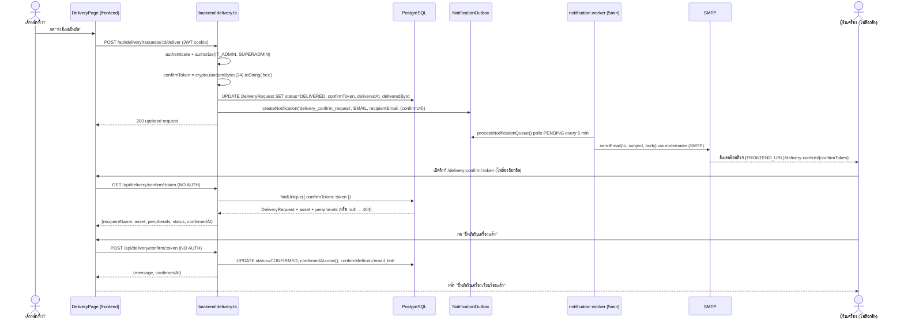

# MODULE: Delivery, Licenses, Contracts

ครอบคลุม 3 โมดูลย่อยที่ผูกกับวงจรชีวิตทรัพย์สิน IT หลังการจัดซื้อ/ระหว่างใช้งาน:
1. **Delivery** (เครื่องใหม่ & ส่งมอบ) — `backend/src/routes/delivery.ts`, `frontend/src/pages/delivery/*`
2. **Licenses** (Software License) — `backend/src/routes/licenses.ts`, `frontend/src/pages/licenses/LicensesPage.tsx`
3. **Contracts** (สัญญา & Warranty) — `backend/src/routes/contracts.ts`, `frontend/src/pages/contracts/ContractsPage.tsx`

Route mount points (`backend/src/app.ts:146-157`):
- `app.use('/api/contracts', contractRoutes)` — `backend/src/app.ts:146`
- `app.use('/api/licenses', licenseRoutes)` — `backend/src/app.ts:147`
- `app.use('/api/delivery', deliveryRoutes)` — `backend/src/app.ts:157`

---

## Module Profile

### Delivery (เครื่องใหม่ & ส่งมอบ)
- **ID**: `delivery`
- **Purpose**: บันทึกการเตรียมเครื่องใหม่/เครื่องหมุนเวียน/เครื่องทดแทนชั่วคราวให้พนักงาน พร้อม Setup Checklist, อุปกรณ์ต่อพ่วง, และขั้นตอนส่งมอบ + ยืนยันรับเครื่องผ่านลิงก์อีเมล (ไม่ต้องล็อกอิน)
- **Users**: เจ้าหน้าที่ IT ที่เตรียม/ส่งมอบเครื่อง (ฝั่งแอดมิน); พนักงานผู้รับเครื่อง (ฝั่ง public link เท่านั้น)
- **Roles**: `IT_ADMIN`, `SUPERADMIN` (ทุก endpoint ในแอดมิน); ไม่มี role สำหรับหน้า public confirm
- **Parent Menu**: "เครื่องใหม่ & ส่งมอบ" (ไอคอน `LocalShippingIcon`), path `/delivery` — `frontend/src/navigation/nav.tsx:90-95`

### Licenses (Software License)
- **ID**: `licenses`
- **Purpose**: บริหาร License ซอฟต์แวร์ (จำนวน seat, วันหมดอายุ, การ assign ให้ asset/user)
- **Users**: เจ้าหน้าที่ IT ผู้ดูแล License
- **Roles**: GET ทั้งหมด (`list`, `:id`) เปิดให้ `IT_ADMIN`, `SUPERADMIN`, `VIEWER`; POST/PUT/assign/unassign ต้อง `IT_ADMIN`/`SUPERADMIN`; DELETE ต้อง `SUPERADMIN` เท่านั้น — `backend/src/routes/licenses.ts:9,40,53,64,76,89,98`
- **Parent Menu**: "License & สัญญา" > "Software License", path `/licenses` — `frontend/src/navigation/nav.tsx:150-156`

### Contracts (สัญญา & Warranty)
- **ID**: `contracts`
- **Purpose**: ติดตามสัญญา MA/เช่า/ประกัน/Support และวันหมดอายุ ผูกกับ asset ที่อยู่ในสัญญา
- **Users**: เจ้าหน้าที่ IT ผู้ดูแลสัญญา/จัดซื้อ
- **Roles**: GET เปิดให้ `IT_ADMIN`, `SUPERADMIN`, `VIEWER`; POST/PUT ต้อง `IT_ADMIN`/`SUPERADMIN`; DELETE ต้อง `SUPERADMIN` — `backend/src/routes/contracts.ts:9,33,48,67,92`
- **Parent Menu**: "License & สัญญา" > "สัญญา & Warranty", path `/contracts` — `frontend/src/navigation/nav.tsx:150-156`

Frontend route protection: `frontend/src/App.tsx:107` (`delivery`, roles `IT_ADMIN`/`SUPERADMIN`), `:161-162` (`contracts`, `licenses`, roles `IT_ADMIN`/`SUPERADMIN`). Note frontend gate is stricter than backend for licenses/contracts GET (backend also allows `VIEWER`, but `ProtectedRoute` never lets a `VIEWER` reach the page).

---

## Page Inventory

| Page ID | Name | Route | Purpose | Role | Evidence |
|---|---|---|---|---|---|
| delivery-main | เครื่องใหม่ & ส่งมอบ (9-tab page) | `/delivery` | ทะเบียนเครื่อง+อุปกรณ์, Setup Checklist, ส่งมอบ+แจ้งเมล, ติดตามยืนยันรับ, และ 5 แท็บ "coming soon" | `IT_ADMIN`, `SUPERADMIN` | `frontend/src/App.tsx:107`; `frontend/src/pages/delivery/DeliveryPage.tsx:60-413` |
| delivery-confirm | ยืนยันการรับเครื่อง (public) | `/delivery-confirm/:token` | หน้า public ให้ผู้รับเครื่องกดยืนยันรับผ่าน token link ที่ส่งทางอีเมล — **ไม่ต้องล็อกอิน (NO AUTH)** | ไม่มี role — ไม่มีการ authenticate ใดๆ | `frontend/src/App.tsx:92` (นอก `ProtectedRoute`); `frontend/src/pages/delivery/DeliveryConfirmPage.tsx:1-99`; backend `backend/src/routes/delivery.ts:228,245` (ไม่มี `authenticate` middleware) |
| licenses-main | Software License | `/licenses` | CRUD License, ดูสรุป seats/วันหมดอายุ | `IT_ADMIN`, `SUPERADMIN` (frontend gate); backend GET ยังอนุญาต `VIEWER` | `frontend/src/App.tsx:162`; `frontend/src/pages/licenses/LicensesPage.tsx:43-228` |
| contracts-main | สัญญา & Warranty | `/contracts` | CRUD สัญญา, filter ตามประเภท/ใกล้หมดอายุ | `IT_ADMIN`, `SUPERADMIN` (frontend gate); backend GET ยังอนุญาต `VIEWER` | `frontend/src/App.tsx:161`; `frontend/src/pages/contracts/ContractsPage.tsx:36-211` |

DeliveryPage มี 9 แท็บ (`TAB_GROUPS`, `frontend/src/pages/delivery/DeliveryPage.tsx:37-47`); มีเพียง 4 แท็บแรกที่มีข้อมูลจริง (index 0-3), แท็บ index 4-8 ("คิวงาน Setup", "คืนเครื่อง / ลาออก", "รายงานเวลาส่งมอบ", "เครื่องหมุนเวียน", "จัดการชุด Checklist") เป็น placeholder `ComingSoon` component — `frontend/src/pages/delivery/DeliveryPage.tsx:49-58,321-325`.

---

## UI Components & Buttons/Actions

| Component/Button | onClick action | Permission | API called | Result |
|---|---|---|---|---|
| "+ เพิ่มรายการใหม่" (แท็บ 0) | `openCreate()` → เปิด dialog สร้าง delivery request | `IT_ADMIN`/`SUPERADMIN` | — | เปิด Dialog `createOpen` |
| Dialog "บันทึก" | `handleCreate()` — ถ้า `assetMode==='new'` เรียก `assetAPI.create` ก่อน แล้ว `deliveryAPI.create` | เดียวกัน | `POST /api/assets` (ถ้าสร้างใหม่), `POST /api/delivery/requests` | สร้าง `DeliveryRequest` status `SETUP_IN_PROGRESS` — `backend/src/routes/delivery.ts:65-101` |
| Checkbox "prepared" ต่ออุปกรณ์ต่อพ่วง (แท็บ 0) | `togglePeripheralFlag(id, itemId, 'prepared', checked)` | เดียวกัน | `PATCH /api/delivery/requests/:id/peripherals/:itemId` | อัปเดต `DeliveryPeripheralItem.prepared` — `backend/src/routes/delivery.ts:173-185` |
| ปุ่ม "พร้อมส่งมอบ" (แท็บ 0, ต่อแถวที่ยังไม่ `PENDING_DELIVERY`) | `handleMarkReady(id)` | เดียวกัน | `PATCH /api/delivery/requests/:id/ready` | เปลี่ยน status → `PENDING_DELIVERY` (manual bridge, จะถูกแทนที่ด้วย auto-transition จาก checklist ในอนาคต) — `backend/src/routes/delivery.ts:153-171` |
| "ทำ Checklist" / "ดูผล" (แท็บ 1 = `SetupChecklistTab`) | เปิด `ChecklistRunEditor` สำหรับ requestId | เดียวกัน | `GET /api/delivery/requests/:id/checklist-run` | โหลด/auto-create `DeliveryChecklistRun` — `backend/src/routes/delivery.ts:272-295` |
| ปุ่มตอบ PASS/FAIL/NA ต่อรายการ checklist | `setAnswer(itemId, value)` (client-only จนกด save) | เดียวกัน | — | อัปเดต local state `answers` |
| "บันทึกความคืบหน้า" | `handleSave('DRAFT')` | เดียวกัน | `POST /api/delivery/requests/:id/checklist-run/perform` (status ไม่ส่งหรือ DRAFT) | ลบ-สร้างใหม่ `DeliveryChecklistAnswer` ทั้งชุด, run status = `DRAFT` |
| "บันทึกผลและปิดงาน Setup" | `handleSave('DONE')` (ต้องตอบครบทุกข้อ ไม่งั้น toast error) | เดียวกัน | เดียวกัน, `status:'DONE'` | run status = `DONE`; ถ้า parent request อยู่ `DRAFT`/`SETUP_IN_PROGRESS` จะ auto-update เป็น `SETUP_DONE` พร้อมตั้ง `installerId`/`installedAt` — `backend/src/routes/delivery.ts:301-349` |
| ปุ่ม "ส่งอีเมลยืนยัน" (แท็บ 2, ต่อแถวที่ยังไม่ `DELIVERED`/`CONFIRMED`, disabled ถ้าไม่มีอีเมล) | `handleDeliver(id)` | เดียวกัน | `POST /api/delivery/requests/:id/deliver` | สร้าง `confirmToken` แบบสุ่ม, status → `DELIVERED`, คิวอีเมล `delivery_confirm_request` — `backend/src/routes/delivery.ts:191-225` |
| Checkbox "delivered" ต่ออุปกรณ์ต่อพ่วง (แท็บ 2) | `togglePeripheralFlag(id, itemId, 'delivered', checked)` | เดียวกัน | `PATCH /api/delivery/requests/:id/peripherals/:itemId` | อัปเดต `.delivered` |
| **[Public]** ปุ่ม "ยืนยันรับเครื่องแล้ว" (`/delivery-confirm/:token`) | `handleConfirm()` | **ไม่มี — public, ไม่ authenticate** | `POST /api/delivery/confirm/:token` | status → `CONFIRMED`, `confirmedAt`, `confirmMethod='email_link'` — `backend/src/routes/delivery.ts:245-258` |
| "เพิ่ม License" / แก้ไข (icon Edit) | `openNew()` / `openEdit(l)` | `IT_ADMIN`/`SUPERADMIN` (create/update ฝั่ง backend) | `POST /api/licenses` / `PUT /api/licenses/:id` | สร้าง/แก้ `SoftwareLicense` — `backend/src/routes/licenses.ts:53-73` |
| ปุ่มลบ License (icon Delete, แสดงเฉพาะ `isSuperAdmin`) | `handleDelete(id)` (มี `window.confirm`) | `SUPERADMIN` เท่านั้น | `DELETE /api/licenses/:id` | ลบ `SoftwareLicense` — `backend/src/routes/licenses.ts:98-104` |
| ปุ่ม toggle "ใกล้หมดอายุ" | `setExpiringSoon(!expiringSoon)` | ทุก role ที่เข้าหน้าได้ | `GET /api/licenses?expiringSoon=true` | filter รายการ ≤90 วัน |
| "เพิ่มสัญญา" / แก้ไข | `openNew()` / `openEdit(c)` | `IT_ADMIN`/`SUPERADMIN` | `POST /api/contracts` / `PUT /api/contracts/:id` | สร้าง/แก้ `Contract` — `backend/src/routes/contracts.ts:48-89` |
| ปุ่มลบสัญญา (แสดงเฉพาะ `isSuperAdmin`) | `handleDelete(id)` (มี `window.confirm`) | `SUPERADMIN` เท่านั้น | `DELETE /api/contracts/:id` | ลบ `Contract` — `backend/src/routes/contracts.ts:92-98` |
| Filter ประเภทสัญญา / toggle "ใกล้หมดอายุ (90 วัน)" | `setTypeFilter` / `setExpiringSoon` | ทุก role ที่เข้าหน้าได้ | `GET /api/contracts?type=...&expiringSoon=true` | filter ตาม `contractType`/`endDate` |

**หมายเหตุ**: `licenseAPI.assign` และ `licenseAPI.unassign` มีอยู่ใน `frontend/src/services/api.ts:512-513` และ endpoint หลังบ้าน `POST /api/licenses/:id/assign`, `DELETE /api/licenses/assignments/:assignmentId` ใช้งานได้ครบ แต่ **ไม่พบปุ่ม/UI ที่เรียกใช้ใน `LicensesPage.tsx`** — ฟีเจอร์ assign seat ให้ asset/user ยังไม่มีหน้าจอใช้งานจริง (ดู "Unknown / Not Verified")

---

## Forms & Fields

### Delivery — Create/Edit Request (`DeliveryPage.tsx` create dialog)
| Field | Label | Type | Required | Validation | DB column |
|---|---|---|---|---|---|
| `deliveryType` | ประเภท (เครื่องใหม่/หมุนเวียน/ทดแทนชั่วคราว) | ToggleButtonGroup | No (default `NEW_PURCHASE`) | — | `DeliveryRequest.deliveryType` (enum `DeliveryType`) |
| `recipientName` | ชื่อผู้รับเครื่อง * | text | **Yes** | client: non-empty; server: `if (!recipientName?.trim()) throw 400` — `backend/src/routes/delivery.ts:72` | `DeliveryRequest.recipientName` |
| `recipientEmail` | อีเมลผู้รับ | text | No | — | `DeliveryRequest.recipientEmail` |
| `recipientDept` | แผนก | text | No | — | `DeliveryRequest.recipientDept` |
| `recipientCompany` | บริษัท | text | No | — | `DeliveryRequest.recipientCompany` |
| `source` | ที่มาของเครื่อง | text | No | — | `DeliveryRequest.source` |
| `assetMode`/`assetId` | เลือกทรัพย์สินที่มีอยู่ (Autocomplete) | select | No | — | `DeliveryRequest.assetId` (FK → `Asset`) |
| `newAsset.*` | สร้างทรัพย์สินใหม่ (assetName, serialNo, type, brand, model, company, departmentId, location, ownerName) | text fields | `serialNo` **required** เมื่อเลือกโหมด "new" — client check `frontend/src/pages/delivery/DeliveryPage.tsx:106` | ส่งผ่าน `assetAPI.create` (นอกขอบเขตไฟล์นี้) | สร้าง `Asset` ใหม่ก่อน แล้วผูกเป็น `assetId` |
| `peripherals[]` | อุปกรณ์ต่อพ่วง (category, itemName, serialNo, qty, remark, prepared) | dynamic rows | No (กรอง `p.itemName.trim()` ก่อนส่ง) | — | `DeliveryPeripheralItem` (category, itemName, serialNo, qty, remark, prepared, delivered) |
| `notes` | หมายเหตุ | multiline text | No | — | `DeliveryRequest.notes` |

Server-side edit guard: `PUT /requests/:id` อนุญาตเฉพาะเมื่อ status อยู่ใน `['DRAFT','SETUP_IN_PROGRESS','SETUP_DONE']` มิฉะนั้น 400 "รายการนี้ส่งมอบไปแล้ว ไม่สามารถแก้ไขได้" — `backend/src/routes/delivery.ts:108-110`.

### Setup Checklist Answer (`SetupChecklistTab.tsx`)
| Field | Label | Type | Required | Validation | DB column |
|---|---|---|---|---|---|
| answer per item | ผ่าน/ไม่ผ่าน/N/A | button group (PASS/FAIL/NA) | ต้องตอบครบทุกข้อก่อนกด "ปิดงาน" — client check `answeredCount < items.length` → toast error, `frontend/src/pages/delivery/SetupChecklistTab.tsx:85-88` | server กรองเฉพาะ `itemId` ที่อยู่ใน `checklistSetId` จริง (`validItemIds`) — `backend/src/routes/delivery.ts:309-312` | `DeliveryChecklistAnswer.value` |
| note (เฉพาะเมื่อ FAIL) | หมายเหตุ | text | No | แสดงเฉพาะเมื่อ `value==='FAIL'` | `DeliveryChecklistAnswer.note` |

### License — Add/Edit Dialog
| Field | Label | Type | Required | Validation | DB column |
|---|---|---|---|---|---|
| `name` | ชื่อซอฟต์แวร์ * | text | **Yes** (ปุ่มบันทึก disabled ถ้าว่าง — `LicensesPage.tsx:223`) | ไม่มี server-side validation เพิ่มเติม (`req.body` ส่งตรงเข้า `prisma.create`) | `SoftwareLicense.name` |
| `vendor` | Vendor | text | No | — | `SoftwareLicense.vendor` |
| `licenseType` | ประเภท * | select (PERPETUAL/SUBSCRIPTION/OEM/VOLUME) | Yes (client default) | ไม่มี server-side enum check (เป็น `String` ใน schema ไม่ใช่ Prisma enum) | `SoftwareLicense.licenseType` |
| `totalSeats` | จำนวน Seats * | number | client parse `parseInt(...) || 1` | — | `SoftwareLicense.totalSeats` |
| `purchasePrice` | ราคา (บาท) | number | No | — | `SoftwareLicense.purchasePrice` |
| `purchaseDate` | วันที่ซื้อ | date | No | server: `new Date(data.purchaseDate)` ถ้ามีค่า | `SoftwareLicense.purchaseDate` |
| `expiryDate` | วันหมดอายุ | date | No (null = ไม่มีวันหมดอายุ) | server: `new Date(data.expiryDate)` ถ้ามีค่า | `SoftwareLicense.expiryDate` |
| `licenseKey` | License Key / Serial | text | No | เก็บเป็น plaintext — คอมเมนต์ schema ระบุ "เข้ารหัสในอนาคต" (`backend/prisma/schema.prisma:1088`) | `SoftwareLicense.licenseKey` |
| `notes` | หมายเหตุ | multiline text | No | — | `SoftwareLicense.notes` |
| (ไม่มี field ใน dialog) `poNumber` | — | — | — | มีคอลัมน์ DB และ `emptyForm.poNumber` แต่**ไม่มี TextField แสดงในฟอร์ม** | `SoftwareLicense.poNumber` |

### Contract — Add/Edit Dialog
| Field | Label | Type | Required | Validation | DB column |
|---|---|---|---|---|---|
| `title` | ชื่อสัญญา * | text | **Yes** (ปุ่มบันทึก disabled ถ้าว่าง) | — | `Contract.title` |
| `contractNo` | เลขที่สัญญา | text | No | DB: `@unique` — ค่าซ้ำจะทำให้ Prisma throw error ที่ไม่ถูกจับเป็น 400 เฉพาะ (ตกไปที่ error handler กลาง) | `Contract.contractNo` |
| `contractType` | ประเภท * | select (WARRANTY/MA/LEASE/INSURANCE/SUPPORT) | Yes (client default) | ไม่มี server-side enum check (เป็น `String`) | `Contract.contractType` |
| `vendor` | Vendor | text | No | — | `Contract.vendor` |
| `poNumber` | เลข PO | text | No | — | `Contract.poNumber` |
| `startDate` | วันเริ่มต้น * | date | **Yes** (ปุ่มบันทึก disabled ถ้าว่าง) | server: `new Date(data.startDate)` | `Contract.startDate` |
| `endDate` | วันสิ้นสุด * | date | **Yes** (ปุ่มบันทึก disabled ถ้าว่าง) | server: `new Date(data.endDate)` | `Contract.endDate` |
| `value` | มูลค่าสัญญา (บาท) | number | No | client `parseFloat` | `Contract.value` |
| `notes` | หมายเหตุ | multiline text | No | — | `Contract.notes` |
| (ไม่มี field ใน dialog) `assetIds[]` | — | — | — | รองรับใน POST/PUT backend (ผูก `ContractAsset`) แต่**ไม่มี UI เลือก asset ในฟอร์มสัญญา** | `ContractAsset` (M2M ผ่าน join table) |

---

## CRUD Matrix

| Entity | Create | Read | Update | Delete |
|---|---|---|---|---|
| `DeliveryRequest` | `POST /delivery/requests` (`IT_ADMIN`/`SUPERADMIN`) | `GET /delivery/requests`, `GET /delivery/requests/:id`, `GET /delivery/requests/summary` | `PUT /delivery/requests/:id` (จำกัดเฉพาะ status DRAFT/SETUP_IN_PROGRESS/SETUP_DONE); `PATCH /:id/ready`; `PATCH /:id/peripherals/:itemId`; `POST /:id/deliver`; `POST /confirm/:token` (public) | ไม่มี endpoint ลบ |
| `DeliveryPeripheralItem` | สร้างพร้อม request หรือแนบตอน `PUT /requests/:id` (delete-all-then-recreate) | ผ่าน include ของ request | `PATCH /:id/peripherals/:itemId` (prepared/delivered) | ลบทั้งหมดของ request ตอน `PUT /requests/:id` ถ้ามี `peripherals` ในบอดี (`deleteMany` แล้ว `create` ใหม่) |
| `DeliveryChecklistRun` | auto-create ตอน `GET /requests/:id/checklist-run` ครั้งแรก (ผูกกับ `checklistSet` docCode `IT-WI-001`) | `GET /requests/:id/checklist-run` | `POST /requests/:id/checklist-run/perform` | ไม่มี endpoint ลบ |
| `DeliveryChecklistAnswer` | สร้างพร้อม perform | ผ่าน include ของ run | delete-all-then-recreate ทุกครั้งที่ perform | ลบพร้อมการ recreate |
| `SoftwareLicense` | `POST /licenses` | `GET /licenses`, `GET /licenses/:id` | `PUT /licenses/:id` | `DELETE /licenses/:id` (`SUPERADMIN` only) |
| `LicenseAssignment` | `POST /licenses/:id/assign` (ตรวจ seat เต็มหรือยัง) | ผ่าน include ของ license | ไม่มี endpoint update | `DELETE /licenses/assignments/:assignmentId` |
| `Contract` | `POST /contracts` | `GET /contracts`, `GET /contracts/:id` | `PUT /contracts/:id` | `DELETE /contracts/:id` (`SUPERADMIN` only) |
| `ContractAsset` | สร้างพร้อม contract (`assetIds`) | ผ่าน include ของ contract | ลบทั้งหมด+สร้างใหม่ตอน `PUT /contracts/:id` ถ้ามี `assetIds` ในบอดี | ลบพร้อม cascade เมื่อลบ contract (`onDelete: Cascade` ที่ `contractId`), ห้ามลบ asset ที่ยังผูกอยู่ (`onDelete: Restrict` ที่ `assetId`) |

---

## API Inventory

### delivery.ts (mounted at `/api/delivery`)

| Method | Endpoint | Purpose | Auth | Request | Response | Evidence |
|---|---|---|---|---|---|---|
| GET | `/requests` | List delivery requests, filter by status/deliveryType/search | `authenticate` + `authorize('IT_ADMIN','SUPERADMIN')` | query: `status`, `deliveryType`, `search` | array of `DeliveryRequest` with `REQUEST_INCLUDE` | `delivery.ts:19-38` |
| GET | `/requests/summary` | KPI counts (total/pendingDelivery/delivered/confirmed/draft) | `authenticate` + `authorize('IT_ADMIN','SUPERADMIN')` | — | `{total, pendingDelivery, delivered, confirmed, draft}` | `delivery.ts:40-54` |
| GET | `/requests/:id` | Get one request detail | `authenticate` + `authorize('IT_ADMIN','SUPERADMIN')` | — | `DeliveryRequest` or 404 | `delivery.ts:56-62` |
| POST | `/requests` | Create request (tab 1) | `authenticate` + `authorize('IT_ADMIN','SUPERADMIN')` | `{deliveryType, assetId, recipientName*, recipientEmail, recipientDept, recipientCompany, source, notes, peripherals[]}` | 201 created `DeliveryRequest`, status=`SETUP_IN_PROGRESS` | `delivery.ts:65-101` |
| PUT | `/requests/:id` | Update request; delete+recreate peripherals if provided | `authenticate` + `authorize('IT_ADMIN','SUPERADMIN')` | same fields as create | updated `DeliveryRequest`; 400 if status not in DRAFT/SETUP_IN_PROGRESS/SETUP_DONE; 404 if missing | `delivery.ts:103-151` |
| PATCH | `/requests/:id/ready` | Manual bridge → `PENDING_DELIVERY` (temporary until checklist auto-transition covers it fully) | `authenticate` + `authorize('IT_ADMIN','SUPERADMIN')` | — | updated request; 400 if status not eligible | `delivery.ts:156-171` |
| PATCH | `/requests/:id/peripherals/:itemId` | Toggle `prepared`/`delivered` flags on one peripheral item | `authenticate` + `authorize('IT_ADMIN','SUPERADMIN')` | `{prepared?, delivered?}` (booleans) | updated `DeliveryPeripheralItem` | `delivery.ts:173-185` |
| POST | `/requests/:id/deliver` | Mark delivered, generate `confirmToken`, queue confirmation email | `authenticate` + `authorize('IT_ADMIN','SUPERADMIN')` | — | updated request status=`DELIVERED`; 400 if already DELIVERED/CONFIRMED or no `recipientEmail` | `delivery.ts:191-225` |
| GET | `/confirm/:token` | **Public — recipient views delivery details to confirm** | **NO AUTH — no `authenticate` middleware** | URL param `token` | `{recipientName, asset, peripherals, status, confirmedAt}`; 404 if token not found | `delivery.ts:228-243` |
| POST | `/confirm/:token` | **Public — recipient confirms receipt** | **NO AUTH — no `authenticate` middleware** | URL param `token` | `{message, confirmedAt}`; idempotent if already `CONFIRMED`; 404 if token not found | `delivery.ts:245-258` |
| GET | `/requests/:id/checklist-run` | Fetch (auto-create if missing) the in-progress checklist run, seeded from `ChecklistSet` `docCode='IT-WI-001'` | `authenticate` + `authorize('IT_ADMIN','SUPERADMIN')` | — | `DeliveryChecklistRun` with `checklistSet.items`, `performer`, `answers`; 404 if no request or no `IT-WI-001` set exists | `delivery.ts:272-295` |
| POST | `/requests/:id/checklist-run/perform` | Save answers (delete-all-then-recreate); if `status:'DONE'`, auto-transition parent request to `SETUP_DONE` | `authenticate` + `authorize('IT_ADMIN','SUPERADMIN')` | `{answers:[{itemId,value,note?}], status?:'DRAFT'\|'DONE'}` | updated `DeliveryChecklistRun`; 404 if no run exists | `delivery.ts:301-349` |

### licenses.ts (mounted at `/api/licenses`)

| Method | Endpoint | Purpose | Auth | Request | Response | Evidence |
|---|---|---|---|---|---|---|
| GET | `/` | List licenses, filter `active`/`expiringSoon` (≤90 days, active only); augments with `usedSeats`/`availableSeats` | `authenticate` + `authorize('IT_ADMIN','SUPERADMIN','VIEWER')` | query: `active`, `expiringSoon` | array of `SoftwareLicense` + `usedSeats`, `availableSeats` | `licenses.ts:9-37` |
| GET | `/:id` | Get one license | `authenticate` + `authorize('IT_ADMIN','SUPERADMIN','VIEWER')` | — | `SoftwareLicense` + seat counts; 404 if missing | `licenses.ts:40-50` |
| POST | `/` | Create license | `authenticate` + `authorize('IT_ADMIN','SUPERADMIN')` | body: `name`, `vendor`, `licenseType`, `totalSeats`, `licenseKey`, `purchaseDate`, `expiryDate`, `purchasePrice`, `poNumber`, `notes` (raw passthrough to Prisma, only dates parsed) | 201 created `SoftwareLicense` | `licenses.ts:53-61` |
| PUT | `/:id` | Update license | `authenticate` + `authorize('IT_ADMIN','SUPERADMIN')` | same fields | updated `SoftwareLicense` | `licenses.ts:64-73` |
| POST | `/:id/assign` | Assign a seat to an asset/user | `authenticate` + `authorize('IT_ADMIN','SUPERADMIN')` | `{assetId?, userId?, note?}` | 201 `LicenseAssignment`; 400 if seats full (`assignments.length >= totalSeats`); 404 if license missing | `licenses.ts:76-86` |
| DELETE | `/assignments/:assignmentId` | Remove a seat assignment | `authenticate` + `authorize('IT_ADMIN','SUPERADMIN')` | — | 204 | `licenses.ts:89-95` |
| DELETE | `/:id` | Delete license | `authenticate` + `authorize('SUPERADMIN')` | — | 204 | `licenses.ts:98-104` |

### contracts.ts (mounted at `/api/contracts`)

| Method | Endpoint | Purpose | Auth | Request | Response | Evidence |
|---|---|---|---|---|---|---|
| GET | `/` | List contracts, filter `type`/`active`/`expiringSoon` (endDate ≤90 days, active only) | `authenticate` + `authorize('IT_ADMIN','SUPERADMIN','VIEWER')` | query: `type`, `active`, `expiringSoon` | array of `Contract` with `assets.asset` | `contracts.ts:9-30` |
| GET | `/:id` | Get one contract | `authenticate` + `authorize('IT_ADMIN','SUPERADMIN','VIEWER')` | — | `Contract` with full `assets.asset`; 404 if missing | `contracts.ts:33-45` |
| POST | `/` | Create contract, optionally attach `assetIds[]` | `authenticate` + `authorize('IT_ADMIN','SUPERADMIN')` | body: `title`, `contractNo`, `contractType`, `vendor`, `startDate*`, `endDate*`, `value`, `poNumber`, `notes`, `assetIds[]` | 201 created `Contract` | `contracts.ts:48-64` |
| PUT | `/:id` | Update contract; if `assetIds` provided, delete-all-then-recreate `ContractAsset` rows | `authenticate` + `authorize('IT_ADMIN','SUPERADMIN')` | same fields | updated `Contract` | `contracts.ts:67-89` |
| DELETE | `/:id` | Delete contract | `authenticate` + `authorize('SUPERADMIN')` | — | 204 | `contracts.ts:92-98` |

**Public (no-auth) endpoints — flagged explicitly**: `GET /api/delivery/confirm/:token` and `POST /api/delivery/confirm/:token` are the only two endpoints across all three route files without `authenticate`/`authorize` middleware — `delivery.ts:228,245` (compare to every other route in the file which chains `authenticate, authorize(...)`).

---

## Database Tables

### `delivery_requests` (model `DeliveryRequest`) — `backend/prisma/schema.prisma:918-948`
| Field | Type | Notes |
|---|---|---|
| id | Int PK autoincrement | |
| deliveryType | enum `DeliveryType` (`NEW_PURCHASE`\|`RECYCLED`\|`TEMP_REPLACEMENT`) default `NEW_PURCHASE` | `schema.prisma:901-905` |
| status | enum `DeliveryStatus` (`DRAFT`\|`SETUP_IN_PROGRESS`\|`SETUP_DONE`\|`PENDING_DELIVERY`\|`DELIVERED`\|`CONFIRMED`\|`RETURN_REQUESTED`\|`RETURNED`) default `DRAFT`, indexed | `schema.prisma:907-916` |
| assetId | Int? FK → `Asset` | nullable — request can exist without an asset yet |
| recipientName | String | required |
| recipientEmail, recipientDept, recipientCompany | String? | |
| source | String? | free text, "ที่มาของเครื่อง" |
| requestedBy | Int FK → `AppUser` (`DeliveryRequestedBy`) | required |
| installerId | Int? FK → `AppUser` (`DeliveryInstalledBy`) | set when checklist run completes |
| installedAt | DateTime? | set when checklist run completes |
| deliveredById | Int? FK → `AppUser` (`DeliveryDeliveredBy`) | set on `/deliver` |
| deliveredAt | DateTime? | set on `/deliver` |
| confirmToken | String? **@unique** | crypto random token, set on `/deliver`, never cleared |
| confirmedAt | DateTime? | set on public `/confirm/:token` POST |
| confirmMethod | String? | hardcoded `'email_link'` on confirm |
| notes | String? | |
| peripherals | 1:N → `DeliveryPeripheralItem` | |
| checklistRuns | 1:N → `DeliveryChecklistRun` | |
| createdAt, updatedAt | DateTime | |

### `delivery_peripheral_items` (model `DeliveryPeripheralItem`) — `schema.prisma:950-963`
id, requestId (FK, cascade delete), category, itemName, serialNo?, qty (default 1), remark?, prepared (bool, default false), delivered (bool, default false).

### `checklist_sets` (model `ChecklistSet`) — `schema.prisma:572-589`
id, docCode (unique), name, appliesToCategories?, itemCount, categoryCount, avgTimeLabel?, revision, isActive, items (1:N `ChecklistItem`), checklistRuns (1:N `DeliveryChecklistRun`).

### `checklist_items` (model `ChecklistItem`) — `schema.prisma:591-607`
id, setId (FK, cascade delete), category, refCode, itemText, answerType (default `PASS_FAIL_NA`), sortOrder, answers (1:N `DeliveryChecklistAnswer`). Indexed on `[setId, sortOrder]`.

### `delivery_checklist_runs` (model `DeliveryChecklistRun`) — `schema.prisma:609-626`
id, requestId (FK → `DeliveryRequest`, cascade delete), checklistSetId (FK → `ChecklistSet`), status (default `DRAFT`), performedBy? (FK `AppUser`, relation `DeliveryChecklistPerformedBy`), performedAt?, completedAt?, answers (1:N). Indexed on `requestId`.

### `delivery_checklist_answers` (model `DeliveryChecklistAnswer`) — `schema.prisma:628-639`
id, runId (FK, cascade delete), itemId (FK → `ChecklistItem`), value?, note?. Unique on `[runId, itemId]`.

### `software_licenses` (model `SoftwareLicense`) — `schema.prisma:1082-1101`
id, name, vendor?, licenseType (String, default `PERPETUAL`; comment lists `PERPETUAL|SUBSCRIPTION|OEM|VOLUME` but **not a DB-level enum**), totalSeats (default 1), licenseKey? (plaintext, schema comment notes "เข้ารหัสในอนาคต"), purchaseDate?, expiryDate? (null = perpetual/no expiry), purchasePrice?, poNumber?, notes?, isActive (default true), assignments (1:N `LicenseAssignment`). Indexed on `expiryDate`.

### `license_assignments` (model `LicenseAssignment`) — `schema.prisma:1103-1116`
id, licenseId (FK, cascade delete), assetId? (no explicit FK relation declared on this field — plain Int, no `Asset` relation field), userId? (plain Int, no `AppUser` relation field), assignedAt (default now), note?. Unique on `[licenseId, assetId]` and `[licenseId, userId]`. Indexed on `licenseId`.

### `contracts` (model `Contract`) — `schema.prisma:1119-1137`
id, title, contractNo? **@unique**, contractType (String, default `WARRANTY`; comment lists `WARRANTY|MA|LEASE|INSURANCE|SUPPORT`, **not a DB-level enum**), vendor?, startDate (required), endDate (required, comment: "ระบบจะแจ้งเตือน 30/60/90 วันก่อน"), value?, poNumber?, notes?, isActive (default true), assets (1:N `ContractAsset`). Indexed on `[endDate, isActive]`.

### `contract_assets` (model `ContractAsset`) — `schema.prisma:1140-1151`
id, contractId (FK → `Contract`, `onDelete: Cascade`), assetId (FK → `Asset`, `onDelete: Restrict` — an asset under an active contract cannot be deleted while linked). Unique on `[contractId, assetId]`. Indexed on `contractId`, `assetId`.

---

## Workflow

### Delivery request → checklist → deliver → public confirm (full lifecycle)

1. **สร้างรายการ** (`POST /delivery/requests`): admin กรอกผู้รับ + เลือก/สร้าง asset + อุปกรณ์ต่อพ่วง → status `SETUP_IN_PROGRESS` (`delivery.ts:74-99`).
2. **Setup Checklist** (แท็บ 1): admin เปิด `GET /requests/:id/checklist-run` — auto-create run ผูกกับ `ChecklistSet` `docCode='IT-WI-001'` ถ้ายังไม่มี run (`delivery.ts:284-291`). ตอบ PASS/FAIL/NA ทีละข้อ แล้วกด "บันทึกความคืบหน้า" (`status` ไม่ส่ง/`DRAFT`) หรือ "บันทึกผลและปิดงาน" (`status:'DONE'`, ต้องตอบครบทุกข้อ) → `POST /requests/:id/checklist-run/perform`.
3. **Auto-transition เมื่อปิดงาน checklist**: ถ้า `status==='DONE'` และ parent request อยู่ `DRAFT`/`SETUP_IN_PROGRESS` → server ตั้ง request เป็น `SETUP_DONE`, บันทึก `installerId`/`installedAt` (`delivery.ts:334-342`).
4. **พร้อมส่งมอบ** (manual bridge, จนกว่า Phase B จะครอบคลุมเต็ม): ปุ่ม "พร้อมส่งมอบ" → `PATCH /requests/:id/ready` → status `PENDING_DELIVERY` (`delivery.ts:156-171`, comment ยืนยันว่าเป็นสะพานชั่วคราว).
5. **ส่งมอบ + คิวอีเมล** (แท็บ 2): ปุ่ม "ส่งอีเมลยืนยัน" → `POST /requests/:id/deliver` — ต้องมี `recipientEmail` (ไม่งั้น 400) และ status ต้องไม่ใช่ `DELIVERED`/`CONFIRMED` แล้ว → สร้าง `confirmToken = crypto.randomBytes(24).toString('hex')` (48 hex chars, 192 bits entropy), set status `DELIVERED`, `deliveredById`, `deliveredAt`, แล้ว `createNotification('delivery_confirm_request', 'EMAIL', recipientEmail, {recipientName, assetName, confirmUrl})` โดย `confirmUrl = ${FRONTEND_URL}/delivery-confirm/${confirmToken}` (`delivery.ts:191-225`). การแจ้งเตือนถูก enqueue เข้า `NotificationOutbox` (status `PENDING`) ผ่าน `createNotification` (`backend/src/services/notification.ts:36-82`) ไม่ได้ส่งอีเมลทันที — ส่งจริงเมื่อ notification worker รอบถัดไป (ทุก 5 นาที, `notification.ts:431-441`) เรียก `processNotificationQueue()`.
6. **ผู้รับเปิดลิงก์** (`GET /delivery-confirm/:token`, public, ไม่ล็อกอิน) → frontend เรียก `GET /delivery/confirm/:token` เพื่อดึงรายละเอียด (ชื่อผู้รับ, asset, peripherals, status) — 404 ถ้า token ไม่ตรงกับ `confirmToken` ใดเลย.
7. **ผู้รับกดยืนยัน** → `POST /delivery/confirm/:token` → ถ้า status เป็น `CONFIRMED` อยู่แล้ว ตอบ idempotent message กลับโดยไม่แก้ข้อมูล; ไม่งั้น set status `CONFIRMED`, `confirmedAt`, `confirmMethod='email_link'`.
8. **ติดตาม** (แท็บ 3): แสดง KPI (total/pendingDelivery/delivered/confirmed) และตาราง deliveredAt/confirmedAt/status ของทุกรายการ.

---

## Business Rules

1. `recipientName` เป็น required field ตอนสร้าง request — ไม่งั้น 400 "กรุณาระบุชื่อผู้รับเครื่อง" — `delivery.ts:72`.
2. แก้ไข request (`PUT /requests/:id`) ทำได้เฉพาะ status `DRAFT`/`SETUP_IN_PROGRESS`/`SETUP_DONE` — ถ้าส่งมอบไปแล้วห้ามแก้ — `delivery.ts:108-110`.
3. "พร้อมส่งมอบ" (`PATCH /:id/ready`) ทำได้เฉพาะ status เดียวกันข้างต้น — `delivery.ts:161-163`.
4. `POST /requests/:id/deliver`: ห้ามส่งมอบซ้ำถ้า status เป็น `DELIVERED`/`CONFIRMED` แล้ว (400) — `delivery.ts:196-198`; ต้องมี `recipientEmail` มิฉะนั้น 400 "ไม่มีอีเมลผู้รับ กรุณาระบุอีเมลก่อนส่งมอบ" — `delivery.ts:199`.
5. `confirmToken` สุ่มด้วย `crypto.randomBytes(24).toString('hex')` (192-bit) ทุกครั้งที่ deliver — เก็บถาวรใน DB คอลัมน์ `@unique`, **ไม่มี expiry field และไม่มี logic หมดอายุใดๆ ในโค้ด** — token ใช้ได้ตลอดไปจนกว่าจะมีการ deliver ซ้ำ (ซึ่งทำไม่ได้เพราะ rule ข้อ 4 บล็อกไว้เมื่อ DELIVERED/CONFIRMED แล้ว) — `delivery.ts:201,208,937`.
6. `GET/POST /confirm/:token` ไม่มี rate limiting ในระดับ route (ไม่พบ middleware จำกัดจำนวนครั้งใน `delivery.ts`) — ไม่สามารถยืนยันได้ว่ามี rate limit ระดับ app/nginx จากไฟล์ที่อ่านในงานนี้.
7. `POST /confirm/:token` เป็น idempotent: ถ้า status เป็น `CONFIRMED` แล้ว จะไม่เขียนทับข้อมูลซ้ำ เพียงตอบข้อความเดิมกลับ — `delivery.ts:249-251`.
8. Checklist run auto-create ผูกกับ `ChecklistSet.docCode==='IT-WI-001'` เท่านั้น (hardcoded) — ถ้าไม่มี set นี้ในระบบ จะ 404 "ยังไม่มีชุด Checklist ในระบบ" — `delivery.ts:285-286`, comment ยืนยัน "the only checklist set with real items today" — `delivery.ts:270-271`.
9. Perform checklist กรองเฉพาะ `answers[].itemId` ที่มีอยู่จริงใน `checklistSetId` ของ run นั้น (ป้องกันการยัด itemId ปลอม) — `delivery.ts:309-312`.
10. ปิดงาน checklist (`status:'DONE'`) จะ auto-set parent request เป็น `SETUP_DONE` **เฉพาะ** เมื่อ request ปัจจุบันอยู่ `DRAFT`/`SETUP_IN_PROGRESS` — ถ้า request อยู่ status อื่นแล้ว (เช่น `SETUP_DONE`/`PENDING_DELIVERY` ซ้ำ) จะไม่ทับ — `delivery.ts:335-341`.
11. License: `POST /:id/assign` บล็อกถ้า `assignments.length >= totalSeats` — 400 "License เต็มแล้ว (seats หมด)" — `licenses.ts:82`.
12. License `expiringSoon=true` filter: `expiryDate <= now+90days AND expiryDate IS NOT NULL AND isActive=true` — `licenses.ts:14-19`.
13. Contract `expiringSoon=true` filter: `endDate <= now+90days AND isActive=true` — `contracts.ts:15-19` (ไม่กรอง `endDate IS NOT NULL` เพราะ `endDate` เป็น required field เสมอ).
14. Contract ลบ asset ที่อยู่ภายใต้สัญญาไม่ได้ในระดับ DB (`ContractAsset.asset` มี `onDelete: Restrict`) — `schema.prisma:1145`.
15. ลบ `SoftwareLicense`/`Contract` จำกัดเฉพาะ role `SUPERADMIN` (ไม่ใช่ `IT_ADMIN`) — `licenses.ts:98`, `contracts.ts:92`; ต่างจาก create/update ที่เปิดให้ `IT_ADMIN` ด้วย.
16. `licenseType`/`contractType` เป็น plain `String` ใน schema (ไม่ใช่ Prisma enum) — ค่าที่ backend รับได้ไม่ถูกจำกัดใน DB/route level ใดๆ นอกจาก UI dropdown ฝั่ง frontend (`LICENSE_TYPES`/`CONTRACT_TYPES` array) — ส่งค่าอื่นผ่าน API โดยตรงจะไม่ถูกปฏิเสธ.

---

## Notifications triggered

| Event key | Channel | Trigger point | Recipient | Payload | Evidence |
|---|---|---|---|---|---|
| `delivery_confirm_request` | EMAIL | `POST /delivery/requests/:id/deliver` (หลัง set confirmToken) | `request.recipientEmail` | `{recipientName, assetName, confirmUrl}` | `delivery.ts:217-221` |

- ไม่มีการเรียก `createNotification` ที่อื่นใน `delivery.ts`, `licenses.ts`, หรือ `contracts.ts` — grep ยืนยันมีเพียงจุดเดียวในทั้งสามไฟล์.
- ไม่มีการแจ้งเตือนอัตโนมัติเมื่อ License/Contract ใกล้หมดอายุ **ในไฟล์ route เหล่านี้** — ฟีเจอร์ "ใกล้หมดอายุ 90 วัน" เป็นเพียง query filter ที่ต้องเปิดหน้าเว็บเพื่อดู ไม่พบ cron/scheduled job เรียก `createNotification` สำหรับ license/contract expiry ในสามไฟล์นี้ (อาจมีอยู่ในไฟล์ cron/scheduler อื่นที่ไม่ได้อยู่ในขอบเขตงานนี้ — ไม่สามารถตรวจสอบได้).
- อีเมลจริงถูกส่งผ่าน worker แยก (`startNotificationWorker`, ทุก 5 นาที) ไม่ใช่ synchronous ตอนเรียก API — `notification.ts:431-441`. ถ้า email/subject template `delivery_confirm_request` ไม่มีใน `NotificationTemplate` จะ fallback เป็นอีเมล generic (`notification.ts:174-178`) — ไม่สามารถยืนยันได้ว่ามี template นี้อยู่จริงในฐานข้อมูล (ไม่ได้ตรวจ seed data ในงานนี้).

---

## Unknown / Not Verified

- **License seat assignment UI**: backend รองรับ `POST /:id/assign`, `DELETE /assignments/:assignmentId` และ frontend `api.ts` มี `licenseAPI.assign`/`unassign` แต่ `LicensesPage.tsx` ไม่มีปุ่ม/dialog เรียกใช้ทั้งสองฟังก์ชันนี้เลย — ไม่สามารถยืนยันได้ว่ามีหน้าจออื่นเรียกใช้ (เช่นจาก Asset detail page) เพราะไม่อยู่ในขอบเขตไฟล์ที่อ่าน.
- **Contract-asset attach UI**: `assetIds[]` รองรับใน POST/PUT contracts backend แต่ dialog ใน `ContractsPage.tsx` ไม่มีช่องเลือก asset — ไม่ทราบว่ามีหน้าจออื่น (เช่น Asset Detail → "ผูกสัญญา") ที่เรียก endpoint นี้หรือไม่ เพราะไม่อยู่ในขอบเขตไฟล์ที่อ่าน.
- **NotificationTemplate สำหรับ `delivery_confirm_request`**: ไม่ได้ตรวจสอบว่ามี record จริงในตาราง `notification_templates` (seed data) — ถ้าไม่มี ระบบจะ fallback เป็นอีเมล generic ที่ไม่มี branding/format ที่ดี.
- **Rate limiting ระดับ app/nginx** สำหรับ `/api/delivery/confirm/:token`: ไม่พบ middleware ใน `delivery.ts` หรือ `app.ts` (เท่าที่ตรวจ) — ไม่ได้อ่านไฟล์ nginx.conf หรือ global rate-limit middleware ในงานนี้เพื่อยืนยัน/ปฏิเสธ.
- **แท็บ 4-8 ของ DeliveryPage** ("คิวงาน Setup", "คืนเครื่อง / ลาออก", "รายงานเวลาส่งมอบ", "เครื่องหมุนเวียน", "จัดการชุด Checklist") เป็น placeholder เท่านั้น (component `ComingSoon`) — ยังไม่มี backend endpoint หรือ schema รองรับ (เช่นไม่มี "return request" flow นอกจาก enum values `RETURN_REQUESTED`/`RETURNED` ที่มีอยู่ใน `DeliveryStatus` แต่ไม่มี route ใดตั้งค่าเป็นสถานะเหล่านี้เลยในไฟล์ที่อ่าน).
- **`RETURN_REQUESTED`/`RETURNED` status**: มีอยู่ใน enum `DeliveryStatus` (`schema.prisma:914-915`) แต่ไม่พบโค้ดใน `delivery.ts` ที่ set สถานะเหล่านี้ — ไม่สามารถยืนยันได้ว่ามี flow คืนเครื่องทำงานจริงที่ไหน (สอดคล้องกับแท็บ "คืนเครื่อง / ลาออก" ที่เป็น ComingSoon).
- **`assetAPI.create`** ที่เรียกจาก `DeliveryPage.tsx:107` เมื่อสร้าง asset ใหม่พร้อม delivery request — ไม่ได้อ่าน `assets.ts` เต็มไฟล์ในงานนี้ (อยู่นอกขอบเขต) จึง verify เฉพาะจุดเรียกใช้ ไม่ verify validation ฝั่ง asset route.
- **โควตา 90 วัน "ใกล้หมดอายุ"** ของทั้ง license และ contract เป็นค่า hardcode `90` วันในโค้ด ไม่มี config ให้ปรับ — ยืนยันจาก `licenses.ts:16`, `contracts.ts:17`.
