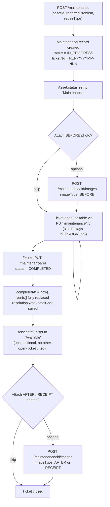

# MODULE: Inventory, Categories, Maintenance, Asset Links

Sources read in full:
- `D:\ITSM\backend\src\routes\inventory.ts` (172 lines)
- `D:\ITSM\backend\src\routes\categories.ts` (34 lines) + `D:\ITSM\backend\src\controllers\category.controller.ts` (153 lines) + `D:\ITSM\backend\src\services\category.service.ts` (129 lines) — `categories.ts` delegates every handler to `CategoryController`, which delegates to `CategoryService`
- `D:\ITSM\backend\src\routes\maintenance.ts` (241 lines)
- `D:\ITSM\backend\src\routes\assetLinks.ts` (49 lines)
- `D:\ITSM\frontend\src\pages\inventory\InventoryPage.tsx` (320 lines)
- `D:\ITSM\frontend\src\pages\categories\CategoryPage.tsx` (347 lines)
- `D:\ITSM\frontend\src\pages\assets\MaintenanceTab.tsx` (512 lines) — actual path; there is no `pages/assets/tabs/MaintenanceTab.tsx`, the maintenance tab component lives directly under `pages/assets/`
- `D:\ITSM\frontend\src\pages\assets\tabs\LinkedAssetsTab.tsx` (125 lines) + `D:\ITSM\frontend\src\pages\assets\components\AssetLinksPanel.tsx` (133 lines) — the asset-link UI (CMDB parent/child) lives in these two files, mounted from the "อุปกรณ์ที่เชื่อมโยง" tab
- `D:\ITSM\frontend\src\services\api.ts` lines 422-528 (`inventoryAPI`, `categoryAPI`, `maintenanceAPI`, `assetLinkAPI`)
- `D:\ITSM\backend\src\services\dashboardData.ts` lines 90-104 (low-stock aggregate logic, since it lives outside inventory.ts but is the only low-stock "alert" logic in the codebase)
- `D:\ITSM\backend\prisma\schema.prisma` lines 483-515 for `Category`/`CategoryType` (not yet present in `03_database_schema.md`, which currently stops before the Master Data domain section)
- `D:\ITSM\docs\system-blueprint\03_database_schema.md` §3 "Inventory" (InventoryItem/InventoryTransaction, lines 418-460) and §5 "Maintenance & PM" (MaintenanceRecord/MaintenancePart/MaintenanceImage, lines 610-654), and §2 "Asset Core" (AssetLink, lines 356-369)

---

## Module Profile

### Inventory (คลังวัสดุ)
Tracks consumable/quantity-based stock (cables, cartridges, consumables, "other") separate from serialized `Asset` records. Single flat table `InventoryItem` with a running `totalQuantity`/`availableQuantity`, moved by explicit checkin/checkout transactions logged to `InventoryTransaction`. Also feeds the borrow workflow as a quantity-based, non-serialized loanable item type (`BorrowRequestItem.inventoryItemId`).

### Categories (หมวดหมู่)
Two-level master-data hierarchy for the **Asset** module (not inventory): `Category` (top-level, e.g. "คอมพิวเตอร์", icon + sort order) → `CategoryType` (sub-type, e.g. "Notebook", carries `detailTable`, `isBorrowable`, `isAssignable` flags that drive Asset-form behavior elsewhere). Pure CRUD + reorder, no workflow.

### Maintenance (ซ่อมบำรุง)
Per-asset repair ticket lifecycle: open a `MaintenanceRecord` (auto-numbered `REP-YYYYMM-NNN`), optionally attach BEFORE/AFTER/RECEIPT photos, record replaced parts and cost, then mark `COMPLETED`. Side-effects the parent `Asset.status` (`Maintenance` on open, `Available` on complete). Rendered inside the Asset detail page's "ประวัติการซ่อม" tab (`MaintenanceTab.tsx`), plus a standalone report page (`ReportMaintenancePage.tsx`, out of scope file list but wired to `maintenanceAPI.reportAll`).

### Asset Links (CMDB parent-child)
Lightweight many-to-many self-relation on `Asset` (`AssetLink`, unique on `(parentId, childId)`) letting IT_ADMIN/SUPERADMIN declare that one asset is a component of / connected to / depends on another (e.g. notebook ↔ dock, PC ↔ monitor). Rendered as `AssetLinksPanel.tsx`, embedded inside `LinkedAssetsTab.tsx` alongside a separate (unrelated) "assets owned by the same person" panel that is derived purely by matching `Asset.ownerName`, not by `AssetLink`.

---

## Page Inventory

| Page ID | Name | Route | Purpose | Role Guard | Evidence |
|---|---|---|---|---|---|
| INV-01 | Inventory Management | `/inventory` (also opened pre-filtered as `/inventory?category=Cable` / `?category=Consumable` from nav) | List/search/filter consumable stock, create/edit/deactivate items, stock in (checkin) / stock out (checkout) | Route-level `ProtectedRoute roles={['IT_ADMIN','SUPERADMIN']}` | `frontend/src/App.tsx:108`; nav entries `frontend/src/navigation/nav.tsx:96-104` |
| CAT-01 | จัดการหมวดหมู่ทรัพย์สิน (Category Management) | `/categories` | CRUD Category + CategoryType, in-page admin-only edit controls | Route-level `ProtectedRoute roles={['IT_ADMIN','SUPERADMIN']}`; page also self-gates edit buttons via `isAdmin = user?.role === 'IT_ADMIN' \|\| 'SUPERADMIN'` and hides delete unless `user?.role === 'SUPERADMIN'` | `frontend/src/App.tsx:109`; `frontend/src/pages/categories/CategoryPage.tsx:63,166,214,267` |
| MNT-01 | ประวัติการซ่อม (Maintenance tab on Asset Detail) | `/assets/:id` (tab `repairs`) | Open repair ticket, complete/edit ticket, manage BEFORE/AFTER/RECEIPT photos, view replaced-parts cost table | Governed by the Asset Detail page's own route guard (not re-verified here); action buttons not further role-gated inside the tab itself | `frontend/src/pages/assets/AssetDetailPage.tsx:42,337-345`; `frontend/src/pages/assets/MaintenanceTab.tsx:200-207` |
| MNT-RPT | รายงานซ่อมบำรุง (Maintenance Report) | `/reports/maintenance` | Filterable read-only report over all `MaintenanceRecord`s (calls `GET /maintenance/report/all`) | `ProtectedRoute roles={['IT_ADMIN','SUPERADMIN','VIEWER']}` | `frontend/src/App.tsx:148` |
| LNK-01 | อุปกรณ์ที่เชื่อมโยง (Linked Assets tab on Asset Detail) | `/assets/:id` (tab `linked`) | View/create/delete CMDB parent-child links for this asset; separately lists other assets owned by the same `ownerName` | `canEdit = user?.role === 'IT_ADMIN' \|\| 'SUPERADMIN'` gates the add/remove-link buttons only (read view open to anyone who can view the tab) | `frontend/src/pages/assets/AssetDetailPage.tsx:45,348`; `frontend/src/pages/assets/tabs/LinkedAssetsTab.tsx:21`; `frontend/src/pages/assets/components/AssetLinksPanel.tsx:20` |

---

## UI Components & Buttons/Actions

**InventoryPage.tsx**
- "เพิ่มรายการ" (Add) button → opens create dialog — `frontend/src/pages/inventory/InventoryPage.tsx:141,62-65`
- Per-row icon buttons: เพิ่มสต็อก (checkin, green `AddCircleIcon`), เบิกออก (checkout, amber `RemoveCircleIcon`), แก้ไข (edit), ลบ (delete, soft) — `InventoryPage.tsx:204-226`
- Stock status `Chip`: "หมด" (error, `availableQuantity<=0`) / "ใกล้หมด" (warning, `availableQuantity<=minStockLevel`) / "ปกติ" (success) computed client-side via `getStockColor` — `InventoryPage.tsx:126-130,197-203`
- Search box + category `Select` filter + "ค้นหา" button, `TablePagination` (10/25/50 rows) — `InventoryPage.tsx:144-162,233`
- Add/Edit dialog fields validated only for non-empty name/category/unit before enabling submit — `InventoryPage.tsx:238-282`
- Checkin/Checkout dialog: quantity input (min 1) + note; checkout submit disabled if `txnQty > item.availableQuantity` (client-side guard, mirrored server-side) — `InventoryPage.tsx:284-317`

**CategoryPage.tsx**
- "เพิ่มหมวดหมู่" button (admin only) → category dialog (icon emoji + name + description) — `CategoryPage.tsx:166-169,294-312`
- Per-category: "เพิ่มประเภท" button, edit icon, delete icon (SUPERADMIN only) — `CategoryPage.tsx:202-220`
- Per-type row: edit icon, delete icon (SUPERADMIN only); columns show `detailTable` (as a Chip, `_details` suffix stripped), "ยืมได้"/"ใช้งานประจำ" boolean chips (✅/❌ for `isBorrowable`/`isAssignable`) — `CategoryPage.tsx:246-274`
- Drag-indicator icon rendered on every type row (`DragIndicatorIcon`) but **no drag handlers are wired in this component** — reorder is only exposed via the backend endpoint `POST /categories/:id/types/reorder` and `categoryAPI.reorderTypes`, which is never called anywhere in `CategoryPage.tsx` (see Unknown/Not Verified) — `CategoryPage.tsx:229,248`; `frontend/src/services/api.ts:474`

**MaintenanceTab.tsx**
- "แจ้งซ่อม / บันทึกส่งซ่อม" button → create dialog (reportedProblem, repairType select INTERNAL/EXTERNAL, vendorName shown only if EXTERNAL, optional BEFORE photo) — `MaintenanceTab.tsx:204-206,358-382`
- Per-ticket card: status Chip ("ซ่อมเสร็จแล้ว" success / "กำลังดำเนินการซ่อม" warning), "แก้ไขข้อมูล" button (always), "ปิดงาน / บันทึกซ่อมเสร็จสิ้น" button (only if `status === 'IN_PROGRESS'`) — `MaintenanceTab.tsx:228-233,340-349`
- "จัดการรูปภาพ" button → image manager dialog (view/delete existing images, upload new with type selector BEFORE/AFTER/RECEIPT) — `MaintenanceTab.tsx:255,441-509`
- Replaced-parts editable rows (add/remove line, partName/quantity/price) inside the complete/edit dialog, client-computed `totalCost = Σ(quantity × price)` sent on submit — `MaintenanceTab.tsx:390-404,105,146`
- RECEIPT images render as a PDF-open button if the filename ends `.pdf`, else as a thumbnail — `MaintenanceTab.tsx:286-304`

**AssetLinksPanel.tsx / LinkedAssetsTab.tsx**
- "เชื่อมโยงอุปกรณ์" button (canEdit only) → dialog with `Autocomplete` search over `assetAPI.list({search, limit:10})` (debounced 300ms, requires ≥2 chars, excludes the current asset), link-type select (COMPONENT/CONNECTED/DEPENDS_ON), note field — `AssetLinksPanel.tsx:20,40-58,107-129`
- Per-link row: "ยกเลิกเชื่อมโยง" (`LinkOffIcon`, canEdit only) with `window.confirm` — `AssetLinksPanel.tsx:86-101`
- Panel renders nothing (`return null`) when there are zero links and the viewer cannot edit — `AssetLinksPanel.tsx:66-67`
- `LinkedAssetsTab.tsx` separately renders a same-owner asset grid, unrelated to `AssetLink` rows, driven by `assetAPI.list({exactOwnerName: asset.ownerName})` — `LinkedAssetsTab.tsx:23-43`

---

## Forms & Fields

### Inventory item form (`InventoryPage.tsx:238-282`, backed by `POST/PUT /inventory`)

| Field | Type | Required | Notes |
|---|---|---|---|
| name | text | Yes (client + server) | `inventory.ts:64` |
| category | select, populated from `GET /inventory/categories/list` | Yes | Default seed list `['Cable','Cartridge','Consumable','Other']` unioned with distinct in-use values — `inventory.ts:34-46` |
| brand | text | No | |
| model | text | No | |
| unit | text | Yes (client + server) | helper text "เช่น เส้น, ชิ้น, ตลับ, ม้วน" |
| totalQuantity | number | No (default 0) | On create, `availableQuantity` is force-set equal to `totalQuantity` — `inventory.ts:69-70` |
| minStockLevel | number | No (default 0) | Drives the low-stock chip/threshold |
| location | text | No | |
| remark | text, multiline | No | |

### Checkin/Checkout transaction form (`InventoryPage.tsx:284-317`, backed by `POST /inventory/:id/checkin` \| `/checkout`)

| Field | Type | Required | Notes |
|---|---|---|---|
| quantity | number, min 1 | Yes | Checkout additionally validated against `availableQuantity` client-side and server-side |
| note | text, multiline | No | |
| refNo | text (checkout only, not exposed in this dialog's UI — API supports it) | No | `inventory.ts:141,163`; not present as a field in `InventoryPage.tsx`'s checkout dialog — only sent as `undefined` |

### Category form (`CategoryPage.tsx:294-312`, backed by `POST/PUT /categories`)

| Field | Type | Required | Notes |
|---|---|---|---|
| icon | text (emoji) | Yes (client + server) | free text, no picker/validation beyond non-empty |
| name | text | Yes (client + server), also DB `@unique` | |
| description | text, multiline | No | |
| sortOrder | not in this dialog's UI | — | settable only via direct API call (`createCategory`/`updateCategory` accept it) — `category.controller.ts:26-36` |

### CategoryType form (`CategoryPage.tsx:315-343`, backed by `POST /categories/:id/types` \| `PUT /categories/types/:typeId`)

| Field | Type | Required | Notes |
|---|---|---|---|
| name | text | Yes (client + server) | server also enforces `@@unique([categoryId, name])` — `schema.prisma:513` |
| description | text | No | |
| detailTable | select (native) | No | options: computer/phone/monitor/device/network_device/rack/printer `_details`, or blank — `CategoryPage.tsx:39-48`; free string on the backend, not FK-validated against real tables |
| isBorrowable | checkbox | No (default true) | |
| isAssignable | checkbox | No (default true) | |
| sortOrder / isActive | not in this dialog's UI | — | settable only via direct API call |

### Maintenance record — create ("แจ้งซ่อม") (`MaintenanceTab.tsx:358-380`, backed by `POST /maintenance`)

| Field | Type | Required | Notes |
|---|---|---|---|
| reportedProblem | text, multiline | Not enforced client-side (no `required` prop, no disabled-submit check) | Server also does not validate presence — `maintenance.ts:30,43-53` accepts `undefined` |
| repairType | select INTERNAL / EXTERNAL | Same as above — no enforced required | |
| vendorName | text, shown only if `repairType==='EXTERNAL'` | No | Sent as `null` if INTERNAL — `MaintenanceTab.tsx:90` |
| beforeImage | file (image/*) | No | Uploaded via a second call `POST /maintenance/:id/images` after record create — `MaintenanceTab.tsx:92-93` |

### Maintenance record — complete/edit (`MaintenanceTab.tsx:384-429`, backed by `PUT /maintenance/:id`)

| Field | Type | Required | Notes |
|---|---|---|---|
| resolutionNote | text, multiline | No | |
| parts[] (partName, quantity, price) | dynamic row list | No | `totalCost` is derived client-side as Σ(qty×price) and sent explicitly, not recomputed by the server from `parts` — `MaintenanceTab.tsx:105-111,146-155`; server just stores whatever `totalCost` it receives — `maintenance.ts:84` |
| status | select IN_PROGRESS / COMPLETED (edit mode only) | — | Completing via the dedicated "ปิดงาน" button always sends `status: 'COMPLETED'` — `MaintenanceTab.tsx:106-111` |
| afterImage / receiptFile | file | No (complete-mode only, not shown in plain edit mode) | `MaintenanceTab.tsx:416-427` |

### Asset link form (`AssetLinksPanel.tsx:107-124`, backed by `POST /asset-links`)

| Field | Type | Required | Notes |
|---|---|---|---|
| target asset | Autocomplete over `assetAPI.list` | Yes (save button disabled until chosen) | search min 2 chars, debounced 300ms, excludes current asset by client-side filter — `AssetLinksPanel.tsx:40-49` |
| linkType | select COMPONENT / CONNECTED / DEPENDS_ON | No (defaults COMPONENT both client and server) | `assetLinks.ts:30` |
| note | text, multiline | No | |

---

## CRUD Matrix

| Entity | Create | Read | Update | Delete |
|---|---|---|---|---|
| InventoryItem | `POST /inventory` (IT_ADMIN/SUPERADMIN) | `GET /inventory`, `GET /inventory/:id` (any authenticated) | `PUT /inventory/:id` (IT_ADMIN/SUPERADMIN); quantity also mutated via checkin/checkout | `DELETE /inventory/:id` — **soft delete** (`isActive:false`), SUPERADMIN only |
| InventoryTransaction | Implicit, created by checkin/checkout only (no direct create endpoint) | Only via `GET /inventory/:id` → `transactions` (latest 100) | — (immutable ledger) | — (no delete endpoint) |
| Category | `POST /categories` (IT_ADMIN/SUPERADMIN) | `GET /categories` (no auth middleware — public/any caller), `GET /categories/all` (IT_ADMIN/SUPERADMIN) | `PUT /categories/:id` (IT_ADMIN/SUPERADMIN) | `DELETE /categories/:id` — **hard delete** (SUPERADMIN only); relies on Prisma cascade (`CategoryType.category onDelete: Cascade`) to remove child types, and `Asset.categoryId` is nullable so assets referencing it are not blocked but become orphaned to `null` implicitly only if the FK allows — see Unknown/Not Verified |
| CategoryType | `POST /categories/:id/types` (IT_ADMIN/SUPERADMIN) | embedded in Category reads only, no standalone list endpoint | `PUT /categories/types/:typeId` (IT_ADMIN/SUPERADMIN); `POST /categories/:id/types/reorder` (IT_ADMIN/SUPERADMIN, bulk `sortOrder` rewrite) | `DELETE /categories/types/:typeId` — hard delete, SUPERADMIN only |
| MaintenanceRecord | `POST /maintenance` (IT_ADMIN/SUPERADMIN) | `GET /maintenance/asset/:assetId`, `GET /maintenance/:id`, `GET /maintenance/report/all` (all `authenticate`; report additionally IT_ADMIN/SUPERADMIN) | `PUT /maintenance/:id` (IT_ADMIN/SUPERADMIN) | No delete endpoint for the record itself |
| MaintenancePart | Implicit via `PUT /maintenance/:id` body `parts[]` (delete-all-then-recreate) | embedded in MaintenanceRecord reads | same as create (full replace) | same call, empty array clears all |
| MaintenanceImage | `POST /maintenance/:id/images` (multipart, IT_ADMIN/SUPERADMIN) | embedded in MaintenanceRecord reads | — | `DELETE /maintenance/images/:imageId` (IT_ADMIN/SUPERADMIN) — deletes DB row + best-effort unlinks the physical file |
| AssetLink | `POST /asset-links` (IT_ADMIN/SUPERADMIN) | `GET /asset-links/by-asset/:assetId` (any authenticated) | No update endpoint | `DELETE /asset-links/:id` (IT_ADMIN/SUPERADMIN) — hard delete, 204 response |

---

## API Inventory

### `backend/src/routes/inventory.ts` (mounted at `/api/inventory` — `backend/src/app.ts:142`)

| Method | Endpoint | Purpose | Auth | Request | Response | Evidence |
|---|---|---|---|---|---|---|
| GET | `/api/inventory` | Paginated/searchable list of active items | `authenticate` | query: `search?, category?, page=1, limit=50` (limit capped at 100) | `{data, total, page, totalPages}` | `inventory.ts:8-32` |
| GET | `/api/inventory/categories/list` | Distinct category values for the filter dropdown, seeded with 4 defaults | `authenticate` | — | `string[]`, sorted | `inventory.ts:34-46` |
| GET | `/api/inventory/:id` | Single item + latest 100 transactions | `authenticate` | — | `InventoryItem & {transactions[]}` or 404 `ไม่พบรายการ` | `inventory.ts:48-59` |
| POST | `/api/inventory` | Create item | `authenticate` + `authorize('IT_ADMIN','SUPERADMIN')` | body: `name*, category*, brand?, model?, totalQuantity?, minStockLevel?, unit*, location?, remark?` | 201, created item (`availableQuantity` seeded = `totalQuantity`) | `inventory.ts:61-76` |
| PUT | `/api/inventory/:id` | Update item metadata/quantities | same | body: same fields, `totalQuantity`/`minStockLevel` fall back to existing if omitted | updated item or 404 | `inventory.ts:78-95` |
| DELETE | `/api/inventory/:id` | Deactivate item (soft delete) | `authenticate` + `authorize('SUPERADMIN')` | — | `{message:'ลบรายการเรียบร้อย'}` | `inventory.ts:97-103` |
| POST | `/api/inventory/:id/checkin` | Stock IN transaction | `authenticate` + `authorize('IT_ADMIN','SUPERADMIN')` | body: `quantity* (>=1), note?` | updated item; 400 if `quantity<1`; 404 if item missing | `inventory.ts:105-136` |
| POST | `/api/inventory/:id/checkout` | Stock OUT transaction | `authenticate` + `authorize('IT_ADMIN','SUPERADMIN')` | body: `quantity* (>=1), note?, refNo?` | updated item; 400 if `quantity<1` or insufficient stock (`คงเหลือไม่พอ (มี N unit)`); 404 if missing | `inventory.ts:138-170` |

### `backend/src/routes/categories.ts` (mounted at `/api/categories` — `backend/src/app.ts:143`) — all handlers in `CategoryController`/`CategoryService`

| Method | Endpoint | Purpose | Auth | Request | Response | Evidence |
|---|---|---|---|---|---|---|
| GET | `/api/categories` | Active categories + active types, for asset-form dropdowns | **none** (`authenticate` not applied on this route) | — | `Category[]` w/ nested `types[]` | `categories.ts:8`; `category.controller.ts:6-13`; `category.service.ts:4-15` |
| GET | `/api/categories/all` | All categories (incl. inactive) + all types + `_count.assets`, for the admin management page | `authenticate` + `authorize('IT_ADMIN','SUPERADMIN')` | — | `Category[]` | `categories.ts:11`; `category.service.ts:17-29` |
| POST | `/api/categories` | Create category | `authenticate` + `authorize('IT_ADMIN','SUPERADMIN')` | body: `name*, icon*, description?, sortOrder?` | 201, created category | `categories.ts:14`; `category.controller.ts:24-41` |
| PUT | `/api/categories/:id` | Update category | same | body: `name?, icon?, description?, sortOrder?, isActive?` | updated category | `categories.ts:17`; `category.controller.ts:43-62` |
| DELETE | `/api/categories/:id` | Hard-delete category | `authenticate` + `authorize('SUPERADMIN')` | — | `{message:'ลบหมวดหมู่เรียบร้อย'}` | `categories.ts:20`; `category.controller.ts:64-76`; `category.service.ts:65-69` |
| POST | `/api/categories/:id/types` | Create sub-type under category | `authenticate` + `authorize('IT_ADMIN','SUPERADMIN')` | body: `name*, description?, detailTable?, isBorrowable?, isAssignable?, sortOrder?` | 201, created type | `categories.ts:23`; `category.controller.ts:78-101` |
| PUT | `/api/categories/types/:typeId` | Update sub-type | same | body: same fields + `isActive?` | updated type | `categories.ts:26`; `category.controller.ts:103-124` |
| DELETE | `/api/categories/types/:typeId` | Hard-delete sub-type | `authenticate` + `authorize('SUPERADMIN')` | — | `{message:'ลบประเภทเรียบร้อย'}` | `categories.ts:29`; `category.controller.ts:126-138` |
| POST | `/api/categories/:id/types/reorder` | Bulk-set `sortOrder` for a list of type IDs (transactional) | `authenticate` + `authorize('IT_ADMIN','SUPERADMIN')` | body: `{typeIds: number[]}` — array index becomes the new `sortOrder` | `{message:'เรียงลำดับเรียบร้อย'}`; 400 if `typeIds` not array | `categories.ts:32`; `category.controller.ts:140-152`; `category.service.ts:119-128` |

### `backend/src/routes/maintenance.ts` (mounted at `/api/maintenance` — `backend/src/app.ts:150`)

| Method | Endpoint | Purpose | Auth | Request | Response | Evidence |
|---|---|---|---|---|---|---|
| POST | `/api/maintenance` | Open a repair ticket; also flips `Asset.status → 'Maintenance'` | `authenticate` + `authorize('IT_ADMIN','SUPERADMIN')` | body: `assetId*, reportedProblem, repairType, vendorName?` | 201, created record (`ticketNo` auto-generated `REP-YYYYMM-NNN`); 404 `ไม่พบทรัพย์สิน` if asset missing | `maintenance.ts:28-63` |
| PUT | `/api/maintenance/:id` | Update ticket fields; replace parts list; if `status→COMPLETED` also sets `completedAt` and flips `Asset.status → 'Available'` | `authenticate` + `authorize('IT_ADMIN','SUPERADMIN')` | body (all optional, partial update): `reportedProblem?, repairType?, vendorName?, resolutionNote?, totalCost?, status?, parts?[]` | updated record; 404 `ไม่พบรายการซ่อม` if missing | `maintenance.ts:66-119` |
| POST | `/api/maintenance/:id/images` | Upload BEFORE/AFTER/RECEIPT evidence image (multipart, disk storage, 10MB limit) | `authenticate` + `authorize('IT_ADMIN','SUPERADMIN')` | multipart: `image` file field, body `imageType? (default BEFORE), description?` | 201, created `MaintenanceImage`; 400 if no file; 404 if record missing | `maintenance.ts:16-25,122-143` |
| GET | `/api/maintenance/asset/:assetId` | All repair records for one asset, newest first, with parts/images/technician name | `authenticate` | — | `MaintenanceRecord[]` | `maintenance.ts:146-160` |
| GET | `/api/maintenance/:id` | Single record with parts/images/technician/asset summary | `authenticate` | — | record or 404 `ไม่พบรายการซ่อม` | `maintenance.ts:163-178` |
| GET | `/api/maintenance/report/all` | Cross-asset maintenance report, filterable, capped at 2000 rows | `authenticate` + `authorize('IT_ADMIN','SUPERADMIN')` | query: `startDate?, endDate?, status?, search?` (search matches ticketNo/reportedProblem/asset code/name/serial) | `MaintenanceRecord[]` w/ asset + technician summary | `maintenance.ts:181-215` |
| DELETE | `/api/maintenance/images/:imageId` | Delete one evidence image (DB row + best-effort physical file unlink) | `authenticate` + `authorize('IT_ADMIN','SUPERADMIN')` | — | `{message:'ลบรูปภาพสำเร็จ'}`; 404 `ไม่พบรูปภาพ` if missing | `maintenance.ts:218-239` |

### `backend/src/routes/assetLinks.ts` (mounted at `/api/asset-links` — `backend/src/app.ts:149`)

| Method | Endpoint | Purpose | Auth | Request | Response | Evidence |
|---|---|---|---|---|---|---|
| GET | `/api/asset-links/by-asset/:assetId` | All links where this asset is either parent or child | `authenticate` | — | `{children: AssetLink[] (as-parent, w/ child summary), parents: AssetLink[] (as-child, w/ parent summary)}` | `assetLinks.ts:8-20` |
| POST | `/api/asset-links` | Create a parent→child link | `authenticate` + `authorize('IT_ADMIN','SUPERADMIN')` | body: `parentId*, childId*, linkType? (default 'COMPONENT'), note?` | 201, created link w/ parent+child summary; 400 `parentId, childId จำเป็น` if missing; 400 `ไม่สามารถเชื่อมโยงทรัพย์สินกับตัวเองได้` if `parentId===childId`; 400 `เชื่อมโยงทรัพย์สินคู่นี้ไว้แล้ว` on Prisma unique-constraint violation (`P2002`) | `assetLinks.ts:8,23-38` |
| DELETE | `/api/asset-links/:id` | Remove a link | `authenticate` + `authorize('IT_ADMIN','SUPERADMIN')` | — | 204 empty body | `assetLinks.ts:41-47` |

---

## Database Tables

Full column-level definitions already catalogued in `03_database_schema.md`:
- `InventoryItem` / `InventoryTransaction` — §3 "Inventory", lines 418-460
- `MaintenanceRecord` / `MaintenancePart` / `MaintenanceImage` — §5 "Maintenance & PM", lines 610-654
- `AssetLink` — §2 "Asset Core", lines 356-369

**Not yet in `03_database_schema.md`** (that document currently ends at the "PM SW Hub" domain and has not reached "Master Data" yet) — captured here directly from `backend/prisma/schema.prisma:483-515`:

### Category (`@@map("categories")`)
| Column | Type | Nullable? | Default | Unique/PK/FK | Notes |
|---|---|---|---|---|---|
| id | Int | N | autoincrement() | PK | |
| name | String | N | — | Unique | |
| icon | String | N | — | | emoji/free text |
| description | String? | Y | — | | |
| sortOrder | Int | N | 0 | | |
| isActive | Boolean | N | true | | |
| createdAt | DateTime | N | now() | | |
| updatedAt | DateTime | N | @updatedAt | | |
| types | CategoryType[] | — | — | Relation | onDelete: Cascade (declared on the child side, see below) |
| assets | Asset[] | — | — | Relation | reverse of `Asset.categoryId` (nullable FK, no cascade — see Unknown/Not Verified) |

### CategoryType (`@@map("category_types")`)
| Column | Type | Nullable? | Default | Unique/PK/FK | Notes |
|---|---|---|---|---|---|
| id | Int | N | autoincrement() | PK | |
| categoryId | Int | N | — | FK -> Category.id | onDelete: Cascade |
| category | Category | N | — | Relation | |
| name | String | N | — | Unique (composite) | |
| description | String? | Y | — | | |
| detailTable | String? | Y | — | | free string, e.g. "computer_details" — not a real Prisma relation/FK, just a naming convention consumed by asset-form logic elsewhere |
| isBorrowable | Boolean | N | true | | |
| isAssignable | Boolean | N | true | | |
| sortOrder | Int | N | 0 | | |
| isActive | Boolean | N | true | | |
| createdAt | DateTime | N | now() | | |
| updatedAt | DateTime | N | @updatedAt | | |

Constraint: `@@unique([categoryId, name])` — `schema.prisma:513`.

Module-specific notes not in `03_database_schema.md`:
- `InventoryTransaction.userId` is a **plain `Int?`, not a Prisma-enforced FK** to `AppUser` — the route still populates it from `req.user!.userId` (`inventory.ts:127,160`), so referential integrity for this column is app-level only, not DB-enforced.
- `MaintenanceRecord.status` is a **plain `String`** (`"IN_PROGRESS"` default), not a Prisma enum — the route accepts any string on `PUT`, and only the literal value `'COMPLETED'` triggers the completion side-effects (`maintenance.ts:75,110`).
- `AssetLink.linkType` is likewise a **plain `String`** (default `"COMPONENT"`), not a DB enum — the three values `COMPONENT`/`CONNECTED`/`DEPENDS_ON` are enforced only in the frontend's `LINK_TYPES` constant (`AssetLinksPanel.tsx:10`), not the backend.

---

## Workflow

### Inventory stock in/out transaction logic
1. **Checkin (stock in)** — `POST /inventory/:id/checkin`: validates `quantity>=1`, then in one `prisma.$transaction` atomically (a) increments both `totalQuantity` and `availableQuantity` on `InventoryItem`, and (b) inserts an `InventoryTransaction` row with `action:'checkin'`, capturing `userId`/`userName` from the JWT and the optional `note` — `inventory.ts:105-136`.
2. **Checkout (stock out)** — `POST /inventory/:id/checkout`: validates `quantity>=1` and `availableQuantity>=quantity` (else 400 `คงเหลือไม่พอ`), then atomically (a) decrements only `availableQuantity` (NOT `totalQuantity` — total quantity represents assets ever brought in stock, available represents what's currently on the shelf) and (b) inserts an `InventoryTransaction` row `action:'checkout'` with optional `refNo` (e.g. a borrow-request number) — `inventory.ts:138-170`.
3. Both operations are wrapped in `prisma.$transaction([...])` (array form — two independent writes committed together), so a partial failure cannot leave the item quantity and the transaction ledger out of sync.
4. `InventoryItem` is also decremented/incremented from the **borrow workflow** independently of this module's own checkin/checkout endpoints, when a `BorrowRequestItem.isQuantityBased` item is checked out/returned (`backend/src/routes/borrow.ts:610-648,756-761` — outside this section's file scope, referenced only for completeness of the stock-movement picture).

### Low-stock alert threshold logic
- There is **no push/email/in-app notification** for low stock anywhere in the codebase (confirmed by grep across `backend/src` for notification/outbox keywords in the inventory context — none found).
- The only "alert" is a **dashboard aggregate**: `inventoryLowStock()` in `backend/src/services/dashboardData.ts:90-104` pulls `{availableQuantity, minStockLevel}` for all active items and computes `lowStockCount = items.filter(i => i.availableQuantity <= i.minStockLevel).length` in JS (done in JS specifically because Prisma's query builder cannot compare two columns of the same row directly in a `where` clause — per the code's own comment), plus `totalQuantity` summed via `aggregate`. Exposed at `GET /api/dashboard/inventory-low-stock` — `backend/src/routes/dashboard.ts:42`.
- The **same threshold formula** (`availableQuantity <= minStockLevel`) is independently re-implemented in the frontend for the per-row status chip (`getStockColor`, `InventoryPage.tsx:126-130`) — not fetched from the dashboard endpoint, just recomputed from the already-loaded item list. `availableQuantity<=0` additionally shows "หมด" (out of stock) as a distinct, more urgent state than "ใกล้หมด" (low stock).

### Maintenance record lifecycle (open → repair → close)
1. **Open**: IT_ADMIN/SUPERADMIN calls `POST /maintenance` with `assetId, reportedProblem, repairType (INTERNAL|EXTERNAL), vendorName?`. Server verifies the asset exists, generates `ticketNo = REP-<YYYYMM>-<seq>` by counting existing tickets for the current month, creates the record with `status:'IN_PROGRESS'`, `startedAt: now()`, `technicianId` = the caller, and **immediately sets `Asset.status = 'Maintenance'`** — `maintenance.ts:28-63`.
2. **In progress**: optional BEFORE photo upload right after creation (`POST /maintenance/:id/images`, `imageType` defaults to `'BEFORE'`); the ticket can also be freely edited (`PUT /maintenance/:id` with `status` omitted or left `IN_PROGRESS`) to update problem/repairType/vendor/notes/parts without affecting `Asset.status`.
3. **Close**: same `PUT /maintenance/:id` endpoint, called with `status:'COMPLETED'`. Server logic: if the record wasn't already `COMPLETED`, sets `completedAt = now()`; replaces the entire `parts[]` set (delete-all then `createMany`, so partial part updates are not possible — every save resends the full list); and **only if the resulting `status==='COMPLETED'`, sets `Asset.status = 'Available'`** unconditionally (does not check whether other open tickets exist for the same asset, does not restore any prior non-Available status) — `maintenance.ts:65-119`.
4. AFTER/RECEIPT photos and `resolutionNote`/`totalCost` are typically attached at this same closing step from the frontend's "ปิดงาน" flow, but the backend does not require them — an operator could set `status:'COMPLETED'` with no resolution note, no cost, and no after-photo.
5. No `AssetHistory` row is written by any maintenance endpoint — the asset-status flips (`Available ↔ Maintenance`) are silent with respect to the asset's audit trail (see Business Rules / Unknown).

### Asset-link create/delete
1. **Create**: `AssetLinksPanel` lets the user search for a target asset (debounced, ≥2 chars, excludes self) and pick a `linkType`. On save, `POST /asset-links` is called with the **current asset always as `parentId`** and the picked target always as `childId` (`AssetLinksPanel.tsx:55`) — i.e. from any given asset's tab, new links you create always describe *this asset owns/contains the other*, never the reverse; to record the opposite direction you must open the *other* asset's tab and link back. Server rejects `parentId===childId` (self-link) and duplicate `(parentId, childId)` pairs (via the DB's `@@unique` constraint, surfaced as Prisma error `P2002` → friendly 400 message) — `assetLinks.ts:23-38`.
2. **Read**: `GET /asset-links/by-asset/:assetId` returns both directions in one call — `children` (rows where this asset is `parentId`, i.e. things it "owns") and `parents` (rows where this asset is `childId`, i.e. things it "belongs to") — `assetLinks.ts:11-20`. The UI renders `parents` as "เป็นส่วนหนึ่งของ: X" and `children` as a plain chip with the child's name.
3. **Delete**: any link row (regardless of direction) can be removed by IT_ADMIN/SUPERADMIN via `DELETE /asset-links/:id`, gated by a `window.confirm` — hard delete, no soft-delete/undo — `assetLinks.ts:41-47`; `AssetLinksPanel.tsx:60-64`.
4. No cascading behavior into `Asset.status` or any other module — asset links are purely descriptive metadata, not enforced anywhere else in the codebase within the files read for this section.

---

## Business Rules

- Inventory checkout is blocked when `quantity > availableQuantity`, with the exact shortfall unit shown in the error: `` `คงเหลือไม่พอ (มี ${item.availableQuantity} ${item.unit})` `` — `inventory.ts:146`.
- Inventory checkin/checkout both require `quantity >= 1` — `inventory.ts:109,142`.
- Inventory delete is a **soft delete** (`isActive:false`); items never truly disappear, they just stop showing in `GET /inventory` (which filters `isActive:true`) and in the categories-list distinct query — `inventory.ts:97-103,15,37`.
- Inventory create seeds `availableQuantity = totalQuantity` — there is no separate "reserved" concept at creation — `inventory.ts:69-70`.
- Category delete and CategoryType delete are **hard deletes**, restricted to SUPERADMIN (one tier above the IT_ADMIN/SUPERADMIN allowed for every other category mutation) — `categories.ts:20,29`.
- CategoryType name uniqueness is scoped per-category (`@@unique([categoryId, name])`), not global — two different categories may each have a type named e.g. "Other" — `schema.prisma:513`.
- Maintenance ticket numbers are generated by counting existing tickets for the current calendar month with a `startsWith` prefix match, then zero-padding to 3 digits (`REP-202609-001`, `-002`, ...) — this is a **read-then-write count, not a DB sequence/unique retry loop**, so two concurrent ticket creations within the same request-handling window could theoretically race to the same `count()` result and collide on the `ticketNo` unique constraint (no retry logic present) — `maintenance.ts:36-41`.
- Opening a maintenance ticket unconditionally sets `Asset.status = 'Maintenance'`, and closing one unconditionally sets it back to `'Available'` — the code does not check whether other maintenance tickets remain open for the same asset before flipping back to Available, nor does it check whether the asset's prior status was something other than Available (e.g. `Borrowed`) before overwriting it — `maintenance.ts:56-59,110-115`.
- Maintenance parts are always fully replaced on save (delete-all-then-recreate against `recordId`), never incrementally patched — `maintenance.ts:95-107`.
- `totalCost` on a maintenance record is **client-computed and trusted as-is** by the server (`Σ quantity×price` computed in `MaintenanceTab.tsx`, sent as a plain number); the server does not recompute or cross-check it against the `parts[]` it just saved — `maintenance.ts:69,84,89-92`; `MaintenanceTab.tsx:105-111,146-152`.
- Maintenance record `status` is a free-form string with no DB-level enum constraint — only the exact literal `'COMPLETED'` triggers the asset-status-restore and `completedAt` side effects; any other string value (including a typo) would silently behave like "still open" — `maintenance.ts:74-75,110`.
- `GET /api/categories` (the active-categories list used by asset forms) has **no `authenticate` middleware**, unlike every other route in these four files — any caller who can reach the API (even unauthenticated) can read the active category/type list — `categories.ts:8`.
- Asset links cannot be created to self and cannot duplicate an existing `(parentId, childId)` ordered pair — but the **reverse** pair `(childId, parentId)` is not blocked by the DB constraint (only the exact ordered pair is unique), so nothing prevents also creating the mirror-image link `B→A` in addition to `A→B` if a user does so from both assets' tabs — `assetLinks.ts:23-38`; `schema.prisma:369` (`@@unique([parentId, childId])` is directional).

---

## Notifications triggered

**None.** No route in `inventory.ts`, `categories.ts`, `maintenance.ts`, or `assetLinks.ts` creates an `AppNotification`, `NotificationOutbox`, or calls any notification-sending service — confirmed by grep for notification/outbox keywords across these files (no matches). The only downstream signal any of these modules produce is the passive dashboard aggregate `inventoryLowStock()` (`backend/src/services/dashboardData.ts:90-104`), which is pulled on-demand by the dashboard page, not pushed to anyone.

---

## Unknown / Not Verified

- **Category delete cascade to `Asset`**: `Category.assets` is a plain reverse relation off `Asset.categoryId Int?` with no explicit `onDelete` behavior visible in the excerpt read (`schema.prisma:483-497`); Prisma's default for an optional FK without `onDelete` is `SetNull` at the DB level only if the migration was generated that way — this was not independently confirmed against the actual migration SQL, so whether deleting a `Category` that still has assets attached succeeds (nulling `categoryId`) or fails (FK violation) is **not verified** in this pass.
- **`detailTable` field enforcement**: `CategoryType.detailTable` is a free string with a fixed dropdown in the UI, but nothing in `categories.ts`/`category.controller.ts`/`category.service.ts` validates it against the actual set of `*_details` Prisma models — a typo or arbitrary string would be accepted silently by the API. Whether any *other* module (asset-form rendering, outside this section's scope) validates or depends on this value was not traced.
- **Reorder feature reachability**: `POST /categories/:id/types/reorder` and `categoryAPI.reorderTypes` exist end-to-end, but no caller of `reorderTypes` was found anywhere in `frontend/src` (only defined, never invoked) — the drag-indicator icons in `CategoryPage.tsx` render with no attached drag logic. This endpoint currently appears to be **dead/unreachable from the UI**.
- **Inventory `refNo` field**: supported by `POST /inventory/:id/checkout` but not exposed as an input in `InventoryPage.tsx`'s checkout dialog — only ever populated by other modules calling the endpoint programmatically (not confirmed which, if any, currently do; the borrow-workflow's own inventory decrement in `borrow.ts` writes directly via `prisma.inventoryItem.update`, not through this checkout endpoint, so it's unclear whether anything currently populates `refNo` in practice).
- **`MaintenanceRecord.status` full value set**: only `'IN_PROGRESS'` (default) and `'COMPLETED'` (special-cased) were observed in the routes and frontend. Whether any other status string is used elsewhere in the codebase (e.g. a "CANCELLED" state) was not checked outside these four files.
- **Asset-link cascade on Asset delete**: `AssetLink.parent`/`.child` both declare `onDelete: Cascade` per `03_database_schema.md:366-367` (already verified there), so deleting either endpoint asset silently deletes the link row too — noted here for completeness but not re-verified independently in this pass since it's already documented in the schema doc.
