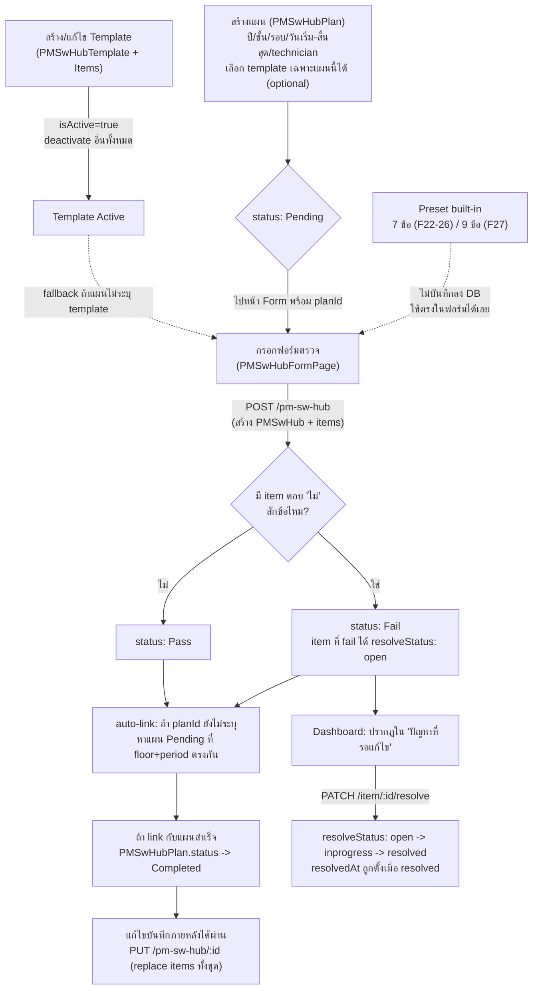
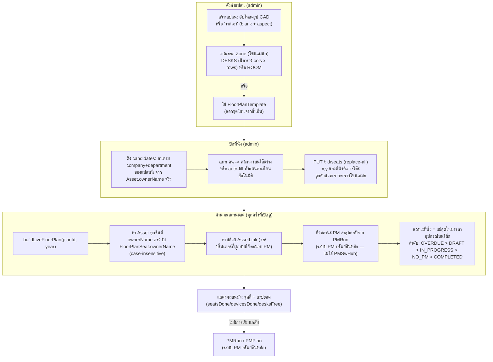

# MODULE: PM SW/Hub Room & Floor Plan

## Module Profile

โมดูลนี้ประกอบด้วยสองระบบย่อยที่เกี่ยวข้องกันแต่แยกกันทำงาน:

1. **PM SW/Hub Room** — ระบบ PM (Preventive Maintenance) คู่ขนานอีกชุดหนึ่ง แยกต่างหากจากระบบ PM ทรัพย์สิน (Asset-based PMRun ที่คุมด้วย `PMPlan`/`PMRun`/`PMTemplate`) ใช้สำหรับตรวจเช็คห้อง Network/Hub Room ตามชั้น (floor) และรอบเวลา (period) ไม่ผูกกับ `Asset` ใด ๆ โดยตรง — อ้างอิงเฉพาะ "ชั้น" (`floor: "F22".."F27"`) backend routes: `D:\ITSM\backend\src\routes\pmSwHub.ts`, `pmSwHubPlan.ts`, `pmSwHubTemplate.ts`
2. **FloorPlan** — ระบบปักหมุดผังชั้น (floor plan) ที่คำนวณสถานะ PM "สด" (live) จากข้อมูลจริง ณ เวลาที่เปิดดู แทนที่จะปักหมุดทีละอุปกรณ์แบบเดิม ระบบใหม่ปักหมุดที่ "คน" (ที่นั่ง/seat) แล้วให้อุปกรณ์ตามมาเองผ่าน `ownerName` backend: `D:\ITSM\backend\src\routes\floorplan.ts`, service คำนวณสถานะสด: `D:\ITSM\backend\src\services\floorPlanLive.ts`

ทั้งสองระบบเชื่อมกันตรงที่ FloorPlan ดึงสถานะ PM ของอุปกรณ์จาก `PMRun` (ระบบ PM ทรัพย์สินหลัก ไม่ใช่ PM SW/Hub) มาแสดงบนผัง — ดู `pmStatusByAsset()` ใน `floorPlanLive.ts:222-255` ส่วน PM SW/Hub Room เป็นแทร็กแยกต่างหากที่ไม่ปรากฏบน FloorPlan เลย

---

## Page Inventory

ยืนยัน route paths ทั้งหมดแล้วจาก `frontend/src/App.tsx:128-138` (ประกาศ `<Route>`) และ `frontend/src/navigation/nav.tsx:128-137` (เมนู sidebar)

| Page ID | Name | Route | Purpose | Role Required (frontend `ProtectedRoute`) | Evidence |
|---|---|---|---|---|---|
| PMSWHUB-01 | PM SW/Hub Dashboard | `/pm/sw-hub` | ภาพรวม/สถิติ/แผนผังสถานะรายชั้น (F22-F27), แนวโน้มรายเดือน, ปัญหาค้างแก้ | IT_ADMIN, SUPERADMIN | `frontend/src/App.tsx:128`, `frontend/src/pages/pm/PMSwHubDashboardPage.tsx:259` |
| PMSWHUB-02 | PM SW/Hub Form (ตรวจ/แก้ไข) | `/pm/sw-hub/new` (query: `floor`, `period`, `planId`, `recordId`) | เลือก Template แล้วกรอกแบบฟอร์มตรวจ checklist, แนบรูป, บันทึกผล | IT_ADMIN, SUPERADMIN | `frontend/src/App.tsx:129`, `frontend/src/pages/pm/PMSwHubFormPage.tsx:136` |
| PMSWHUB-03 | PM SW/Hub Plan List (Gantt) | `/pm/sw-hub/plans` | จัดการแผนตรวจ (CRUD) ต่อชั้น/ปี/รอบ, แสดง Gantt chart, export Excel/Print | IT_ADMIN, SUPERADMIN | `frontend/src/App.tsx:130`, `frontend/src/pages/pm/PMSwHubPlanListPage.tsx:103` |
| PMSWHUB-04 | PM SW/Hub Template List | `/pm/sw-hub/template` | รายการ Template checklist ทั้งหมด, สร้าง Template ใหม่จาก preset 7/9 ข้อ | IT_ADMIN, SUPERADMIN | `frontend/src/App.tsx:131`, `frontend/src/pages/pm/PMSwHubTemplateListPage.tsx:17` |
| PMSWHUB-05 | PM SW/Hub Template Editor/Preview | `/pm/sw-hub/template/:id`, `/pm/sw-hub/template/:id/edit` (`:id` = `new` สำหรับสร้างใหม่) | สร้าง/แก้ไข/ดูตัวอย่าง Template และรายการ checklist ในนั้น | IT_ADMIN, SUPERADMIN | `frontend/src/App.tsx:132-133`, `frontend/src/pages/pm/PMSwHubTemplatePage.tsx:76` |
| FLOORPLAN-01 | PM Floor Plan | `/pm/floorplan` | ดูผังชั้น, ปักที่นั่ง/โซน/อุปกรณ์ส่วนกลาง, ดูสถานะ PM สดต่อที่นั่ง/อุปกรณ์ | หน้าทั้งหน้าถูกจำกัดที่ IT_ADMIN/SUPERADMIN โดย frontend `ProtectedRoute` — แต่ backend เองอนุญาตให้ authenticated user ทุก role ดู (GET) ได้ ดู "SECURITY AUDIT NOTE" ด้านล่าง | `frontend/src/App.tsx:138`, `frontend/src/pages/pm/PMFloorPlanPage.tsx:121` |
| PMSCHED-01 | PM Schedule | `/pm/schedule` | ตาราง Gantt กำหนดการ **PM ทรัพย์สินหลัก** (ดึงจาก `pmAPI.plans()` ผูกกับ `PMPlan`/`PMRun` ไม่ใช่ `PMSwHubPlan`) — อยู่ในเมนูเดียวกับ PM SW/Hub แต่เป็นคนละระบบข้อมูล ไม่เชื่อมกับ PM SW/Hub Room เลย | IT_ADMIN, SUPERADMIN | `frontend/src/App.tsx:137`, `frontend/src/pages/pm/PMSchedulePage.tsx:72,92` |

หมายเหตุสำคัญ: แม้ backend `floorplan.ts` จะอนุญาตให้ authenticated user ทุก role เรียก GET ได้ (ดูออดิตด้านล่าง) แต่ frontend gate หน้า `/pm/floorplan` ทั้งหน้าไว้ที่ `roles={['IT_ADMIN','SUPERADMIN']}` ใน `ProtectedRoute` (`App.tsx:138`) ผู้ใช้ role อื่นจึงเข้าหน้านี้ไม่ได้อยู่ดีในทางปฏิบัติ — ส่วนที่ backend เปิดกว้างกว่า frontend คือช่องโหว่เชิงทฤษฎี (เช่น เรียก API ตรงด้วย token ของ user ทั่วไป) ไม่ใช่ช่องทางที่ UI พาไปถึง

---

## UI Components & Buttons/Actions

### PM SW/Hub Dashboard (`PMSwHubDashboardPage.tsx`)

| Component/Action | Behavior | Evidence |
|---|---|---|
| KPI cards (5 ใบ) | บันทึกทั้งหมด, ผ่าน, พบปัญหา, ปัญหาค้างแก้, อัตราผ่าน — คำนวณจาก `data` ที่โหลดทั้งหมดด้วย `useMemo` ฝั่ง client | `PMSwHubDashboardPage.tsx:276-288, 378-384` |
| Floor map cards (F22-F27) | คลิกเพื่อ toggle เลือกชั้น แสดง progress bar pass/fail ของบันทึกล่าสุดของชั้นนั้น; ชั้น 27 มี Chip "Critical" ติดถาวร | `PMSwHubDashboardPage.tsx:41, 438-495, 461-463` |
| ปุ่ม "PM ทรัพย์สิน" | navigate ไป `/pm` (ระบบ PM หลัก) | `PMSwHubDashboardPage.tsx:400` |
| ปุ่ม "Template" | navigate ไป `/pm/sw-hub/template` | `PMSwHubDashboardPage.tsx:401` |
| ปุ่ม "แผน SW/Hub" | navigate ไป `/pm/sw-hub/plans` | `PMSwHubDashboardPage.tsx:402` |
| ปุ่ม "ตรวจ SW/Hub Room" (contained) | navigate ไป `/pm/sw-hub/new` (สร้างบันทึกใหม่แบบไม่ผูก plan) | `PMSwHubDashboardPage.tsx:403` |
| แผงรายละเอียดชั้นที่เลือก | ตาราง 5 รายการล่าสุดของชั้น, ปุ่ม "ตรวจชั้น N" (`/pm/sw-hub/new?floor=FN`), ปุ่ม PDF ต่อแถว | `PMSwHubDashboardPage.tsx:499-557` |
| ปุ่ม PDF | เรียก `printRecordReport()` เปิดหน้าต่างใหม่พิมพ์รายงาน HTML แบบ standalone (inline CSS, ไม่ผ่าน React tree) | `PMSwHubDashboardPage.tsx:69-254` |
| กราฟแนวโน้มรายเดือน (AreaChart) | Pass/Fail ย้อนหลัง 6 เดือน จาก `data` ทั้งหมด | `PMSwHubDashboardPage.tsx:319-338, 566-593` |
| การ์ด "ปัญหาที่รอแก้ไข" | รวม item ที่ `resolveStatus === 'open'` จากทุก record, ปุ่ม "แสดงทั้งหมด/แสดงน้อยลง" toggle เกิน 8 รายการ | `PMSwHubDashboardPage.tsx:341-349, 644-680` |

### PM SW/Hub Form (`PMSwHubFormPage.tsx`)

| Component/Action | Behavior | Evidence |
|---|---|---|
| Step 1: เลือก Template | เลือกจาก built-in preset 2 แบบ (F22-26 มาตรฐาน 7 ข้อ, F27 Critical 9 ข้อ) หรือ Template ที่บันทึกไว้ใน DB | `PMSwHubFormPage.tsx:82-131, 269-274, 400-500` |
| Step 2: ฟอร์มตรวจ | เลือกชั้น/วันที่/รอบ/ผู้ตรวจ, ตอบ ใช่/ไม่/N/A ต่อรายการ, แนบรูปต่อรายการ (compress ด้วย `browser-image-compression` ก่อนอัปโหลด), ระบุหมายเหตุเมื่อตอบ "ไม่"/"N/A" | `PMSwHubFormPage.tsx:556-782, 682-696` |
| ปุ่ม "ทำทั้งหมด (Yes)" | ตั้งคำตอบทุกข้อเป็น `yes` พร้อมกัน | `PMSwHubFormPage.tsx:317-321, 606` |
| ปุ่ม "ล้างข้อมูล" | ล้างคำตอบ/หมายเหตุ/รูปทั้งหมดหลัง confirm | `PMSwHubFormPage.tsx:323-330, 607` |
| ปุ่ม "เพิ่มรายการตรวจสอบ" | เพิ่ม custom checklist item ชั่วคราว (key ขึ้นต้น `custom_`) ลบได้เฉพาะ item ที่เพิ่มเองในเซสชันนี้ | `PMSwHubFormPage.tsx:276-300, 740-780` |
| ตัวกรองกลุ่ม F27 | กลุ่ม "F27 — Critical Systems" ถูกซ่อนถ้าเลือกชั้นอื่นที่ไม่ใช่ 27 | `PMSwHubFormPage.tsx:302-306` |
| ภาพก่อน/หลังทำ | อัปโหลดแยก 2 slot BEFORE/AFTER ผ่าน endpoint `/pm-sw-hub/:id/images` (ต้องมี record id ก่อน อัปโหลดหลัง create/update) | `PMSwHubFormPage.tsx:387-388, 784-815` |
| ปุ่ม "บันทึกรายงาน" | validate floor/date/technician/checks ไม่ว่าง, คำนวณ `status: Fail` ถ้ามี item ใดตอบ "ไม่" แม้แต่ข้อเดียว, สร้างหรืออัปเดตตามมี `existingRecordId` | `PMSwHubFormPage.tsx:339-398` |

### PM SW/Hub Plan List (`PMSwHubPlanListPage.tsx`)

| Component/Action | Behavior | Evidence |
|---|---|---|
| Gantt chart matrix | มุมมองรายวัน/รายสัปดาห์/รายเดือน, เลื่อนช่วงเวลาด้วยปุ่มลูกศร/รีเซ็ต | `PMSwHubPlanListPage.tsx:253-320, 459-564` |
| ปุ่ม "Excel Report" | export `.xlsx` ด้วย `xlsx` lib รวมคอลัมน์ Gantt + ผลตรวจล่าสุดต่อรายการ template (ดึง Active Template เป็น header เสมอ ไม่ใช่ template เฉพาะของแต่ละแผน) | `PMSwHubPlanListPage.tsx:322-413` |
| ปุ่ม "PDF / Print" | `window.print()` พร้อม `PRINT_STYLES` global (ซ่อน `.no-print`) | `PMSwHubPlanListPage.tsx:94-101, 433` |
| การ์ดแผนต่อรายการ | ปุ่ม "ตรวจ SW/Hub" (ถ้ายัง Pending) หรือ "แก้ไขผลตรวจ" (ถ้า Completed) ไปหน้า Form พร้อม `planId` | `PMSwHubPlanListPage.tsx:651-673` |
| ปุ่มแก้ไข/ลบแผน | เปิด modal แก้ไข หรือลบหลัง `window.confirm` | `PMSwHubPlanListPage.tsx:139-151, 219-231, 675-676` |
| Modal สร้าง/แก้ไขแผน | ฟิลด์ปี/ชั้น/รอบ/ผู้รับผิดชอบ/วันเริ่ม-สิ้นสุด/Template (dropdown เลือก Template เฉพาะของแผนนี้ — ถ้าไม่เลือกจะ fallback ไปที่ Template ที่ `isActive` ตอนไปตรวจจริง) | `PMSwHubPlanListPage.tsx:685-764` |

### PM SW/Hub Template List/Editor (`PMSwHubTemplateListPage.tsx`, `PMSwHubTemplatePage.tsx`)

| Component/Action | Behavior | Evidence |
|---|---|---|
| การ์ด Template | แสดงจำนวนข้อ (`_count.items`), Chip "ใช้งานอยู่" ถ้า `isActive`, ปุ่ม Preview/แก้ไข/ลบ (ลบไม่ได้ถ้า active) | `PMSwHubTemplateListPage.tsx:75-102` |
| Modal "สร้าง Template ใหม่" | เลือก preset 7 ข้อ หรือ 9 ข้อ (TRR Standard) เป็นจุดตั้งต้น แล้ว navigate ไปหน้า editor พร้อม `?preset=7|9` | `PMSwHubTemplateListPage.tsx:106-139`, `PMSwHubTemplatePage.tsx:46-67, 104-106` |
| Editor: เพิ่ม/ลบ/จัดเรียงรายการ | ปุ่มลูกศรขึ้น/ลง สลับตำแหน่งแล้ว renumber `order`; เพิ่มรายการใหม่ด้วย key `custom_{timestamp}`; Checkbox "จำเป็น" ต่อรายการ; เลือกประเภทคำตอบ (boolean/text/rating/select) | `PMSwHubTemplatePage.tsx:119-179, 254-283` |
| Checkbox "เปิดใช้งานเป็นหลัก" (`isActive`) | ตั้ง template นี้เป็น active — backend จะ deactivate template อื่นทั้งหมดโดยอัตโนมัติ (ดู Business Rules) | `PMSwHubTemplatePage.tsx:198-201` |
| โหมด Preview vs Edit | กำหนดจาก URL: `/template/:id` = preview (read-only), `/template/:id/edit` หรือ `:id === 'new'` = edit | `PMSwHubTemplatePage.tsx:167-168` |

### PM Floor Plan (`PMFloorPlanPage.tsx`)

| Component/Action | Behavior | Evidence |
|---|---|---|
| ปุ่ม "เพิ่มแผนผังใหม่" (admin only) | เปิด modal สร้างแปลน เลือกโหมด "รูปภาพ" (อัปโหลดรูป CAD) หรือ "วาดเอง" (blank canvas + aspect ratio), เลือก template โซนตั้งต้นได้ | `PMFloorPlanPage.tsx:392-425` (backend), `1470-1541` (frontend modal) |
| Selector แปลน/ปี PM | เลือกแปลนที่จะดู และปี PM ที่จะคำนวณสถานะ live | `PMFloorPlanPage.tsx:706-721` |
| ปุ่ม "จัดผังที่นั่ง" (admin only) | เข้าโหมดแก้ไข (`isEditMode`), มี 3 แท็บย่อย: ที่นั่ง (seat), ส่วนกลาง (spot/pin), ผังโซน (zone) | `PMFloorPlanPage.tsx:738-741, 844-855` |
| แท็บ "ผังโซน" | ลากกรอบสร้างโซนใหม่, ลากย้าย/ปรับขนาดโซน, ตั้งคอลัมน์×แถว, เลือกสี, สลับ DESKS/ROOM, ปุ่ม "บันทึกเป็นเทมเพลต"/"ใช้เทมเพลต" | `PMFloorPlanPage.tsx:386-449, 857-936` |
| แท็บ "ที่นั่ง" | ค้นหา/กรองผู้สมัคร (candidates) ตามแผนก, ตัวกรอง "เฉพาะที่อยู่ในแผน PM", ปุ่ม auto-fill เติมทั้งแผนกลงโต๊ะว่างในโซนอัตโนมัติ, "arm" คนแล้วคลิกวางบนแปลนหรือคลิกช่องโต๊ะ | `PMFloorPlanPage.tsx:355-380, 550-604, 937-1030` |
| แท็บ "ส่วนกลาง" | ค้นหาทรัพย์สิน (เช่น เครื่องพิมพ์/network) แล้วเพิ่มเป็นหมุด (spot/pin) แยกจากที่นั่ง | `PMFloorPlanPage.tsx:451-462, 1060-1096` |
| ปุ่ม "ยกเลิก"/"บันทึกตำแหน่ง" | ยกเลิกคืนค่าฉบับร่างกลับเป็นข้อมูลจาก server, หรือบันทึก 3 อย่างพร้อมกัน (zones → seats → pins ตามลำดับ เพราะ seat อ้างอิงตำแหน่งจากตารางโซน) | `PMFloorPlanPage.tsx:464-496, 725-736` |
| Legend/สรุปด้านบนผัง | จำนวนที่นั่ง/อุปกรณ์ที่ PM ครบ, จำนวนต่อ device kind, สี status 5 แบบ, toggle แสดง/ซ่อนโซน-โต๊ะว่าง-หรี่แบบ, Chip เตือน "ที่นั่งนอกตาราง"/"ที่นั่งไม่พบอุปกรณ์" | `PMFloorPlanPage.tsx:752-824` |
| ปุ่ม "ตั้งค่าแปลน" (admin only) | เปิด modal แก้ไขชื่อ/ชั้น/อาคาร/บริษัท/รูป/aspect, ปุ่ม "ลบแปลนนี้" (ลบทั้งที่นั่ง/หมุดในแปลน) | `PMFloorPlanPage.tsx:742-745, 1470-1541` |
| คลิกที่นั่ง/หมุด | เปิดแผงรายละเอียดด้านข้าง แสดงอุปกรณ์ของเจ้าของที่นั่งนั้นพร้อมสถานะ PM, ลิงก์ไปหน้ารายละเอียด asset | `PMFloorPlanPage.tsx:1277, 1326, 1375-1401` |

---

## Forms & Fields

### PM SW/Hub Form (checklist ตรวจห้อง)

| Field | Type | Required | Notes | Evidence |
|---|---|---|---|---|
| floor | select (22-27) | ใช่ | บันทึกเป็น `F{n}` | `PMSwHubFormPage.tsx:568-571, 370` |
| date | DatePicker | ใช่ | | `PMSwHubFormPage.tsx:573-581` |
| period | select (Monthly/Quarterly/Annual) | ไม่ (default Monthly) | | `PMSwHubFormPage.tsx:583-589` |
| technician | text | ใช่ | | `PMSwHubFormPage.tsx:591-593` |
| checklist items (ต่อรายการใน template) | radio group ใช่/ไม่/N/A + note + photo | note บังคับทางตรรกะ UX เมื่อเลือก "ไม่"/"N/A" (ไม่ validate ฝั่ง backend) | เก็บเป็น `status: pass/fail/na`, `resolveStatus: open` อัตโนมัติเมื่อ fail | `PMSwHubFormPage.tsx:351-365, 624-733` |
| remark | multiline text | ไม่ | หมายเหตุรวมทั้งฟอร์ม | `PMSwHubFormPage.tsx:816-826` |
| photoBeforeUrl / photoAfterUrl | file upload | ไม่ | compress ก่อนอัปโหลด, ต้องมี record id ก่อนถึงอัปโหลดได้จริง | `PMSwHubFormPage.tsx:387-388` |

### PM SW/Hub Plan (แผนตรวจ)

| Field | Type | Required | Notes | Evidence |
|---|---|---|---|---|
| year | select | ใช่ (default ปีปัจจุบัน) | | `PMSwHubPlanListPage.tsx:694-698` |
| floor | select (F22-F27) | ใช่ | validate ฝั่ง frontend เท่านั้น | `PMSwHubPlanListPage.tsx:188, 700-705` |
| period | select | ใช่ (default Monthly) | | `PMSwHubPlanListPage.tsx:707-713` |
| technician | text | ไม่ | | `PMSwHubPlanListPage.tsx:715-717` |
| startDate / endDate | DatePicker | ใช่ | validate `endDate >= startDate` ฝั่ง frontend เท่านั้น (`invalidDateRange`) | `PMSwHubPlanListPage.tsx:65-67, 189-190, 719-735` |
| templateId | select | ไม่ | ถ้าไม่เลือก ใช้ template ที่ `isActive` ตอนไปตรวจจริง | `PMSwHubPlanListPage.tsx:737-751` |

### PM SW/Hub Template (แบบฟอร์ม checklist)

| Field | Type | Required | Notes | Evidence |
|---|---|---|---|---|
| name | text | ใช่ | unique ในฐานข้อมูล (`@@unique` บน `name`) | `PMSwHubTemplatePage.tsx:144`, schema doc `03_database_schema.md:804` |
| description | text | ไม่ | | `PMSwHubTemplatePage.tsx:220-226` |
| isActive | checkbox | — | ตั้ง active แล้ว template อื่นถูก deactivate อัตโนมัติ | `pmSwHubTemplate.ts:90-96` |
| items[].group | text (freeSolo autocomplete จาก `GROUP_OPTIONS`) | ใช่ (validate ก่อนบันทึก) | | `PMSwHubTemplatePage.tsx:30-44, 145` |
| items[].label | text | ใช่ | validate: ห้ามว่าง | `PMSwHubTemplatePage.tsx:145` |
| items[].type | select (boolean/text/rating/select) | — | default `boolean` | `PMSwHubTemplatePage.tsx:69-74` |
| items[].required | checkbox | — | เก็บไว้แต่ไม่ถูกใช้บังคับจริงในฟอร์ม PM SW/Hub | `PMSwHubTemplatePage.tsx:277-281` |

### Floor Plan — สร้าง/แก้ไขแปลน

| Field | Type | Required | Notes | Evidence |
|---|---|---|---|---|
| name | text | ใช่ | validate ฝั่ง backend (400 ถ้าว่าง) | `floorplan.ts:403` |
| floor | text | ไม่ (แต่ backend เก็บเป็น `''` ถ้าไม่ส่ง) | | `floorplan.ts:409` |
| building, company | text | ไม่ | | `floorplan.ts:410-411` |
| mode: รูปภาพ / วาดเอง | radio | — | ถ้า "รูปภาพ" ต้องแนบไฟล์ (jpeg/png/gif/webp, ≤10MB); ถ้า "วาดเอง" ใช้ `aspect` ratio แทน | `floorplan.ts:18-32, 405-413` |
| aspect | number | ไม่ | บังคับช่วง 0.2-5 มิฉะนั้น fallback เป็น 1.6 | `floorplan.ts:405, 413, 439` |
| templateId (ตอนสร้างใหม่เท่านั้น) | select | ไม่ | ลอกชุดโซนจากเทมเพลตมาเป็นจุดตั้งต้น | `floorplan.ts:417-419` |

### Floor Plan — โซน (Zone), ที่นั่ง (Seat), หมุดอุปกรณ์ (Pin)

| Field | Type | Required | Notes | Evidence |
|---|---|---|---|---|
| zone.code | text | ใช่ | uppercase, ห้ามซ้ำในแปลนเดียวกัน (validate 400) | `floorplan.ts:93-97, 109` |
| zone.kind | DESKS / ROOM | — | DESKS มีตาราง cols×rows, ROOM ไม่มีโต๊ะ | `floorplan.ts:112` |
| zone.cols / zone.rows | number | — | clamp 1-20 | `floorplan.ts:118-119` |
| seat.ownerName | text (จาก autocomplete รายชื่อเจ้าของทรัพย์สินจริง) | ไม่บังคับ (backend ไม่ validate) แต่ต้อง unique ต่อแปลน | ห้ามชื่อซ้ำในแปลนเดียวกัน (400) | `floorplan.ts:308-310` |
| seat.zoneId + seat.deskIndex | reference | ไม่ | ห้ามสองที่นั่งชี้โต๊ะเดียวกันในแปลนเดียวกัน (400); ถ้าเกาะโต๊ะ ตำแหน่ง x,y จะถูก server เขียนทับด้วยพิกัดที่คำนวณจากตารางโซนเสมอ | `floorplan.ts:312-318, 332-336` |
| pin.assetId | reference (Asset) | ใช่ | unique ต่อแปลน (`@@unique([floorPlanId, assetId])`) — ใช้กับเครื่องพิมพ์/อุปกรณ์เครือข่ายที่ไม่มีเจ้าของ | `03_database_schema.md:862`, `floorplan.ts:467-490` |

---

## CRUD Matrix

| Entity | Create | Read | Update | Delete | Evidence |
|---|---|---|---|---|---|
| PMSwHub (บันทึกตรวจ) | `POST /api/pm-sw-hub` | `GET /api/pm-sw-hub`, `GET /api/pm-sw-hub/:id`, `GET /api/pm-sw-hub/by-plan/:planId` | `PUT /api/pm-sw-hub/:id` (ลบ items เดิมทั้งหมดแล้วสร้างใหม่), `PATCH /api/pm-sw-hub/item/:id/resolve` | ไม่มี endpoint ลบบันทึก | `pmSwHub.ts:27-229` |
| PMSwHubItem | สร้างพร้อม parent เท่านั้น (nested create) | รวมมากับ parent | รวมมากับ parent update (delete-then-recreate) | ลบทั้งชุดเมื่อ parent ถูก `PUT` (ไม่มี endpoint ลบรายตัว) | `pmSwHub.ts:77-91, 193-220` |
| PMSwHubPlan | `POST /api/pm-sw-hub-plan` | `GET /api/pm-sw-hub-plan` | `PUT /api/pm-sw-hub-plan/:id` | `DELETE /api/pm-sw-hub-plan/:id` | `pmSwHubPlan.ts:11-97` |
| PMSwHubTemplate | `POST /api/pm-sw-hub-template/save` (ไม่มี `id`) | `GET /api/pm-sw-hub-template`, `/active`, `/:id` | `POST /api/pm-sw-hub-template/save` (มี `id`) | `DELETE /api/pm-sw-hub-template/:id` | `pmSwHubTemplate.ts:11-145` |
| PMSwHubTemplateItem | เขียนทับทั้งชุดผ่าน template save (deleteMany + createMany) | รวมมากับ parent | เหมือน create (replace-all) | ลบทั้งชุดเมื่อลบ/บันทึก template ใหม่ | `pmSwHubTemplate.ts:98-115` |
| FloorPlan | `POST /api/floorplans` (multipart, รองรับไม่มีรูป) | `GET /api/floorplans` (list, เฉพาะ `isActive`), `GET /api/floorplans/:id` (พร้อม pins), `GET /api/floorplans/:id/live` (คำนวณสด) | `PUT /api/floorplans/:id` | `DELETE /api/floorplans/:id` | `floorplan.ts:37-50, 68-79, 363-465` |
| FloorPlanZone | ผ่าน `PUT /api/floorplans/:id/zones` (upsert ทั้งชุด, ลบเฉพาะที่หายจาก payload) | รวมมากับ live/plan | เหมือน create (ทั้งชุด) | เหมือน create (ลบเฉพาะแถวที่หายจาก payload); ผ่าน `apply-template` จะลบทั้งหมดแล้วแทนที่ | `floorplan.ts:88-166, 174-201` |
| FloorPlanSeat | ผ่าน `PUT /api/floorplans/:id/seats` (replace-all: delete then createMany) | รวมมากับ live | เหมือน create (replace-all) | เหมือน create (replace-all — ส่ง array ว่างคือลบทั้งหมด) | `floorplan.ts:300-360` |
| FloorPlanPin | ผ่าน `PUT /api/floorplans/:id/pins` (replace-all: delete then createMany) | รวมมากับ `:id` และ live | เหมือน create (replace-all) | เหมือน create (replace-all) | `floorplan.ts:467-518` |
| FloorPlanTemplate | `POST /api/floorplans/:id/save-template` (upsert by name) | `GET /api/floorplans/templates/list` | เหมือน create (upsert เขียนทับถ้าชื่อซ้ำ) | `DELETE /api/floorplans/templates/:tid` | `floorplan.ts:204-257, 273-280` |

หมายเหตุ: PM SW/Hub Room **ไม่มี** endpoint ลบบันทึกตรวจ (`PMSwHub`) หรือลบรายการ checklist รายตัว (`PMSwHubItem`) — ต่างจาก FloorPlan ที่มี DELETE ครบทุก entity ระดับบนสุด

---

## API Inventory

Base path: `/api/pm-sw-hub` (`pmSwHub.ts`), `/api/pm-sw-hub-plan` (`pmSwHubPlan.ts`), `/api/pm-sw-hub-template` (`pmSwHubTemplate.ts`), `/api/floorplans` (`floorplan.ts`) — mount points ยืนยันจาก `backend/src/app.ts:137-139, 156`

### pmSwHub.ts (ทุก route ผ่าน `router.use(authenticate)` + `router.use(authorize('IT_ADMIN','SUPERADMIN'))` ที่บรรทัด 10-11)

| Method | Path | Purpose | Evidence |
|---|---|---|---|
| GET | `/` | รายการบันทึกตรวจทั้งหมด พร้อม items, เรียงตามวันที่ล่าสุด | `pmSwHub.ts:27-42` |
| POST | `/` | สร้างบันทึกตรวจใหม่พร้อม items แบบ nested create; ถ้าไม่ส่ง `planId` มา จะพยายาม auto-link กับแผน Pending ที่ตรงชั้น+รอบ; ถ้า link ได้ ตั้งสถานะแผนเป็น `Completed` | `pmSwHub.ts:46-105` |
| PATCH | `/item/:id/resolve` | อัปเดตสถานะแก้ไขปัญหาของรายการ (`resolveStatus`), ตั้ง `resolvedAt` เมื่อ resolved | `pmSwHub.ts:108-126` |
| GET | `/by-plan/:planId` | ดึงบันทึกล่าสุดของแผนที่ระบุ พร้อม template ที่ผูกกับแผนนั้น (คืน `null` ถ้าไม่มี ไม่ error) | `pmSwHub.ts:129-156` |
| GET | `/:id` | ดึงบันทึกตาม id พร้อม items/plan/template | `pmSwHub.ts:159-185` |
| PUT | `/:id` | แก้ไขบันทึก — ลบ items เดิมทั้งหมดแล้วสร้างใหม่จาก payload (ไม่ใช่ patch รายรายการ) | `pmSwHub.ts:188-229` |
| POST | `/:id/images` | อัปโหลดรูป BEFORE/AFTER (multer, บันทึกไฟล์ลง `uploads/pmswhub/`) | `pmSwHub.ts:232-257` |
| POST | `/upload-temp` | อัปโหลดรูปชั่วคราว (ใช้แนบรายการ checklist ก่อนมี record id) คืน URL อย่างเดียว ไม่ผูกกับ record ใด | `pmSwHub.ts:260-271` |

### pmSwHubPlan.ts (ทุก route ผ่าน `authenticate` + `authorize('IT_ADMIN','SUPERADMIN')` ที่บรรทัด 7-8)

| Method | Path | Purpose | Evidence |
|---|---|---|---|
| GET | `/` | รายการแผนทั้งหมด พร้อม `swHubs` (บันทึกที่ผูกไว้) และ `template`, เรียงปีล่าสุดก่อนแล้วตามชั้น | `pmSwHubPlan.ts:11-32, 94` |
| POST | `/` | สร้างแผนใหม่ | `pmSwHubPlan.ts:35-54, 95` |
| PUT | `/:id` | แก้ไขแผน (ทุกฟิลด์รวม status/templateId) | `pmSwHubPlan.ts:57-80, 96` |
| DELETE | `/:id` | ลบแผน | `pmSwHubPlan.ts:83-92, 97` |

### pmSwHubTemplate.ts (ทุก route ผ่าน `authenticate` + `authorize('IT_ADMIN','SUPERADMIN')` ที่บรรทัด 7-8)

| Method | Path | Purpose | Evidence |
|---|---|---|---|
| GET | `/` | รายการ template ทั้งหมด พร้อมนับจำนวน items (`_count`) | `pmSwHubTemplate.ts:11-26` |
| GET | `/active` | template ที่ `isActive: true` (legacy fallback สำหรับฟอร์มที่ไม่ผูก plan) | `pmSwHubTemplate.ts:29-44` |
| GET | `/:id` | template เดียวพร้อม items เรียงตาม `order` | `pmSwHubTemplate.ts:47-64` |
| POST | `/save` | สร้าง/แก้ไข template (upsert ตาม `id` ใน body) — ถ้า `isActive` เป็น `true` จะ deactivate template อื่นทั้งหมด, แล้ว replace-all items (deleteMany + createMany) | `pmSwHubTemplate.ts:67-129` |
| DELETE | `/:id` | ลบ template (cascade ลบ items ผ่าน FK `onDelete: Cascade`) | `pmSwHubTemplate.ts:132-143` |

### floorplan.ts (`router.use(authenticate)` ที่บรรทัด 34 คลุมทั้งไฟล์; เฉพาะ route ที่เขียนข้อมูลมี `authorize('IT_ADMIN','SUPERADMIN')` เพิ่มเป็น middleware ต่อ route — ดูตารางด้านล่างว่า route ไหนมี)

| Method | Path | Purpose | Auth เพิ่มเติมนอกจาก `authenticate` | Evidence |
|---|---|---|---|---|
| GET | `/` | รายการแปลนที่ `isActive`, เรียงตามชั้น, พร้อมนับจำนวน pins | ไม่มี (authenticated ทุก role) | `floorplan.ts:37-50` |
| GET | `/owners` | ค้นหาเจ้าของที่นั่งจากทะเบียนทรัพย์สินจริง (สำหรับตอนปักที่นั่ง) — ต้องประกาศก่อน `/:id` ไม่งั้น Express จับ "owners" เป็น id | ไม่มี | `floorplan.ts:52-66` |
| GET | `/:id/live` | ผังชั้นพร้อมสถานะ PM สดของทุกที่นั่ง/อุปกรณ์ ณ ปีที่ระบุ (คำนวณผ่าน `buildLiveFloorPlan`) | ไม่มี | `floorplan.ts:68-79` |
| PUT | `/:id/zones` | บันทึกโซนทั้งชุด (upsert by id/code, ลบเฉพาะที่หายจาก payload), ปรับ seat ที่หลุดตารางตามโซนที่เปลี่ยน | **มี** `authorize('IT_ADMIN','SUPERADMIN')` | `floorplan.ts:88-166` |
| GET | `/templates/list` | รายการ FloorPlanTemplate ทั้งหมดพร้อมนับโซน/โต๊ะ | ไม่มี | `floorplan.ts:204-220` |
| POST | `/:id/save-template` | บันทึกชุดโซนของแปลนนี้เป็น template ใหม่ (upsert by name) | **มี** | `floorplan.ts:223-257` |
| POST | `/:id/apply-template` | ทับชุดโซนของแปลนนี้ด้วย template (ลบโซนเดิมทั้งหมดก่อน) | **มี** | `floorplan.ts:260-271` |
| DELETE | `/templates/:tid` | ลบ FloorPlanTemplate | **มี** | `floorplan.ts:273-280` |
| GET | `/:id/candidates` | รายชื่อคนที่ควรอยู่บนแปลนนี้ (ตามบริษัท+แผนก) พร้อม flag ว่าอยู่ในแผน PM ปีนี้หรือยัง/วางแล้วหรือยัง | ไม่มี | `floorplan.ts:283-292` |
| PUT | `/:id/seats` | บันทึกที่นั่งทั้งชุด (replace-all), validate ชื่อซ้ำ/โต๊ะซ้ำ | **มี** | `floorplan.ts:300-360` |
| GET | `/:id` | แปลนเดียวพร้อม pins + asset info พื้นฐาน | ไม่มี | `floorplan.ts:363-389` |
| POST | `/` | สร้างแปลนใหม่ (multipart, รูปไม่บังคับ, เลือก templateId ลอกโซนตั้งต้นได้) | **มี** | `floorplan.ts:400-425` |
| PUT | `/:id` | แก้ไขแปลน (multipart) | **มี** | `floorplan.ts:428-453` |
| DELETE | `/:id` | ลบแปลน | **มี** | `floorplan.ts:456-465` |
| PUT | `/:id/pins` | บันทึกหมุดอุปกรณ์ทั้งชุด (replace-all) | **มี** | `floorplan.ts:467-518` |

---

## Database Tables

ดูรายละเอียดคอลัมน์ครบถ้วนใน `docs/system-blueprint/03_database_schema.md`:
- ส่วน "6. PM SW Hub" (`03_database_schema.md:740-824`): `PMSwHub`, `PMSwHubPlan`, `PMSwHubItem`, `PMSwHubTemplate`, `PMSwHubTemplateItem`
- ส่วน "7. FloorPlan" (`03_database_schema.md:828-927`): `FloorPlan`, `FloorPlanPin`, `FloorPlanSeat`, `FloorPlanTemplate`, `FloorPlanZone`

จุดเชื่อมข้ามระบบที่ควรรู้ (ไม่มี FK บังคับ เป็น string join ทั้งคู่):
- `FloorPlanSeat.ownerName` ↔ `Asset.ownerName` (case-insensitive, trim) — กลไกหลักที่ทำให้อุปกรณ์ "ตามคนไป" บนผัง ดู `floorPlanLive.ts:276-294`
- `FloorPlanPin.assetId` → `Asset.id` (FK จริง) — ใช้เฉพาะอุปกรณ์ที่ไม่มีเจ้าของ เช่น เครื่องพิมพ์/network
- `PMRun.assetId` → คำนวณสถานะ PM ที่แสดงบนผัง (ระบบ PM ทรัพย์สินหลัก) ดู `floorPlanLive.ts:222-255` — **ไม่เกี่ยวกับ** `PMSwHub`/`PMSwHubPlan` เลย
- `PMSwHub.planId` → `PMSwHubPlan.id` (`onDelete: SetNull`) และ `PMSwHubPlan.templateId` → `PMSwHubTemplate.id` (`onDelete: SetNull`) — ทั้งสองเป็น FK จริงภายในระบบ PM SW/Hub เอง แยกขาดจาก `Asset`/`PMPlan`/`PMRun` โดยสิ้นเชิง

---

## Workflow

### PM SW/Hub Room — วงจร template → plan → run/inspect → close



หมายเหตุ workflow:
- การเชื่อม `PMSwHub` กับ `PMSwHubPlan` เป็นแบบ "soft link" — สร้างบันทึกโดยไม่ระบุ `planId` ได้เสมอ (เข้าหน้า `/pm/sw-hub/new` ตรง ๆ ไม่ผ่านแผน) ระบบจะพยายาม auto-link ให้เองถ้าชั้น+รอบตรงกับแผน Pending ที่มีอยู่ (`pmSwHub.ts:52-61`) มิฉะนั้นบันทึกจะลอยไม่มีแผนแม่ตลอดไป
- ไม่มี state machine บังคับสำหรับ `PMSwHubPlan.status` — มีแค่ 2 ค่า (`Pending`/`Completed`) และเปลี่ยนเป็น `Completed` อัตโนมัติเพียงจุดเดียวคือตอน auto-link สำเร็จตอนสร้างบันทึก (`pmSwHub.ts:93-98`) ไม่มี logic ย้อนกลับเป็น `Pending`
- Template ที่ผูกกับ record ที่บันทึกไปแล้วเป็น snapshot ทางอ้อม — `PMSwHubItem` เก็บ `category`/`checkItem` เป็น string ตรง ๆ ไม่ใช่ FK ไปยัง `PMSwHubTemplateItem` ดังนั้นแก้ template ภายหลังจะไม่กระทบบันทึกเก่าที่บันทึกไปแล้ว

### FloorPlan — การปักหมุดและความสัมพันธ์กับ PM scheduling



หมายเหตุ workflow:
- FloorPlan เป็น **read-model แบบคำนวณสด** สำหรับสถานะ PM — ไม่มีการเขียนข้อมูลกลับไปยัง `PMRun`/`PMPlan` จากหน้านี้เลย การไปทำ PM จริงต้องออกจากหน้านี้ไปที่ระบบ PM ทรัพย์สินหลัก (ปุ่ม "รายการ PM" นำไป `/pm/runs`) — ดู `PMFloorPlanPage.tsx:700`
- กลไก "อุปกรณ์ตามคนไป" ผูกกับ `ownerName` ที่เป็น free-text ไม่ใช่ FK จึงมีความเสี่ยงข้อมูลไม่ตรงกัน (สะกดชื่อคลาดเคลื่อน, คนลาออกแต่ asset ยังค้าง ownerName เดิม) — UI มี Chip เตือน "ที่นั่งไม่พบอุปกรณ์" (`seatsUnplaced`) เพื่อจับปัญหานี้ (`floorPlanLive.ts:434-435`, `PMFloorPlanPage.tsx:817-822`)
- **FloorPlan ไม่เชื่อมกับ PM SW/Hub Room เลย** — ปักหมุดเฉพาะทรัพย์สิน (`Asset`) ที่อยู่ในระบบ PM หลัก ไม่มีการอ้างอิงถึง `PMSwHub`/`PMSwHubPlan`/ตู้ Switch-Hub บนผังแต่อย่างใด (ยืนยันจาก grep ทั้ง `floorplan.ts` และ `floorPlanLive.ts` ไม่พบการอ้างอิงโมเดล `PMSwHub*` เลย)

---

## Business Rules

1. **สถานะบันทึกตรวจคำนวณจาก item ที่แย่ที่สุด**: ถ้ามี checklist item ใดในบันทึกตอบ "ไม่" (fail) แม้แต่ข้อเดียว บันทึกทั้งใบจะถูกตั้ง `status: 'Fail'` ทันที ไม่ขึ้นกับสัดส่วน pass/fail — `PMSwHubFormPage.tsx:350-356, 375`
2. **`resolveStatus` ถูกตั้งอัตโนมัติเฉพาะ item ที่ fail**: item ที่ตอบ pass/na จะได้ `resolveStatus: null` เสมอ ไม่มีสถานะให้ track ต่อ; เฉพาะ item ที่ fail จะได้ `resolveStatus: 'open'` เริ่มต้น — `PMSwHubFormPage.tsx:363`
3. **Auto-link บันทึกกับแผน**: ตอนสร้างบันทึกโดยไม่ระบุ `planId` explicit ระบบจะค้นหาแผนที่ `status: 'Pending'` ที่ `floor` และ `period` ตรงกัน เรียงเอาอันที่ `startDate` เร็วที่สุด — ถ้ามีแผน Pending มากกว่า 1 รายการชั้น/รอบเดียวกัน จะ auto-link กับอันแรกเสมอโดยไม่ถามผู้ใช้ — `pmSwHub.ts:52-61`
4. **แผนถูกปิดอัตโนมัติเมื่อบันทึกสำเร็จ**: การ auto-link (ข้อ 3) หรือระบุ `planId` ตรง ๆ ตอนสร้างบันทึก จะทำให้ `PMSwHubPlan.status` เปลี่ยนเป็น `'Completed'` ทันที — ไม่มีเงื่อนไขว่าผลตรวจต้อง Pass ก่อนถึงจะปิดแผนได้ (แผนที่ Fail ก็ถูกปิดเหมือนกัน) — `pmSwHub.ts:93-98`
5. **แก้ไขบันทึกคือ replace-all ของ items เสมอ**: `PUT /pm-sw-hub/:id` ลบ `PMSwHubItem` เดิมทั้งหมดแล้วสร้างใหม่จาก payload ทุกครั้ง — ไม่มี partial update รายรายการ (ยกเว้น resolve status ผ่าน endpoint แยก) — `pmSwHub.ts:193-220`
6. **Template เดียวที่ active ได้ในคราวเดียว**: บันทึก template ด้วย `isActive: true` จะ deactivate ทุก template อื่นทันที (`updateMany where id != this`) — เป็น global switch ไม่ใช่ per-plan — `pmSwHubTemplate.ts:90-96`
7. **Template ผูกกับ plan เป็น snapshot ทางอ้อม ไม่ใช่ FK ต่อ item**: `PMSwHubItem.category`/`checkItem` เก็บเป็น string คัดลอกจาก template ตอนบันทึก ไม่อ้างอิง `PMSwHubTemplateItem.id` — แก้ template ภายหลังไม่กระทบบันทึกเก่า — สังเกตจาก schema (`03_database_schema.md:784-797`) ที่ไม่มี FK จาก `PMSwHubItem` ไปยัง `PMSwHubTemplateItem`
8. **กลุ่ม "F27 — Critical Systems" ถูกกรองออกถ้าไม่ใช่ชั้น 27**: แม้ template จะมีกลุ่มนี้อยู่ ฟอร์มจะไม่แสดงกลุ่มนี้เมื่อ `floor !== '27'` — `PMSwHubFormPage.tsx:302-306`
9. **โซนที่มีคนนั่งอยู่ ลบไม่ได้เงียบ ๆ**: ลบโซน (`removeZone`) หรือย่อ cols/rows ให้เล็กกว่าจำนวนที่นั่งเดิม (`PUT /:id/zones`) จะทำให้ที่นั่งที่อยู่ในช่องที่หายไปหลุดเป็น "หมุดอิสระ" (`zoneId: null, deskIndex: null`) — ไม่ถูกลบทิ้ง แต่ต้องย้ายตำแหน่งใหม่ — `floorplan.ts:136-147`, `PMFloorPlanPage.tsx:442-448`
10. **ที่นั่งที่เกาะโต๊ะ ตำแหน่งมาจากโซนเสมอ**: แม้ frontend จะส่งพิกัด `x,y` มาด้วย backend จะคำนวณตำแหน่งจริงจากตารางของโซน (`deskGeometry`) ทับค่าที่ส่งมาเสมอเมื่อที่นั่งมี `zoneId`+`deskIndex` — กันพิกัดเก่าค้างเมื่อโซนถูกขยับ — `floorplan.ts:320-326, 332-336`
11. **Validation กันชนกันของที่นั่ง/โต๊ะทำที่ backend เท่านั้น**: ชื่อเจ้าของซ้ำในแปลนเดียวกัน หรือสองที่นั่งชี้โต๊ะเดียวกัน ถูกปฏิเสธด้วย HTTP 400 ที่ `PUT /:id/seats` — เป็น business rule เดียวที่มี validation ระดับ backend ในทั้งสองระบบนี้ (นอกนั้นพึ่งพา frontend validate เท่านั้น) — `floorplan.ts:306-318`
12. **อุปกรณ์ "ตามคนไป" เฉพาะ 3 ประเภท**: `notebook`, `desktop`, `monitor` เท่านั้นที่ตามเจ้าของอัตโนมัติผ่าน `ownerName` — เครื่องพิมพ์/อุปกรณ์เครือข่าย (`printer`, `network`) ต้องปักหมุด (`FloorPlanPin`) เองเสมอเพราะเป็นของใช้ร่วมกัน (มี ownerName แค่ ~5%) — `floorPlanLive.ts:26-42`
13. **สถานะที่นั่งใช้กฎ "แย่สุดชนะ"**: ที่นั่งหนึ่งมีได้หลายอุปกรณ์ สถานะที่แสดงบนผังคือสถานะที่แย่ที่สุดในบรรดาอุปกรณ์ทั้งหมดบนโต๊ะนั้น ตามลำดับ `OVERDUE > DRAFT > IN_PROGRESS > NO_PM > COMPLETED` (ที่นั่งจะเขียวได้ก็ต่อเมื่อทุกเครื่องบนโต๊ะ COMPLETED จริง) — `floorPlanLive.ts:46-65`
14. **งานที่ยังไม่เสร็จแต่เลยกำหนดแผนแล้ว ถูก override เป็น OVERDUE**: แม้ `PMRun.status` เดิมจะไม่ใช่ OVERDUE แต่ถ้า plan ที่ผูกอยู่มี `endDate` ผ่านมาแล้วและงานยังไม่ `COMPLETED` ระบบจะ override สถานะเป็น `OVERDUE` ตอนคำนวณ live — `floorPlanLive.ts:242-246`
15. **ลบ FloorPlanTemplate ไม่กระทบแปลนที่เคยใช้เทมเพลตนั้น**: เพราะ `zones` ใน template เป็น JSON snapshot ไม่ใช่ FK relation ไปยัง `FloorPlanZone` จริง — `03_database_schema.md:898, 903`

---

## Notifications Triggered

**ไม่มี** — ตรวจสอบทั้ง 4 ไฟล์ route (`pmSwHub.ts`, `pmSwHubPlan.ts`, `pmSwHubTemplate.ts`, `floorplan.ts`) ด้วยการค้นหาคำว่า `notify`/`Notification`/`sendMail`/`createNotification`/`emit` ไม่พบการเรียกใช้แม้แต่จุดเดียว และ `backend/src/services/agentMonitors.ts` (ไฟล์ monitor ที่พบในรายการไฟล์ที่แก้ไข) ก็ไม่มีการอ้างอิงถึงโมเดล `PMSwHub*`/`FloorPlan*` เลย ทั้งสองระบบนี้จึงไม่ส่ง notification ใด ๆ ในระบบ ไม่ว่าจะเป็นการสร้างบันทึก PM ที่ Fail, ปิดแผน, หรือปักที่นั่งใหม่

---

## SECURITY AUDIT NOTE

**คำถาม**: `floorplan.ts` มีหลาย route ที่เรียก `authorize('IT_ADMIN','SUPERADMIN')` โดยไม่เห็น `authenticate` ชัดเจนในบรรทัดเดียวกัน (ต่างจากไฟล์ route อื่นในระบบที่มักเขียน `authenticate, authorize(...)` คู่กันในบรรทัดเดียว) — เป็นช่องโหว่ที่ authorize ทำงานได้โดยไม่มี authenticate มาก่อนหรือไม่?

**คำตอบ: ไม่ใช่ช่องโหว่ — มี `authenticate` ครอบคลุมทุก route ในไฟล์นี้แน่นอน**

หลักฐาน: `D:\ITSM\backend\src\routes\floorplan.ts:34` มีบรรทัด

```ts
router.use(authenticate);
```

วางอยู่ที่ระดับ router **ก่อน** การประกาศ route ทั้งหมด (route แรกเริ่มที่บรรทัด 37) เนื่องจาก Express middleware ที่ผูกกับ `router.use()` จะถูกรันเรียงลำดับก่อนทุก route handler ที่ประกาศตามหลัง ดังนั้น**ทุก route ในไฟล์นี้ (ทั้ง GET และ route ที่เขียนข้อมูล) ต้องผ่าน `authenticate` ก่อนเสมอ** โดยไม่มีข้อยกเว้น

รูปแบบที่ใช้ในไฟล์นี้ต่างจาก `pmSwHub.ts`, `pmSwHubPlan.ts`, `pmSwHubTemplate.ts` ตรงที่ 3 ไฟล์หลังเรียก `router.use(authenticate)` **และ** `router.use(authorize('IT_ADMIN','SUPERADMIN'))` เป็น global middleware ทั้งคู่ (บังคับทุก route ให้เป็น IT_ADMIN/SUPERADMIN หมด) ในขณะที่ `floorplan.ts` เรียกเฉพาะ `authenticate` แบบ global (บรรทัด 34) แล้วเพิ่ม `authorize('IT_ADMIN','SUPERADMIN')` เป็น **per-route middleware** เฉพาะ route ที่เขียนข้อมูล (เช่น บรรทัด 88, 223, 260, 273, 300, 400, 428, 456, 468) นี่คือการออกแบบตั้งใจ ไม่ใช่ความผิดพลาด — เพื่อให้ endpoint อ่านข้อมูล (`GET /`, `GET /owners`, `GET /:id/live`, `GET /templates/list`, `GET /:id/candidates`, `GET /:id`) เปิดให้ authenticated user **ทุก role** (SUPERADMIN, IT_ADMIN, USER, VIEWER) ดูผังชั้นได้ ในขณะที่ endpoint เขียนข้อมูลทั้งหมด (POST/PUT/DELETE) ยังคงจำกัดเฉพาะ IT_ADMIN/SUPERADMIN

สรุปสถานะ authorization ต่อ route (นับจากไฟล์จริง):
- **มี `authenticate` (global, บรรทัด 34) + ไม่มี `authorize` เพิ่ม** → authenticated user ทุก role เข้าถึงได้: `GET /`, `GET /owners`, `GET /:id/live`, `GET /templates/list`, `GET /:id/candidates`, `GET /:id`
- **มี `authenticate` (global) + มี `authorize('IT_ADMIN','SUPERADMIN')` เพิ่มต่อ route** → เฉพาะ IT_ADMIN/SUPERADMIN: `PUT /:id/zones` (88), `POST /:id/save-template` (223), `POST /:id/apply-template` (260), `DELETE /templates/:tid` (273), `PUT /:id/seats` (300), `POST /` (400), `PUT /:id` (428), `DELETE /:id` (456), `PUT /:id/pins` (468)

ไม่มี route ใดในไฟล์นี้ที่ไม่มี `authenticate` เลย — ข้อกังวลในโจทย์ไม่พบหลักฐานสนับสนุนหลังตรวจโค้ดจริง อย่างไรก็ตาม ผลที่เกิดขึ้นจริงคือ endpoint อ่านข้อมูล 6 ตัวข้างต้นเปิดกว้างกว่าที่ frontend ต้องการ — เพราะหน้า `/pm/floorplan` ทั้งหน้าถูก frontend `ProtectedRoute` จำกัดไว้ที่ IT_ADMIN/SUPERADMIN เท่านั้น (`App.tsx:138`) ผู้ใช้ role USER/VIEWER จึงเข้าไม่ถึงหน้านี้ผ่าน UI อยู่ดี แต่ถ้ามี token ของ USER/VIEWER อยู่ในมือ ก็สามารถเรียก endpoint อ่านข้อมูลเหล่านี้ตรง ๆ ได้ (เช่น เห็นรายชื่อพนักงานพร้อมแผนกจาก `GET /owners`, หรือเห็นผังที่นั่งทั้งชั้นจาก `GET /:id/live`) ซึ่งเป็นพฤติกรรมที่ตั้งใจออกแบบไว้ (ดู comment ในโค้ดเกี่ยวกับการเปิดให้ดูข้อมูลได้กว้างขึ้น) ไม่ใช่บั๊ก — แต่ควรเป็นที่รับทราบว่า role ต่ำกว่า IT_ADMIN สามารถเห็นข้อมูลตำแหน่งที่นั่ง/แผนกของพนักงานทั้งหมดได้หากเรียก API ตรง

---

## Unknown / Not Verified

- **PMSwHubItem.status validation**: ค่า `status` ที่ backend รับใน `POST`/`PUT /pm-sw-hub` (`pass`/`fail`/`na`) ไม่ถูก validate ฝั่ง backend เลย (ไม่มี enum check หรือ whitelist) — ค่าอื่นที่ frontend ไม่ได้ส่งตามปกติก็ถูกบันทึกได้ทั้งหมด ยังไม่ยืนยันว่ามี validation อยู่ที่ Prisma schema level หรือไม่ (คอลัมน์เป็น `String?` ธรรมดา)
- **สิทธิ์ resolve item**: endpoint `PATCH /pm-sw-hub/item/:id/resolve` ไม่ตรวจสอบว่า item ที่จะ resolve นั้น `status: 'fail'` จริงหรือไม่ — เรียกกับ item ที่ pass/na ก็ทำงานได้เหมือนกัน (ตั้ง `resolveStatus` ได้อย่างอิสระ) ยังไม่ตรวจสอบว่า frontend เคย exploit เส้นทางนี้หรือไม่
- **จำนวนแผนก/รายชื่อพนักงานที่ FloorPlan candidates ใช้**: อ้างอิงจาก comment ในโค้ด `floorPlanLive.ts:507-509` ว่าแผน PM ทั้ง 32 แผนมีค่า `site` เป็น "HQ" กับ "คลังพระประแดง" เท่านั้น (ไม่มี "ชั้น") — ตัวเลข 32 แผนนี้เป็นข้อมูล ณ เวลาที่เขียน comment ในโค้ด ไม่ได้ query ยืนยันสดจากฐานข้อมูลจริงในการตรวจสอบนี้
- **PMSchedulePage.tsx ความสัมพันธ์กับ SW/Hub**: ยืนยันจากโค้ดแล้วว่าใช้ `pmAPI.plans()` (ระบบ PM ทรัพย์สินหลัก) ไม่ใช่ `pmSwHubPlanService` — แต่ไม่ได้ไล่อ่านทั้งไฟล์ `PMSchedulePage.tsx` (505 บรรทัด) และไฟล์ประกอบ `pmSchedule.ts`/`pmScheduleExport.ts`/`components/GanttChart.tsx` โดยละเอียด เพราะอยู่นอกขอบเขตของโมดูลนี้ตามที่ได้รับมอบหมาย (คือ "PM SW/Hub Room และ FloorPlan") — ระบุไว้เป็นข้อมูลอ้างอิงเท่านั้น
- **DeviceIcons.tsx และ Modal.tsx**: ไม่ได้อ่านเนื้อไฟล์แบบละเอียดทีละบรรทัด (component ใช้ร่วมกันทั่วทั้งกลุ่มหน้า PM ไม่ใช่ business logic เฉพาะโมดูลนี้) — ยืนยันแค่ว่ามีอยู่จริงและถูก import ใช้งาน (`PMFloorPlanPage.tsx:17-18`)
- **การ validate ไฟล์รูปของ PM SW/Hub upload**: `pmSwHub.ts` ใช้ `multer` แบบไม่มี `fileFilter`/`limits` (ต่างจาก `floorplan.ts` ที่มี `fileFilter` จำกัดชนิดไฟล์และ `limits: { fileSize: 10MB }` ชัดเจนที่บรรทัด 26-31) — หมายความว่า endpoint อัปโหลดรูปของ PM SW/Hub Room (`/pm-sw-hub/:id/images`, `/pm-sw-hub/upload-temp`) ไม่จำกัดชนิดไฟล์หรือขนาดไฟล์เลยที่ระดับ backend ยังไม่ได้ตรวจสอบเพิ่มเติมว่ามี validation อยู่ที่ middleware อื่นหรือ reverse proxy หรือไม่

