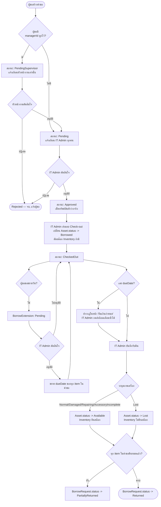

# MODULE: Borrow / Return (ระบบยืม-คืน)

> Confidence: **LEVEL 1 — VERIFIED** — เขียนจากการอ่าน `backend/src/routes/borrow.ts` (1200+ บรรทัด อ่านครบ), `backend/src/middleware/validation.ts` (schema ของโมดูลนี้), และหน้า frontend ทั้ง 13 หน้าในโฟลเดอร์ `frontend/src/pages/borrow/` อ่านครบทุกไฟล์ ผู้เขียนเอกสารนี้เป็นผู้พัฒนาฟีเจอร์ "หัวหน้างานอนุมัติ" ในโมดูลนี้เองในเซสชันเดียวกัน จึงยืนยันโค้ดได้ตรงที่สุดในทุกโมดูลของระบบ

## Module Profile

| หัวข้อ | รายละเอียด |
|---|---|
| Module ID | MOD-BORROW |
| Purpose | จัดการวงจรยืม-คืนทรัพย์สิน IT และวัสดุสิ้นเปลืองภายในองค์กร ตั้งแต่สร้างคำขอ, อนุมัติ (2 ขั้นได้), ส่งมอบ, รับคืน, ขยายเวลา, จนถึงติดตามรายการเกินกำหนด |
| Business Objective | ควบคุมการเบิก-คืนอุปกรณ์ให้ตรวจสอบย้อนหลังได้ทุกขั้นตอน มีการอนุมัติก่อนจ่ายจริง และเตือนเมื่อเกินกำหนดคืน |
| Users | พนักงานทุกคน (ผู้ขอยืม), หัวหน้างาน (ผู้อนุมัติขั้น 1 — ไม่ใช่ role แยก), IT Admin/SuperAdmin (ผู้อนุมัติขั้น 2 + จ่าย-รับของจริง) |
| Roles | ไม่จำกัด role สำหรับสร้าง/ดูคำขอของตัวเอง; `IT_ADMIN`,`SUPERADMIN` สำหรับคิวงานฝั่งแอดมิน; ผู้ถือ `managerId` ของผู้ขอ (ไม่ผูก role) สำหรับขั้นหัวหน้างาน |
| Parent Menu | "ระบบยืม-คืน" (adminNav) + รายการเดี่ยวใน userNavItems |
| Related Modules | Assets (เปลี่ยนสถานะ Asset เมื่อจ่าย/รับคืน), Inventory (ตัด/คืนสต๊อกวัสดุสิ้นเปลือง), Notifications (ทุกจุดเปลี่ยนสถานะ) |
| Dependencies | `AppUser.managerId` (self-relation), `NotificationSetting` (borrowDays, maxBorrowDays, maxItemsPerRequest, allowExtension, maxExtensionsPerRequest, overdueWarningDays) |

## Page Inventory

| Page ID | ชื่อ | Route | ผู้ใช้ | Purpose |
|---|---|---|---|---|
| PAGE-BOR-01 | ยืมทรัพย์สิน | `/borrow/new` | ทุกคน | สร้างคำขอยืม (multi-item: asset + inventory) |
| PAGE-BOR-02 | คำขอของฉัน | `/borrow/my-requests` | ทุกคน | ดู/ยกเลิกคำขอของตัวเอง แยกตาม tab สถานะ |
| PAGE-BOR-03 | รายการที่ยืม | `/borrow/my-items` | ทุกคน | ดูของที่ถืออยู่ตอนนี้ + ขอขยายวัน + ยกเลิกคำขอ |
| PAGE-BOR-04 | คำขอขยายวันของฉัน | `/borrow/my-extensions` | ทุกคน | ติดตามผลคำขอขยายวันที่ยื่นไปแล้ว |
| PAGE-BOR-05 | ประวัติการยืม | `/borrow/my-history` | ทุกคน | ประวัติของที่คืนแล้วทั้งหมดของตัวเอง |
| PAGE-BOR-06 | อนุมัติคำขอยืม (หัวหน้างาน) | `/borrow/supervisor-queue` | ทุกคน (กรองจริงด้วย managerId) | อนุมัติ/ปฏิเสธคำขอของลูกทีมตัวเอง |
| PAGE-BOR-07 | คำขอทั้งหมด | `/borrow/all-requests` | IT_ADMIN, SUPERADMIN | ภาพรวมคำขอทุกสถานะ + stat tiles operational |
| PAGE-BOR-08 | รออนุมัติ (IT Admin) | `/borrow/approval-queue` | IT_ADMIN, SUPERADMIN | อนุมัติขั้นสุดท้ายก่อนจ่ายของ |
| PAGE-BOR-09 | ส่งมอบ (Check-out) | `/borrow/checkout` | IT_ADMIN, SUPERADMIN | บันทึกส่งมอบของจริง พร้อมลายเซ็น/รูปหลักฐาน |
| PAGE-BOR-10 | รับคืน (Return) | `/borrow/return` | IT_ADMIN, SUPERADMIN | บันทึกรับคืน ระบุสภาพเครื่อง พร้อมลายเซ็น/รูปหลักฐาน |
| PAGE-BOR-11 | ขยายวัน (Extension) | `/borrow/extensions` | IT_ADMIN, SUPERADMIN | อนุมัติ/ปฏิเสธคำขอขยายวันของพนักงาน |
| PAGE-BOR-12 | ยืมเกินกำหนด | `/borrow/overdue` | IT_ADMIN, SUPERADMIN | ดูรายการเกินกำหนด + ส่งอีเมลเตือนซ้ำ |
| PAGE-BOR-13 | ประวัติทั้งหมด | `/borrow/history` | IT_ADMIN, SUPERADMIN | ประวัติทุกคำขอทั้งระบบ + สถิติ on-time/damaged/top asset |

## Workflow หลัก (state machine เต็ม)



**จุดสำคัญ:** เมื่อหัวหน้างานอนุมัติแล้ว สถานะเปลี่ยนตรงเป็น `Pending` (สถานะเดียวกับกรณีไม่มีหัวหน้างาน) ทำให้โค้ดฝั่ง IT Admin (`status !== 'Pending'` guard) ใช้ร่วมกันได้โดยไม่ต้องเขียนเงื่อนไขใหม่ — เป็นการตัดสินใจออกแบบที่ตั้งใจไว้ (`backend/src/routes/borrow.ts` comment ใน route `POST /requests`)

## Database Status Enums

```prisma
enum BorrowRequestStatus {
  PendingSupervisor  // ใหม่ — รอหัวหน้างานอนุมัติ
  Pending            // รอ IT Admin อนุมัติ (หรือเข้ามาตรงถ้าไม่มีหัวหน้างาน)
  Approved
  Rejected
  CheckedOut
  PartiallyReturned
  Returned
  Cancelled
}
enum BorrowItemStatus { Pending Approved Rejected CheckedOut Returned PartiallyReturned Cancelled }
enum ExtensionStatus { Pending Approved Rejected }
enum ReturnCondition { Normal Damaged Repairing AccessoryIncomplete Lost }
enum ApprovalStage { Supervisor ITAdmin }  // ใหม่ — บอกว่า BorrowApproval row นั้นเกิดขั้นไหน
```

## API Inventory เต็ม (backend/src/routes/borrow.ts)

| Method | Endpoint | Auth | Purpose | Evidence |
|---|---|---|---|---|
| POST | `/requests` | authenticate | สร้างคำขอยืม multi-item (asset+inventory); ตรวจ maxItemsPerRequest, asset ยังว่างจริง, 1 คนยืมได้ 1 ชิ้นต่อ type, กำหนด dueDate อัตโนมัติ/กำหนดเอง; **กำหนด initialStatus ตาม managerId ของผู้ขอ** | `borrow.ts:98` |
| GET | `/requests` | authenticate | รายการคำขอของตัวเอง (filter by status) | `borrow.ts:267` |
| GET | `/my-items` | authenticate | ของที่กำลังถือ (CheckedOut/PartiallyReturned) | `borrow.ts:317` |
| GET | `/my-history` | authenticate | ประวัติที่คืนแล้วของตัวเอง | `borrow.ts:331` |
| GET | `/my-extensions` | authenticate | คำขอขยายวันของตัวเอง | `borrow.ts:344` |
| GET | `/requests/supervisor-queue` | authenticate เท่านั้น (ไม่มี authorize role) | รายการที่รอตัวเอง (ในฐานะ manager) อนุมัติ — คุมสิทธิ์ด้วย `where: requester.managerId === req.user.userId` | `borrow.ts:363` |
| POST | `/requests/:id/supervisor-approve` | authenticate + เช็ค `requester.managerId === req.user.userId` หรือ SUPERADMIN ในโค้ด | อนุมัติ/ปฏิเสธขั้นหัวหน้างาน | `borrow.ts:387` |
| GET | `/all-requests` | IT_ADMIN, SUPERADMIN | ทุกคำขอทุกสถานะ (filter ได้) | `borrow.ts:473` |
| POST | `/requests/:id/approve` | IT_ADMIN, SUPERADMIN | อนุมัติ/ปฏิเสธขั้น IT Admin — เช็คสถานะต้อง `Pending` เท่านั้น, เช็ค asset ยังว่างจริงก่อนอนุมัติ | `borrow.ts:496` |
| POST | `/requests/:id/checkout` | IT_ADMIN, SUPERADMIN | ส่งมอบจริง — ต้องสถานะ `Approved`; ลด `InventoryItem.availableQuantity`, เปลี่ยน `Asset.status = Borrowed`, สร้าง `AssetHistory` (CHECKOUT) | `borrow.ts:592` |
| POST | `/checkouts/:checkoutId/images` | IT_ADMIN, SUPERADMIN | แนบรูปหลักฐานตอนส่งมอบ (multer, เก็บที่ `uploads/borrow/`) | `borrow.ts:703` |
| POST | `/items/:itemId/return` | IT_ADMIN, SUPERADMIN | รับคืน 1 รายการ — ระบุ `condition`; `Lost` ไม่คืนสต๊อก/ไม่กลับเป็น Available (ไปเป็น Lost); อัปเดตสถานะ request เป็น `Returned` หรือ `PartiallyReturned` ตามที่เหลือ | `borrow.ts:722` |
| POST | `/returns/:returnId/images` | IT_ADMIN, SUPERADMIN | แนบรูปหลักฐานตอนรับคืน | `borrow.ts:835` |
| POST | `/extensions` | authenticate | ผู้ขอ (หรือ IT_ADMIN/SUPERADMIN) ยื่นขอขยายวัน — ต้องสถานะ `CheckedOut`/`PartiallyReturned`, เช็ค `allowExtension` setting | `borrow.ts:~880` (ก่อน route 950) |
| PUT | `/extensions/:id` | IT_ADMIN, SUPERADMIN | อนุมัติ/ปฏิเสธคำขอขยายวัน — อนุมัติแล้วเขียนทับ `dueDate` ทุก item ที่เกี่ยวข้อง | `borrow.ts:950` |
| GET | `/extensions` | IT_ADMIN, SUPERADMIN | คิวคำขอขยายวันที่ pending | `borrow.ts:1018` |
| GET | `/overdue` | IT_ADMIN, SUPERADMIN | รายการเกินกำหนดคืน (คำนวณ daysOverdue) | `borrow.ts:1029` |
| POST | `/items/:itemId/reminder` | IT_ADMIN, SUPERADMIN | ส่งอีเมลเตือนซ้ำสำหรับ 1 รายการเกินกำหนด | `borrow.ts:1075` |
| DELETE | `/requests/:id` | authenticate (เจ้าของคำขอ หรือ IT_ADMIN/SUPERADMIN) | ยกเลิกคำขอ — อนุญาตเฉพาะสถานะ `Pending`/`PendingSupervisor` | `borrow.ts:~985` |
| GET | `/history` | IT_ADMIN, SUPERADMIN | ประวัติทุกคำขอทั้งระบบ | `borrow.ts:1148` |
| GET | `/stats` | IT_ADMIN, SUPERADMIN | Stat tiles operational (pending, pendingOverDay, approvedToday, activeItems, overdueItems, returnedThisMonth ฯลฯ) | `borrow.ts:1180` |
| GET | `/requester-history/:userId` | IT_ADMIN, SUPERADMIN | ประวัติการยืมของผู้ขอรายคน (ใช้ในหน้า approval-queue detail dialog) — คำนวณ `currentlySuspended` จากการคืนล่าช้า >7 วันใน 30 วันล่าสุด (informational เท่านั้น ไม่ได้บล็อกการยืมจริง) | `borrow.ts:1267` |
| GET | `/history-stats` | IT_ADMIN, SUPERADMIN | สถิติ on-time%, damaged%, top 5 asset ที่ถูกยืมบ่อยสุด (ตลอดกาล) | `borrow.ts:1306` |

## Forms & Fields

### PAGE-BOR-01 ฟอร์ม "ยืมทรัพย์สิน" (`BorrowRequestPage.tsx`)

| Field | Type | Required | Validation | ส่งไปที่ |
|---|---|---|---|---|
| เลือกทรัพย์สิน (การ์ด grid, multi-select) | click-to-toggle | อย่างน้อย 1 (รวมกับวัสดุ) | บล็อกถ้าประเภทนั้นถืออยู่แล้ว (`blockedTypes`), บล็อกถ้ามีของเกินกำหนดค้างอยู่ (`overdueItems.length > 0`) | `assetIds: number[]` |
| เลือกวัสดุสิ้นเปลือง + จำนวน | click-to-toggle + stepper | — | จำนวนไม่เกิน `availableQuantity` | `inventoryItems: {inventoryItemId, quantity}[]` |
| วัตถุประสงค์การยืม | multiline TextField | **required** | ห้ามว่าง (client + server) | `purpose` |
| สถานที่/หน่วยงานที่ใช้งาน | TextField | ไม่บังคับ | — | `location` |
| กำหนดคืน | DatePicker | ไม่บังคับ (default = วันนี้+`borrowDays`) | `minDate = วันนี้`, `maxDate = วันนี้+maxBorrowDays`; server ตรวจซ้ำและ reject ถ้าย้อนหลัง | `dueDate` |
| หมายเหตุ | multiline TextField | ไม่บังคับ | — | `notes` |

Client-side ตรวจก่อนส่ง: `totalSelected > maxItemsPerRequest` และ `diffDays > maxBorrowDays` → บล็อกพร้อม toast (ค่าที่ใช้มาจาก `systemSettings` ผ่าน `AuthContext`, ตรงกับ `NotificationSetting.maxItemsPerRequest`/`maxBorrowDays`)

### PAGE-BOR-09 ฟอร์ม Checkout Dialog (`CheckoutPage.tsx`)
| Field | Type | Required |
|---|---|---|
| ชื่อผู้รับมอบ | TextField (prefill = ชื่อ admin ที่ login) | **required** |
| หมายเหตุการส่งมอบ | multiline TextField | ไม่บังคับ |
| ภาพถ่ายหลักฐาน | `EvidencePhotoPicker` (multi-file) | ไม่บังคับ, อัปโหลด best-effort หลัง checkout สำเร็จ (ล้มเหลวไม่ rollback) |
| ลายเซ็นผู้รับมอบ | `SignaturePad` (canvas -> base64 PNG) | ไม่บังคับ |

### PAGE-BOR-10 ฟอร์ม Return Dialog (`ReturnPage.tsx`)
| Field | Type | Required |
|---|---|---|
| สภาพเครื่อง | Select (Normal/Damaged/Repairing/AccessoryIncomplete/Lost) | **required** |
| ผู้รับคืน | TextField | ไม่บังคับ |
| รายละเอียดความเสียหาย/สูญหาย | multiline (โชว์เฉพาะ condition = Damaged/Repairing/Lost) | conditional |
| อุปกรณ์เสริมที่ไม่ครบ | multiline (โชว์เฉพาะ condition = AccessoryIncomplete) | conditional |
| ภาพถ่ายหลักฐาน | EvidencePhotoPicker | ไม่บังคับ |
| ลายเซ็นผู้รับคืน | SignaturePad | ไม่บังคับ |

**ฟีเจอร์พิเศษหน้านี้:** "โหมดคืนด่วน" (`quickReturnMode`) — Autocomplete ค้นหาทรัพย์สิน/Serial/ชื่อวัสดุแล้วเปิด dialog คืนทันที 1 รายการ ข้ามการเปิดดูทั้งคำขอ; และปุ่ม "สแกน QR รับคืน" เรียก `QRScannerModal` แล้ว auto-match asset code/serial

### Backend Zod Schemas (`backend/src/middleware/validation.ts`)
- `borrowRequestSchema`: assetIds[], inventoryItems[{inventoryItemId, quantity:min(1)}], purpose?, notes?, location?, dueDate?
- `approveSchema`: `action: enum(['Approved','Rejected'])`, note? — ใช้ร่วมกันทั้งอนุมัติ IT Admin, อนุมัติหัวหน้างาน, และอนุมัติ extension
- `checkoutSchema`: receivedBy?, handoverNote?, signatureData?
- `returnSchema`: `condition: enum([...5 ค่า])`, damageNote?, accessoriesNote?, receiverName?, signatureData?
- `extensionSchema`: requestId, itemIds[min 1], extraDays(1-365), reason?
- `reminderSchema`: note?

## CRUD Matrix

| Entity | Create | Read | Update | Delete | Approve |
|---|---|---|---|---|---|
| BorrowRequest | ✅ (ผู้ขอ) | ✅ | ❌ (ไม่มี edit-in-place) | ⚠️ Cancel เท่านั้น (soft, สถานะ `Cancelled`) ไม่ hard delete | ✅ 2 ขั้น |
| BorrowRequestItem | (สร้างพร้อม request) | ✅ | ⚠️ ผ่าน checkout/return เท่านั้น | ❌ | — |
| Checkout | ✅ (1 ครั้งต่อ request) | ✅ | ❌ | ❌ | — |
| Return | ✅ (1 ครั้งต่อ item) | ✅ | ❌ | ❌ | — |
| BorrowExtension | ✅ | ✅ | ❌ | ❌ | ✅ |
| BorrowApproval | ✅ (auto, บันทึกทุกครั้งที่อนุมัติ/ปฏิเสธ) | ✅ | ❌ | ❌ | (เป็นบันทึกผลเอง) |

## Notifications (event keys)

| Event key | ผู้รับ | Trigger |
|---|---|---|
| `borrow_pending_supervisor` | หัวหน้างานของผู้ขอ | สร้างคำขอสำเร็จ + มี managerId |
| `borrow_request_pending` | IT Admin ทุกคน (+ LINE broadcast) | สร้างคำขอสำเร็จ + ไม่มี managerId |
| `borrow_supervisor_approved` | IT Admin ทุกคน | หัวหน้างานอนุมัติแล้ว |
| `borrow_rejected_by_supervisor` | ผู้ขอ | หัวหน้างานปฏิเสธ |
| `borrow_approved` / `borrow_rejected` | ผู้ขอ | IT Admin ตัดสินใจ |
| `checkout_completed` | ผู้ขอ (+ LINE) | ส่งมอบสำเร็จ |
| `return_recorded` | ผู้ขอ (+ LINE) | รับคืนสำเร็จ |
| `overdue_borrow` | ผู้ขอ | กดส่งเตือนซ้ำจากหน้า "ยืมเกินกำหนด" |
| `extension_pending` | IT Admin (+ LINE) | ยื่นคำขอขยายวัน |
| `extension_approved` / `extension_rejected` | ผู้ขอ | IT Admin ตัดสินใจ extension |

ทุกรายการ in-app ยังสร้าง `AppNotification` คู่กันเสมอ (แยกจาก outbox — เห็นทันทีในกระดิ่งแจ้งเตือน)

## Business Rules (VERIFIED, cite file:line)

1. **1 คนยืมของประเภทเดียวกันซ้ำไม่ได้จนกว่าจะคืน** — `getActiveBorrowTypesByUser()` เช็ค asset.type ที่ user มี item สถานะ Pending/Approved/CheckedOut อยู่แล้ว — `borrow.ts:37-49`, ใช้ตอนสร้างคำขอ `borrow.ts:120-127`
2. **มีของเกินกำหนดค้างอยู่ ยืมใหม่ไม่ได้เลย** — เช็คฝั่ง frontend (`overdueItems.length > 0` disable ปุ่ม) — `BorrowRequestPage.tsx:236` — **ไม่พบการเช็คนี้ซ้ำฝั่ง backend ใน `POST /requests`** (ต้องยืนยันเพิ่มถ้าต้องการ server-side enforce)
3. **จำนวนรายการต่อคำขอ และจำนวนวันยืมสูงสุด มาจาก `NotificationSetting`** ไม่ hardcode — `getMaxItems()`/`getBorrowDays()` ใน `borrow.ts:27-35`
4. **สถานะเริ่มต้นของคำขอขึ้นกับ `AppUser.managerId` ของผู้ขอ ไม่ใช่ตัวเลือกที่ผู้ขอกำหนดเอง** — `borrow.ts` ใน route `POST /requests`
5. **หัวหน้างานอนุมัติได้เฉพาะคำขอของคนที่ตั้ง `managerId` ชี้มาที่ตัวเองเท่านั้น ยกเว้น SUPERADMIN override ได้ทุกคำขอ** — route `POST /requests/:id/supervisor-approve`
6. **Checkout ต้อง Approved เท่านั้น, Return ต้อง CheckedOut/PartiallyReturned เท่านั้น, Approve (IT Admin) ต้อง Pending เท่านั้น** — status guard ทุก route
7. **เงื่อนไข Lost ระหว่าง Return: ของไม่กลับเข้าคลัง** — asset ไปที่สถานะ `Lost` ไม่ใช่ `Available`, inventory ไม่ increment คืน — `borrow.ts` ใน route `POST /items/:itemId/return`
8. **ยกเลิกคำขอได้เฉพาะสถานะ `Pending`/`PendingSupervisor`** — เจ้าของคำขอเองหรือ IT_ADMIN/SUPERADMIN เท่านั้น — route `DELETE /requests/:id`
9. **"currentlySuspended" ในหน้าประวัติผู้ขอเป็นข้อมูลประกอบการตัดสินใจเท่านั้น ไม่ได้บล็อกการยืมจริงในระบบ** — คอมเมนต์ยืนยันตรงๆ ใน `borrow.ts` ที่ route `/requester-history/:userId`

## Unknown / Not Verified

- Rule ข้อ 2 (บล็อกยืมใหม่ถ้ามีของเกินกำหนด) เช็คแค่ client-side เท่าที่อ่านเจอ — ยังไม่ได้ไล่หา server-side enforcement เพิ่มเติมในทุกบรรทัดของ `POST /requests` (มีโอกาสสูงที่จะไม่มี เพราะ endpoint ยาวและเน้นเช็คเรื่อง type ซ้ำเป็นหลัก) — ควรตรวจยืนยันอีกรอบก่อนสรุปเป็นข้อเท็จจริง 100%
- ไม่ได้ตรวจ `extensionSchema`'s POST `/extensions` route แบบเต็มบรรทัด (อ้างจาก grep ตำแหน่งประมาณ) — เลขบรรทัดที่แม่นยำสำหรับ route นี้ยังไม่ได้ทวนอีกครั้ง (ประมาณอยู่ก่อนบรรทัด 950)
- `MyHistoryPage.tsx` และ `BorrowHistoryPage.tsx` ยังไม่ได้อ่านครบ 100% ของแต่ละไฟล์ (อ่านบางส่วน) — ส่วนหัว/สถิติได้ครบ ส่วนท้ายสุด (การ export ถ้ามี) ยังไม่ยืนยัน

---
*ไฟล์นี้เป็นส่วนหนึ่งของ System Blueprint — ดู `INDEX.md` สำหรับสารบัญเต็ม*
