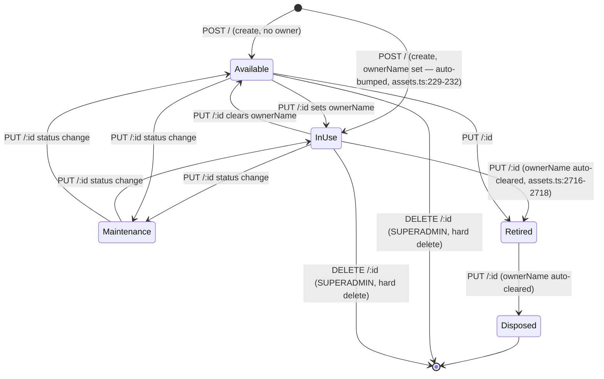
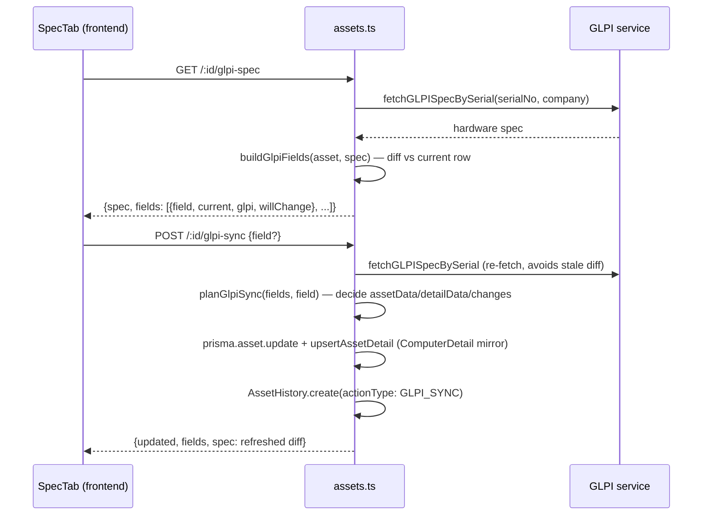
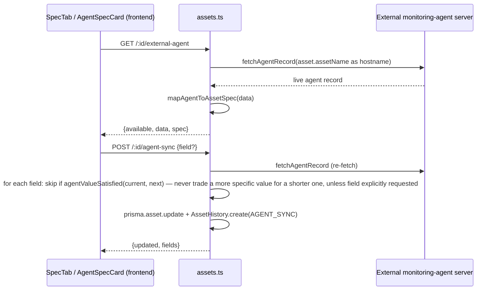

# MODULE: Asset Registry (ทะเบียนทรัพย์สิน IT) — Core

> Backend: `backend/src/routes/assets.ts` (3096 lines). Frontend: `frontend/src/pages/assets/` (`AssetListPage.tsx`, `AssetDetailPage.tsx`, `AssetFormPage.tsx`, `tabs/`, `components/`). Schema reference: `docs/system-blueprint/03_database_schema.md` §2 "Asset Core". Roles reference: `docs/system-blueprint/02_ROLES_PERMISSIONS.md`.

## Module Profile

This is the single most central module in the system: every other module (Borrow, PM, Donation/Disposal, Delivery, FloorPlan, Contracts, Licenses) ultimately points back at `Asset` rows here. `assets.ts` is the largest route file in the backend (3096 lines) and `AssetFormPage.tsx` is the largest form in the frontend (2525 lines).

The module owns:
- The `Asset` table itself (a "wide" table — one row per physical item, with ~50 flat columns covering identity, specs, ownership, purchase/finance, and dual-write FK pointers).
- Nine `*Detail` 1:1 tables holding type-specific specs (`ComputerDetail`, `PhoneDetail`, `MonitorDetail`, `DeviceDetail`, `NetworkDeviceDetail`, `RackDetail`, `PrinterDetail`, `CableDetail`, `ConsumableDetail`) — see field lists in `03_database_schema.md` §2.
- `AssetDocument` (file attachments), `AssetHistory` (audit trail), and (partially, via read-only surfacing) `AssetLink`/`AssetDisposal` which are more fully owned by other modules (CMDB linking, donation/disposal).
- Bulk import/export (Excel/CSV/JSON), GLPI hardware-inventory integration, and a separate external monitoring-agent integration — both scoped specifically to the asset registry (distinct from the PM module's own GLPI/Agent integrations documented in `12_module_pm_core.md`).

## Business Rules (file:line evidence)

1. **`ownerName` is NOT required on create or update** (`backend/src/routes/assets.ts:263-313`, `validateAssetData`). This was a fix landed in this session: the code comment at lines 294-300 explains that ผู้ถือครอง (owner) is genuinely optional — a machine sitting in IT storage or pending assignment has no current holder, and the dashboard tracks "ไม่มีผู้ครอบครอง" as a normal state, not an error. Requiring it previously blocked *any* update to an already-ownerless asset, even edits that didn't touch `ownerName` at all (because the whole payload was rejected together). Confirmed current: no `ownerName` push into `errors[]` exists anywhere in `validateAssetData`.
2. **Fields still required** by `validateAssetData` (`assets.ts:263-313`): `serialNo` (non-empty, regex `^[A-Z0-9\-_\.]+$` at line 270), `assetName` (non-empty), `type` (non-empty), `brand` (non-empty), `departmentId` (non-empty). Also: if both `purchaseDate` and `warrantyEndDate` are given, `warrantyEndDate` must not be before `purchaseDate` (line 303-311).
3. **Duplicate detection** (`checkDuplicateAssets`, `assets.ts:317-362`), run on create/update/upsert, excluding the current row on update: `serialNo` unique, `assetCode` unique (skipped if `'-'` or blank), `accountingCode` unique (only enforced when provided — comment at 340-341 notes it's optional so blanks must not collide), `snComputer` unique (computer S/N, checked against `Asset.snComputer` even though this is denormalized from `ComputerDetail`). Separately, `assetName` uniqueness is checked inline in the POST/PUT/upsert handlers (not inside `checkDuplicateAssets`) — `assets.ts:2591-2596`, `2674-2677`, `2742-2745`.
4. **Asset code / accounting code normalization**: `'-'`, `''`, or `null` all collapse to `null` before insert (`normalizeAssetPayload`, `assets.ts:241-249`) — necessary because both columns are `@unique`, and an empty string `''` is a real, comparable Postgres value (unlike `NULL`, which never collides), so leaving `''` in would make the second "no code yet" asset fail as a duplicate.
5. **Auto status bump on create**: if `ownerName` is set and non-empty on create, and `status` is unset or `'Available'`, status is forced to `'InUse'` (`normalizeAssetPayload`, `assets.ts:229-232`).
6. **Auto owner clear on retirement**: on `PUT /:id` and `POST /bulk-update`, if the new `status` is `'Retired'` or `'Disposed'`, `ownerName` is force-set to `null` (`assets.ts:2716-2718`, `2857-2860`).
7. **`age` is server-computed, never stored input** — `calculateAssetAge()` (`assets.ts:71-80`) derives whole years from `purchaseDate` vs. today (with month/day rollback for partial years), floored at 0, recomputed on every normalize/read via `withCalculatedAge` (`assets.ts:82-85`) and on list responses.
8. **`warrantyDaysLeft` is a derived, non-persisted response field**: `withCalculatedWarranty` (`assets.ts:87-90`) computes days remaining from `warrantyEndDate` vs. now, floored at 0, attached to every list-row response.
9. **`heldDays`** (days since last `OWNER_CHANGE` history event) is computed per-row on `GET /` from the latest matching `AssetHistory` row per asset, falling back to `0` if the asset currently has an owner with no matching history, or `null` if it has none (`assets.ts:841-853`).
10. **Type → detail-table dispatch is keyword-matching on the free-text `type` column**, not a fixed enum/FK — see "Database Tables" section below for the exact keyword lists (`assets.ts:385-552` for write via `upsertAssetDetail`, `assets.ts:1263-1303` for read via `getAssetDetail`/`getDetailInclude`). The two keyword tables are *not* kept in perfect lockstep (e.g. cable/consumable detection differs slightly between `upsertAssetDetail`'s broader lists at 522-550 and `getAssetDetail`'s narrower ones at 1296-1300 — `getAssetDetail` is missing several keywords like `'vga'`, `'adapter'`/`'converter'` for cables, and `'paper'`, `'drum'`, `'ribbon'` for consumables that the write path recognizes).
11. **`upsertAssetDetail` also writes back onto the parent `Asset` row for computer-type assets** (`assets.ts:413-417`) — CPU/RAM/storage/OS/etc. are duplicated onto flat `Asset` columns "to prevent empty specs in main asset queries" (list view doesn't join `ComputerDetail`).
12. **Company code normalization on write** (`resolveCompanyCode`, `assets.ts:188-221`): AD hands back a company's full legal name, but assets/PM-plan scoping match on a short code, so any recognized legal name (Thai or English) is swapped for its master-data code (`Company.assetCompanyCodes` or `Company.code`) before saving; an unrecognized value is left exactly as typed rather than guessed at. Comment cites a real incident: `HQ-PS-N051` stored as `"Phitsanulok Sugar Co., Ltd."` instead of `"PS"`, invisible to PM plan #33 forever.
13. **Non-admin list visibility is company-scoped**: `GET /` — for any `req.user.role` not in `['SUPERADMIN','IT_ADMIN']`, the query is restricted to `where.company IN (appUser's mapped assetCompanyCodes)`, or to a guaranteed-empty `['__NONE__']` if the user's company has no mapping (`assets.ts:646-666`).
14. **`USER` role additionally only ever sees `status = 'Available'` assets** on `GET /`, unless a `status` filter is explicitly passed (`assets.ts:757-760`); `GET /stats` applies the same restriction (`assets.ts:924`).
15. **`GET /` excludes the `image` column from its `select`** (`assets.ts:765-772`) — comment explains `image` stores a full base64 upload inline (up to ~10MB/row) and an unfiltered list query was round-tripping that on every page load, worst-case on the default newest-first sort since recent uploads disproportionately have photos; list/grid falls back to a placeholder icon, detail page still loads the full image.
16. **`next-code` suggestion never invents an unprecedented prefix** (`assets.ts:1145-1227`): degrades through 3 tiers of matching (company+department+type → company+type → company-only), extracting the most common `prefix+trailing-number` pattern among existing `assetName`s at that scope and incrementing the highest number seen; reports which tier (`matchedOn`) was used and how many rows it was based on (`basedOn`).
17. **`/options/*` endpoints prefer curated master-data tables over `SELECT DISTINCT` on live asset data**, with `?company=` scoping to an intersection with what that company actually has (`assets.ts:1014-1143`) — extensive code comments (1075-1092, 1003-1013) document this was a deliberate fix: unioning master data with live distinct values meant one typo, once, became a permanent dropdown option forever (cites concrete garbage values found: `"N00"`, `"EOF"`, `"BUG"`, a location value under the department filter, 42 accumulated department values before the fix). Falls back to `SELECT DISTINCT` only when the master table has zero curated rows.
18. **Department option/dropdown matching favors `departments.code`** over `departments.name`, because `Asset.departmentId` stores a short code (`"PUR"`) while the AD sync populates `departments.name` with department *names* (`"จัดซื้อ"`) — comment at `assets.ts:147-152` notes this mismatch meant the resolver almost never fired before code-matching was added (75/792 assets linked, and only by four accidental identical spellings).
19. **Bulk warranty-from-purchase-date**: `POST /bulk-update` with `data.warrantyYearsFromPurchase` (1-10) sets `warrantyEndDate = purchaseDate + N years` per-asset for every id that has a `purchaseDate`, skipping (not guessing) ones that don't (`assets.ts:2862-2889`). Extensive Thai comment explains the numbers came from a real data audit (8/733 warranty dates filled vs 206 with purchase dates; 6 assets with both showed 2.87–3.92 year spread) and insists the multiplier must come from a human holding the PO, never be inferred.
20. **`DELETE /:id` and bulk deletes cascade-clean dependent rows manually inside a transaction** before deleting the `Asset` row itself: `PMRunAnswer`→`PMRun`, `AssetHistory`, `BorrowRequestItem.assetId` set to null (not deleted), `DonationItem`, `MaintenanceRecord` (`assets.ts:2769-2840`).
21. **Deleting an asset is SUPERADMIN-only**; creating/editing/importing/exporting/image/documents/GLPI/Agent-sync are IT_ADMIN+SUPERADMIN; the main list (`GET /`) and single-asset read (`GET /:id`) require only `authenticate` (any logged-in role, scoped per rules #13/#14 above).

## The dual-write legacy-string vs. FK-relation pattern

This is the single most architecturally important pattern in the module. `Asset` carries **two parallel representations** for four relationships, plus a normalization-only fifth field:

| Legacy free-text column | Type | New FK column | Points to | Resolver function | Location |
|---|---|---|---|---|---|
| `ownerName` | `String?` | `assignedToUserId` → `assignedTo` | `AppUser` | `resolveAssignedToUserId` | `assets.ts:130-140` |
| `departmentId` | `String?` (short code, not a real FK despite the name) | `departmentRefId` → `departmentRef` | `Department` | `resolveDepartmentRefId` | `assets.ts:153-164` |
| `vendor` | `String?` | `vendorRefId` → `vendorRef` | `Vendor` | `resolveVendorRefId` | `assets.ts:166-175` |
| `location` | `String?` | `locationRefId` → `locationRef` | `AssetLocation` | `resolveLocationRefId` | `assets.ts:177-186` |
| `company` | `String?` (no separate FK column — normalized in place) | — | `Company.code`/`assetCompanyCodes` | `resolveCompanyCode` | `assets.ts:188-221` |

Design/behavior:

- The legacy string columns remain the **source of truth for display and for every filter/search/report** built before the FK columns existed (list search, filter-options, export, PM plan scoping, dashboards) — they are never dropped or made read-only.
- The FK columns are **Phase 2 (`assignedToUserId`) / Phase 5 (`departmentRefId`/`vendorRefId`/`locationRefId`)** additions per Prisma schema comments (see `03_database_schema.md:167-174`), intended to eventually let the app join/query relationally instead of string-matching.
- On every create/update/upsert (`POST /`, `PUT /:id`, `POST /upsert` — `assets.ts:2640-2638`/`2699-2767`/`2541-2638`), whenever the free-text field is present in the payload **and has actually changed** from the stored value, **and** the caller did not already supply the FK id explicitly, the matching resolver is called to best-effort look up an FK id and silently attach it alongside the string. If no id was explicitly given and the text didn't change, no resolver runs (so re-saving a form that only touches other fields doesn't churn the FK lookup).
- All four resolvers do **exact, whitespace/case-normalized matching only** — they never fuzzy-match or guess. `resolveAssignedToUserId` additionally returns `null` (no match) on an **ambiguous** match (`LIMIT 2` and only accept `rows.length === 1`), since `AppUser.displayName` is not guaranteed unique; the other three resolvers assume their target name column is unique on the master table so only check for "no match" (comment at `assets.ts:142-146` spells out why this asymmetry is safe).
- `resolveDepartmentRefId` specifically matches on **`departments.code` first, `departments.name` second** (ordered `ORDER BY (code match) DESC LIMIT 1`), because of the code/name mismatch noted in rule #18 above.
- `resolveCompanyCode` is different in kind from the other four: it does not populate a separate FK column, it **rewrites the `company` string itself** in place (legal name → short code) so all the *other* string-matching logic elsewhere in the app (PM plan company scoping, dashboards) keeps working without knowing about a second representation.
- Net effect: two assets with identically-spelled free text will get the identical FK id (since matching is deterministic and exact); an asset whose free text doesn't match any master-data row keeps `null` in the FK column and is only reachable via the string column — this is expected and common "until master data / free-text entry converge" (comment, `assets.ts:144-146`), not a bug to fix reactively.

## CRUD Matrix

| Operation | Route | Role | Notes |
|---|---|---|---|
| List/search/filter | `GET /` | any authenticated (scoped, see rules #13/#14) | pagination, ~25 filter params |
| Read one | `GET /:id` | any authenticated | includes history(50), pmRuns(20), category, documents, computed `detail` |
| Create | `POST /` | IT_ADMIN, SUPERADMIN | full validate + dual-write resolve + duplicate check |
| Create-or-update by code/serial | `POST /upsert` | IT_ADMIN, SUPERADMIN | used by import; same validation path as POST/PUT |
| Update | `PUT /:id` | IT_ADMIN, SUPERADMIN | same validation; auto-clears owner on retire/dispose |
| Delete (single) | `DELETE /:id` | **SUPERADMIN only** | transactional cascade cleanup of dependents |
| Delete (bulk, by ids) | `POST /bulk-delete` | **SUPERADMIN only** | same cascade, batched |
| Delete (bulk, by type) | `POST /bulk-delete-by-type` | **SUPERADMIN only** | deletes every asset of a given free-text `type` |
| Update (bulk) | `POST /bulk-update` | IT_ADMIN, SUPERADMIN | whitelisted fields only; special warranty-from-purchase mode |

IT_ADMIN can create/edit/import/export/sync but never delete — deletion is deliberately reserved for SUPERADMIN alone (confirmed directly in code, matches `02_ROLES_PERMISSIONS.md`).

## API Inventory

All routes are mounted under `/api/assets` (base path implied; only the sub-path is shown below). All require `authenticate` unless noted. Device-type/location/vendor/status-master CRUD used to live in this file but was moved to `routes/assetMasterData.ts` (comment at `assets.ts:1239-1244`), mounted at the same base before this router — not part of this file's inventory.

### Core CRUD

| Method | Path | Role | Purpose | Evidence |
|---|---|---|---|---|
| GET | `/` | any (scoped) | Paginated list with ~25 query filters (search, status, department, location, type/typeGroup, categoryId, cpu, ram, warranty status/expiry, owner, monitor/printer/network detail fields, storage, osType, company, serialNo, purchase-date range) | `assets.ts:607-858` |
| GET | `/:id` | any | Single asset + history(50) + pmRuns(20) + category + documents + type-specific `detail` | `assets.ts:2227-2248` |
| POST | `/` | IT_ADMIN, SUPERADMIN | Create asset (+ optional `detail` sub-object) | `assets.ts:2640-2697` |
| PUT | `/:id` | IT_ADMIN, SUPERADMIN | Update asset (+ optional `detail`); writes `AssetHistory` rows for status/owner/location changes | `assets.ts:2699-2767` |
| DELETE | `/:id` | SUPERADMIN | Cascade-delete asset + dependents | `assets.ts:2769-2798` |
| POST | `/upsert` | IT_ADMIN, SUPERADMIN | Create-or-update keyed on `assetCode` then `serialNo`; same validation/resolver/duplicate pipeline as POST/PUT | `assets.ts:2541-2638` |

### Bulk operations

| Method | Path | Role | Purpose | Evidence |
|---|---|---|---|---|
| POST | `/bulk-delete` | SUPERADMIN | Delete many by `ids[]`, cascade-cleans PM runs/history/donation items/maintenance records first, nulls out `BorrowRequestItem.assetId` | `assets.ts:2800-2819` |
| POST | `/bulk-delete-by-type` | SUPERADMIN | Delete every asset matching a free-text `type` | `assets.ts:2821-2840` |
| POST | `/bulk-update` | IT_ADMIN, SUPERADMIN | Batch-set a whitelist of 11 fields across `ids[]`; special `warrantyYearsFromPurchase` mode derives `warrantyEndDate` per-asset from each one's own `purchaseDate` | `assets.ts:2842-2895` |

### Lookups / dropdown options / stats

| Method | Path | Role | Purpose | Evidence |
|---|---|---|---|---|
| GET | `/filter-options` | any | Distinct-value lists for cpu/ram/osType/storage/monitor+printer detail fields/brand/department/location/company (used to populate list-page filter dropdowns) | `assets.ts:860-894` |
| GET | `/check-duplicate` | any | Ad-hoc existence check for assetCode/accountingCode/serialNo/assetName, with `excludeId` | `assets.ts:896-915` |
| GET | `/stats` | any (USER scoped to Available) | Count by status, optional `typeGroup` filter | `assets.ts:917-931` |
| GET | `/owners/search-ad` | IT_ADMIN, SUPERADMIN | AD user search for owner autofill, falls back to local `AppUser` search on LDAP failure | `assets.ts:933-961` |
| GET | `/options/types` | any | Device-type dropdown; `?inUse=1` restricts to types actually present on assets (create/edit form must never pass this) | `assets.ts:963-1001` |
| GET | `/options/locations` | any | Location dropdown, curated master-first, `?company=` scopes to that company's actually-owned locations | `assets.ts:1014-1039` |
| GET | `/options/vendors` | any | Vendor dropdown, curated master-first | `assets.ts:1041-1049` |
| GET | `/options/statuses` | any | Status master list (`code`,`name`) | `assets.ts:1051-1056` |
| GET | `/options/os-types` | any | OS type list (defaults ∪ distinct existing) | `assets.ts:1058-1066` |
| GET | `/options/brands` | any | Distinct brand list | `assets.ts:1068-1073` |
| GET | `/options/departments` | any | Department-code dropdown, curated master-first, `?company=` scoped | `assets.ts:1093-1126` |
| GET | `/options/domains` | any | Distinct domain-name list | `assets.ts:1128-1133` |
| GET | `/options/companies` | any | Company code list (defaults ∪ distinct existing) | `assets.ts:1135-1143` |
| GET | `/options/antivirus` | any | Antivirus product list (defaults ∪ distinct existing) | `assets.ts:1229-1237` |
| GET | `/next-code` | any | Suggests next asset code/name by pattern-matching existing codes at company[+department][+type] scope | `assets.ts:1145-1227` |

### Import / Export

| Method | Path | Role | Purpose | Evidence |
|---|---|---|---|---|
| GET | `/export/excel` | IT_ADMIN, SUPERADMIN | Filtered Excel export (search/status/categoryId/type/typeGroup/department/location), styled worksheet, includes all `*Detail` columns flattened per asset's type | `assets.ts:1305-1556` |
| GET | `/export/csv` | IT_ADMIN, SUPERADMIN | Same filtering/shape as excel export, CSV output | `assets.ts:1557-1734` |
| POST | `/export/by-ids` | IT_ADMIN, SUPERADMIN | Export a specific selected set of asset `ids[]` to Excel | `assets.ts:1735-1900` |
| GET | `/import/template` | **no auth** (only route in file without `authenticate`) | Downloads blank Excel import template with bilingual headers | `assets.ts:2115-2139` |
| POST | `/import/excel` | IT_ADMIN, SUPERADMIN | Bulk import from uploaded .xlsx/.csv (auto-detects by file signature), all sheets concatenated | `assets.ts:2140-2165` |
| POST | `/import/json` | IT_ADMIN, SUPERADMIN | Bulk import from a JSON array of row objects (same `importRows` engine as excel import) | `assets.ts:2167-2178` |

Import engine (`importRows`, `assets.ts:1929-2113`) shared by both import routes: per row, resolves `categoryId` from an explicit category name (upsert into `Category`) or falls back to keyword-matching the `type` string (`getCategoryIdByAssetType`, `assets.ts:1902-1927` — 7 hardcoded category ids 1-7); normalizes `assetCode`/`serialNo`; matches an existing asset by `assetCode` then `serialNo`; rejects on `assetName` collision or `assetCode`/`serialNo` collision with a *different* row; creates-or-updates; runs `syncMasterDataFromAsset` (upserts `DeviceType`/`AssetLocation`/`Company`/`Vendor` master rows from the free text so future dropdowns include it — `assets.ts:554-595`); maps ~40 export-header names back to type-detail field names and calls `upsertAssetDetail`. Per-row errors are collected (not aborting the batch) and returned as `{success, errors, errorDetails[]}`; failures are also appended to a local `import_errors.log` file (`assets.ts:2107`).

### GLPI integration (Asset Registry–specific)

Distinct from the PM module's own GLPI integration (see `12_module_pm_core.md`) — this one syncs *asset hardware spec* fields, not PM checklist data.

| Method | Path | Role | Purpose | Evidence |
|---|---|---|---|---|
| GET | `/glpi-spec` | IT_ADMIN, SUPERADMIN | Look up GLPI hardware spec by arbitrary `?serial=` (used before an asset exists, e.g. during create) | `assets.ts:2181-2191` |
| GET | `/:id/glpi-spec` | IT_ADMIN, SUPERADMIN | Look up GLPI spec for an existing asset by its own `serialNo`+`company`; returns `fields` = a pre-built diff (`buildGlpiFields`) so the UI's "what would change" view matches exactly what sync would write | `assets.ts:2991-3005` |
| POST | `/:id/glpi-sync` | IT_ADMIN, SUPERADMIN | Applies GLPI spec to the asset — either one `field` or every field `planGlpiSync` decides should change (fills blanks; only overwrites a populated value with GLPI's when the plan judges GLPI's more complete); writes `ComputerDetail` too via `upsertAssetDetail`; logs `AssetHistory` with `actionType: 'GLPI_SYNC'` | `assets.ts:3007-3058` |

### External monitoring-Agent integration (Asset Registry–specific)

Distinct from the PM module's Agent integration. Talks to a separate external asset-monitoring agent server, matched by `assetName` == agent's `hostname`.

| Method | Path | Role | Purpose | Evidence |
|---|---|---|---|---|
| GET | `/:id/external-agent` | IT_ADMIN, SUPERADMIN | Read-only live pull of one asset's agent record + mapped spec preview | `assets.ts:2253-2267` |
| POST | `/:id/agent-sync` | IT_ADMIN, SUPERADMIN | Apply agent data to one asset — single `field` or "all that differ"; a blanket sync never overwrites a *more specific* stored value with the agent's shorter one (`agentValueSatisfied` guard), single-field request always applies; logs `AssetHistory` `AGENT_SYNC` | `assets.ts:2271-2321` |
| GET | `/agent/monitors` | IT_ADMIN, SUPERADMIN | Fleet-wide monitor reconciliation (`reconcileFleet`) — buckets into FIX/OK/CREATE/MANUAL; slow (one upstream call/host), only on explicit page load | `assets.ts:2336-2352` |
| GET | `/:id/agent-monitors` | IT_ADMIN, SUPERADMIN | Monitors reported by the agent for one machine (feeds Spec tab) | `assets.ts:2355-2366` |
| POST | `/:id/monitor-sync` | IT_ADMIN, SUPERADMIN | Apply picked fields (brand/model/ownerName/location/departmentId/assetName/assetCode) from agent-reported monitor data to one asset; field-level opt-in | `assets.ts:2371-2403` |
| POST | `/agent/monitor-link` | IT_ADMIN, SUPERADMIN | Create `AssetLink` (`linkType: 'MONITOR'`) rows joining monitor assets to the machine they're plugged into, from agent-reported pairs | `assets.ts:2407-2429` |
| GET | `/agent/health` | IT_ADMIN, SUPERADMIN | Fleet health/risk view built from all agent records (`buildFleetHealth`) — risk ranking, replacement planning, license usage, silent/non-reporting machines | `assets.ts:2437-2441` |
| GET | `/agent/lookup` | IT_ADMIN, SUPERADMIN | Look up one machine in the agent system by serial or hostname, for autofilling the create form | `assets.ts:2443-2471` |
| GET | `/agent/drift` | IT_ADMIN, SUPERADMIN | Fleet-wide diff between every agent-known machine and its matched asset — blanks + conflicts per machine, plus unmatched agent machines | `assets.ts:2473-2523` |
| POST | `/agent/fill-blanks` | IT_ADMIN, SUPERADMIN | Fills only empty asset fields from agent data, fleet-wide or for given `assetIds[]`; never overwrites an existing value (safe by construction) | `assets.ts:2528-2539` |

Note: `/agent/*` sub-routes are deliberately registered so they cannot be shadowed by the `/:id/*` numeric-id routes (comment, `assets.ts:2324-2326`).

### Images / Documents

| Method | Path | Role | Purpose | Evidence |
|---|---|---|---|---|
| POST | `/:id/image` | IT_ADMIN, SUPERADMIN | Upload asset photo, stored inline as base64 data-URL in `Asset.image` (max 10MB, image/* only) | `assets.ts:2897-2915` |
| DELETE | `/:id/image` | IT_ADMIN, SUPERADMIN | Clear `Asset.image` | `assets.ts:2917-2930` |
| GET | `/:id/documents` | any | List `AssetDocument` rows for an asset | `assets.ts:2932-2941` |
| POST | `/:id/documents` | IT_ADMIN, SUPERADMIN | Upload a document to disk (`uploads/documents/`, random UUID filename), max 10MB, allow-listed mime types (PDF/images/Word/Excel) | `assets.ts:2943-2964` |
| GET | `/:id/documents/:docId/download` | any | Stream a document file back | `assets.ts:2966-2977` |
| DELETE | `/:id/documents/:docId` | IT_ADMIN, SUPERADMIN | Delete document row + file from disk | `assets.ts:2979-2989` |

### History / audit

| Method | Path | Role | Purpose | Evidence |
|---|---|---|---|---|
| GET | `/global-history` | IT_ADMIN, SUPERADMIN | Paginated audit log across ALL assets | `assets.ts:2194-2225` |
| GET | `/:id/history` | any | Paginated audit log for one asset | `assets.ts:3061-3094` |

## Database Tables

Full field-by-field schema for `Asset` and all nine `*Detail` tables, `AssetDocument`, `AssetLink`, `AssetDisposal`, `AssetHistory` is catalogued in `03_database_schema.md` §2 "Asset Core" (lines 109-415) — not re-derived here. What's not obvious from the schema alone:

**How `categoryId` and the `*Detail` table are chosen — two independent mechanisms:**
- `categoryId` (FK to `Category`) is set explicitly by the client on create/edit (form-driven), or inferred on import by `getCategoryIdByAssetType` (`assets.ts:1902-1927`) — a hardcoded keyword→id map covering only 7 category ids (1=คอมพิวเตอร์, 2=อุปกรณ์สื่อสาร, 3=จอภาพ, 4=อุปกรณ์ต่อพ่วง, 5=เครื่องพิมพ์, 6=อุปกรณ์เครือข่าย, 7=Rack & Infrastructure). This never runs on normal create/update (`POST /`, `PUT /:id`) — only the import path uses it.
- Which of the nine `*Detail` tables an asset's specs live in is decided **independently of `categoryId`**, purely by keyword-matching the free-text `type` column, on every read and write:
  - Write: `upsertAssetDetail(prisma, assetId, type, detail)` (`assets.ts:385-552`)
  - Read (single detail object): `getAssetDetail(prisma, assetId, type)` (`assets.ts:1271-1303`)
  - Read (Prisma `include` shape): `getDetailInclude(type)` via `detailIncludeMap` (`assets.ts:1245-1269`) — used only for `export/excel`'s include, and is a *third*, smaller keyword table (case-insensitive exact match against 15 literal type strings, not substring matching like the other two)
  - All three tables independently list overlapping-but-not-identical keyword sets per detail type (e.g. `upsertAssetDetail`'s computer-type list is `['notebook','pc desktop','macbook','mini pc','all-in-one','thin client','computer']`, `assets.ts:393`) — see Business Rule #10 above for the specific drift found between the write and read keyword lists.
- Practically: nothing enforces that `categoryId` and the keyword-matched `type` agree (e.g. an asset could have `categoryId=3` "จอภาพ" but a `type` string that doesn't contain "monitor", in which case no `MonitorDetail` row is ever created/read for it). The two systems are historical layers, not one designed together.

**Other relationship notes not obvious from the schema:**
- `Asset.snComputer` (flat column) is duplicated with `ComputerDetail.snComputer` — both are checked for uniqueness in `checkDuplicateAssets` (only the `Asset` copy), and both are kept in sync by `upsertAssetDetail`'s write-back for computer types (Business Rule #11).
- `AssetHistory.actionType` values actually written by this file: `CREATE`, `STATUS_CHANGE`, `OWNER_CHANGE`, `LOCATION_CHANGE`, `AGENT_SYNC`, `GLPI_SYNC` (grep-confirmed against every `assetHistory.create` call in `assets.ts`).
- `AssetLink` is written from this file only via `/agent/monitor-link`, always with `linkType: 'MONITOR'` — general parent/child CMDB linking UI lives in `LinkedAssetsTab.tsx`/`AssetLinksPanel.tsx` (frontend) but its write path was not found inside `assets.ts` itself (see Unknown section).

## Workflow

### Asset lifecycle

`status` itself is a free-standing enum column (`AssetStatus`) — the diagram above shows the transitions this file's business logic reacts to (owner auto-set/auto-clear); it does not enforce that only these transitions are legal. Any status can be set to any other via `PUT /:id`/`bulk-update`; disposal detail (method, sale value, recipient) is recorded by the separate `AssetDisposal` table, owned by the donation/disposal module (`04_module_donation_disposal.md`), not by this file. Every status/owner/location change on `PUT /:id` writes a matching `AssetHistory` row (`assets.ts:2754-2763`).

### GLPI sync workflow (asset-registry specific)

### External Agent sync workflow (asset-registry specific)

Fleet-wide variants (`/agent/health`, `/agent/drift`, `/agent/fill-blanks`, `/agent/monitors`) run the same per-machine matching/mapping logic (`matchAssetForAgent`, `computeDrift`, `mapAgentToAssetSpec`) across every agent-known machine in one pass, without a per-asset UI trigger — these back a dedicated fleet drift/health screen (evidence: comments at `assets.ts:2431-2436`, `2323-2333`).

## Page Inventory

Routes registered in `frontend/src/App.tsx:96-106` (all under the `ProtectedRoute` guard):

| Page | Route | Component | Role | Purpose | Evidence |
|---|---|---|---|---|---|
| Asset List | `/assets` | `AssetListPage.tsx` | SUPERADMIN, IT_ADMIN, USER, VIEWER (scoped per role server-side) | Search/filter/browse all assets; USER sees only `Available` and gets a borrow-oriented card view instead of the admin table | `App.tsx:96` |
| Asset Create | `/assets/new` | `AssetFormPage.tsx` (no `id` param) | IT_ADMIN, SUPERADMIN | Register a new asset | `App.tsx:97` |
| Asset Detail | `/assets/:id` | `AssetDetailPage.tsx` | SUPERADMIN, IT_ADMIN, USER, VIEWER | Tabbed single-asset view: overview, spec, PM, repairs, documents, history, linked | `App.tsx:98` |
| Asset Edit | `/assets/:id/edit` | `AssetFormPage.tsx` (with `id` param) | IT_ADMIN, SUPERADMIN | Edit an existing asset; same component/form as create | `App.tsx:99` |
| Print QR | `/assets/print-qr` | `PrintQRPage.tsx` | IT_ADMIN, SUPERADMIN | Bulk QR/label printing (linked from list bulk actions and detail page) — not read in this pass | `App.tsx:105` |
| Agent Drift | `/assets/agent-drift` | `AgentDriftPage.tsx` | IT_ADMIN, SUPERADMIN | Fleet-wide agent drift/health dashboard, backs `/agent/drift`, `/agent/health` — not read in this pass | `App.tsx:106` |
| Import/Export | `/assets/import-export` | `ImportExportPage.tsx` | IT_ADMIN, SUPERADMIN | Standalone bulk import/export UI — not read in this pass | `App.tsx:104` |
| Asset History (global) | `/assets/:id/history` | `AssetHistoryPage.tsx` | any (no `ProtectedRoute` role list on this specific line) | Full history view for one asset outside the tabbed detail page — not read in this pass | `App.tsx:159` |

Master-data pages (`device-types`, `locations`, `vendors`, `statuses` under `/assets/*`, `App.tsx:100-103`) belong to the dual-write master tables this module writes through, but their CRUD lives in `assetMasterData.ts`, not `assets.ts` — out of this section's scope.

### AssetListPage.tsx (937 lines)

Single-page component, no sub-routes. Renders one of three body modes depending on role/viewport: admin `DataGrid` table (desktop), admin card grid (`viewMode='grid'` or mobile), or a borrow-oriented card grid grouped by category (role `USER`, `isAvailableOnlyView`). State is entirely client-side (URL search params for shareable filters + `localStorage` for column/view/density prefs and personal saved filter views — `frontend/src/pages/assets/AssetListPage.tsx:111,121-122,128`).

### AssetDetailPage.tsx (405 lines)

Single asset, 7 tabs via `PillTabBar` (`AssetDetailPage.tsx:38-46`): `overview` (default — a 2-column dashboard, not a plain tab body), `spec`, `pm`, `repairs`, `documents`, `history`, `linked`. Owns three parallel async loads on mount: the asset itself, its maintenance records (shared across timeline/service-history/insight tiles, not owned by the repairs tab — comment at lines 82-84), and — gated on "is this a computer" — GLPI spec and external-agent live status, both silently empty for non-computers and for roles without backend access to those routes (comment `116-119`).

### AssetFormPage.tsx (2525 lines)

One component for both create (`/assets/new`) and edit (`/assets/:id/edit`) — see "Forms & Fields" below for full breakdown.

## UI Components & Buttons/Actions

### List view (`AssetListPage.tsx` + `components/`)

- **Search bar**: free-text search (debounced 400ms, `AssetListPage.tsx:243-250`, plus instant Enter-key/button trigger), Type dropdown, Company dropdown, multi-select Status dropdown (checkboxes).
- **Advanced filters popover**: warranty status (active/expiringSoon/expired/none), purchase-date range.
- **Active filter chips row**: one removable chip per active filter + "clear all".
- **Saved views** (`components/savedFilterViews.ts`, localStorage-only, personal): save current filter combo under a name, apply, delete. Separate from the 8 built-in **preset views** (`components/presetViews.ts`) — 7 type-group shortcuts + "ของพร้อมยืม" (Available) — which replaced what used to be 9 separate sidebar menu entries all pointing at `/assets` with one query param (comment, `presetViews.ts:1-13`).
- **Column picker** (`ColumnPickerDialog.tsx`): show/hide/reorder any of ~36 possible columns (`assetListConfig.tsx:20-62`), grouped for search (พื้นฐาน/องค์กร-ตำแหน่ง/ซอฟต์แวร์/ฮาร์ดแวร์/จัดซื้อ/อื่นๆ), persisted to `localStorage` (`COLUMN_PREF_KEY`).
- **View toggles**: table vs. card-grid (`viewMode`), DataGrid density compact/standard — both admin-desktop only, persisted to `localStorage`.
- **Bulk select + bulk update**: DataGrid checkbox selection (admin only) → "แก้ไขที่เลือก (N)" button opens `BulkUpdateDialog.tsx`, posts to `POST /bulk-update`.
- **Import/Export buttons**: `ImportAssetsButton`/`ExportAssetsButton` (shared components, not under `pages/assets/`), admin only.
- **Row actions** (`AssetRowActionsMenu.tsx`): per-row "..." menu — view, edit, delete (role-gated), plus header-menu variant on mobile for column settings.
- **Quick-view drawer** (`AssetQuickViewDrawer.tsx`): single-click on a table row (not on Actions/checkbox cell) opens a side drawer without navigating away; double-click navigates to the full detail page.
- **KPI strip** (`AssetKpiStrip.tsx`): status-count tiles above the filter bar, clickable to set the status filter.
- **Borrowed-items section** (USER role, available-only view): cards for the user's own active borrows, with an "ขยายวัน" (extend) action opening `ExtendBorrowDialog.tsx`.

### Detail view — per tab

- **Overview** (not a tab component, inline in `AssetDetailPage.tsx`): `AssetOverviewCard` (hero), `AssetSpecMiniCard` + `AssetLiveStatusCard` + `AssetFinanceCard` (auto-fit 3-up grid), `AssetServiceHistoryCard` with "ดูทั้งหมด" → jumps to repairs tab, `AssetInsightTiles`. Context rail: `AssetTimeline`, `AssetDocumentsRail`, `AssetActionsPanel` (edit / transfer / report repair / borrow / show-QR / report-damage / propose-disposal — several of these just navigate to the edit page or the disposals module rather than being distinct actions).
- **Spec** (`SpecTab.tsx`): `AgentSpecCard` (live agent comparison, shown first since it's the connected data source) → GLPI comparison card (computers only, per-field or bulk "ปรับปรุงตาม GLPI" apply) → accordions of identity/hardware/OS/type-specific-detail/purchase/owner/system-metadata/remark/image, each field hidden entirely when empty (`SpecItem` returns `null`).
- **PM** (`PMTab.tsx`): shows PM run history for the asset, eligibility check for this year, "เริ่มทำ PM" opens a template-picker dialog, on success navigates to the PM run page.
- **Repairs** (`MaintenanceTab.tsx`, outside this scope — shared with the maintenance module): not read in this pass.
- **Documents** (`DocumentsTab.tsx`): upload (10MB limit client + server), grid of document cards, download, delete (role-gated).
- **History** (`HistoryTab.tsx`): MUI Lab `Timeline` of `AssetHistory` rows, icon/color per `actionType`, includes a `CUSTODY_CHANGE` label marked "(ยกเลิกแล้ว)" — a leftover from the removed custody feature (see git log `e169e45 feat: drop the custody feature`) still rendered defensively even though the backend no longer writes it.
- **Linked** (`LinkedAssetsTab.tsx` + `components/AssetLinksPanel.tsx`): two independent panels — (1) `AssetLinksPanel` is the real CMDB parent/child `AssetLink` CRUD (create/remove via `assetLinkAPI`, a different route file from `assets.ts` — see Unknown section), with an asset-search autocomplete and a link-type selector (COMPONENT/CONNECTED/DEPENDS_ON); (2) a same-owner listing below it, computed client-side by calling `assetAPI.list({ exactOwnerName })` and filtering out the current asset — not a stored relationship at all, just "what else does this person hold".

### Form — see "Forms & Fields" below for the full per-section breakdown; page-level chrome: sticky footer with Cancel/Submit, an "unsaved changes" warning banner + live changelog panel (diffs every changed field against the values loaded when the page opened, edit mode only), duplicate-check inline errors (debounced 600ms against `check-duplicate`), and three external-fill actions (ดึงสเปคจาก GLPI, ดึงจาก Agent, and per-field "กรอกอัตโนมัติ" from the GLPI preview card).

## Forms & Fields — `AssetFormPage.tsx`

One form serves both create and edit. Client-side required-field validation (`validateForm`, `AssetFormPage.tsx:493-526`) exactly mirrors the backend's `validateAssetData` (serialNo format, assetName, type, brand, departmentId — **not** ownerName, matching the backend fix). Sections render conditionally based on the detected device family (`isComputer`/`isMonitor`/`isPhone`/`isDevice`/`isNetwork`/`isRack`/`isPrinter`/`isCable`/`isConsumable`, each computed by category name first, keyword-match on the `type` string second — `AssetFormPage.tsx:309-323`, mirroring the backend's own type-keyword dispatch).

### 1. ข้อมูลพื้นฐานทรัพย์สิน (Core Asset Identification) — always shown

| Field | Label | Type | Required | Notes | DB column |
|---|---|---|---|---|---|
| assetCode | เลขครุภัณฑ์ (ฝ่ายบัญชี) — ถ้ามี | text | No | dup-check inline | `assetCode` |
| assetName | ชื่อทรัพย์สิน / รหัสทรัพย์สิน (IT) | text | **Yes** | dup-check; shows a "next code" suggestion chip when empty, sourced from `GET /next-code` | `assetName` |
| brand | ยี่ห้อ (Brand) | Autocomplete freeSolo | **Yes** | suggestions from type-specific brand list (`AssetFormHelpers.getBrandSuggestionsForType`) falling back to global `brandOptions` | `brand` |
| model | รุ่น (Model) | text | No | | `model` |
| serialNo | หมายเลขซีเรียล (S/N) | text | **Yes** | regex `^[A-Z0-9\-_\.]+$`; dup-check; "ดึงสเปคจาก GLPI"/"ดึงจาก Agent" buttons shown for computers | `serialNo` |
| หมวดหมู่ (category) | select | No | drives `availableTypes` and the type-detection booleans; resets `type` on change | `categoryId` |
| type | ประเภท (from category's type list, or global `typeOptions`) | select | **Yes** | | `type` |

### 2. ข้อมูลการครอบครองและตำแหน่งพิกัด (Ownership & Location) — always shown

| Field | Label | Type | Required | Notes | DB column |
|---|---|---|---|---|---|
| ownerName | ผู้ใช้งานหลัก (ถ้ามี) | Autocomplete freeSolo, AD search (debounced 500ms via `owners/search-ad`) | **No** — explicitly optional in the label itself | selecting an AD result also auto-fills empty `departmentId`/`company` from that user's AD department/company | `ownerName` (+ dual-write `assignedToUserId`) |
| company | บริษัท (Company) | Autocomplete (options ∪ current value) | No | | `company` |
| departmentId | แผนกที่ใช้งาน | Autocomplete (options ∪ current value) | **Yes** | helper text points to master-data admin page for adding new codes | `departmentId` (+ dual-write `departmentRefId`) |
| location | สถานที่ติดตั้ง / อาคาร | Autocomplete (options ∪ current value) | No | | `location` (+ dual-write `locationRefId`) |
| floor | ชั้น / บริเวณห้อง | text | No | | `floor` |
| oldAssetCode | รหัสทรัพย์สินเดิม (Old Code) | text | No | | `oldAssetCode` |

### 3. Type-specific sections (mutually exclusive, one shown per asset per its detected family)

**สเปก Hardware + Memory Specification + GPU & Storage + ระบบปฏิบัติการ & Software** (computer only, 4 sections):

| Field | Label | DB column | Notes |
|---|---|---|---|
| cpu, cpuGeneration | CPU, CPU Generation | `Asset.cpu`/`cpuGeneration` | |
| memoryType | Memory Type (Soldered / Slot / Hybrid picker) | `Asset.memoryType` | UI-only classifier that gates which of the fields below are shown |
| ramOnboard | On-board RAM | `Asset.ramOnboard` | shown for Soldered/Hybrid |
| ramSlot1, ramSlot2 | RAM Slot 1/2 | `Asset.ramSlot1`/`ramSlot2` | shown for Slot/Hybrid |
| — | Total Installed RAM | *(not persisted)* | client-computed display-only field, parses GB out of the slot/onboard strings and sums them; never sent to the API |
| ramType | RAM Type (DDR3…LPDDR5X) | `Asset.ramType` | select |
| ramSpeed | RAM Speed | `Asset.ramSpeed` | |
| ramMaxSupported | Maximum Supported RAM | `Asset.ramMaxSupported` | |
| ramAvailableSlots | Available Slots (0-4) | `Asset.ramAvailableSlots` | select, shown for Slot/Hybrid |
| ramUpgradeable | Upgradeable (Yes/No/Limited) | `Asset.ramUpgradeable` | select |
| gpu | GPU | `Asset.gpu` | |
| storage1, storage2 | Storage 1/2 | `Asset.storage1`/`storage2` | |
| — | อายุอุปกรณ์ (ปี) | *(not persisted)* | read-only, client-computed from `purchaseDate`, same formula as the backend's `calculateAssetAge` |
| osType | OS Type (Windows/macOS/Linux…) | `Asset.osType` | select |
| osVersion | OS Version | `Asset.osVersion` | |
| windowsLicense | Windows License | `Asset.windowsLicense` | |
| officeLicense | MS Office / Office License | `Asset.officeLicense` | |
| antivirusStatus | Antivirus | `Asset.antivirusStatus` | select |
| snComputer | S/N Computer (Computer Name) | `Asset.snComputer` | dup-checked server-side against other assets' `snComputer` |

Note: the Hardware section's spacing bug — `AssetFormPage.tsx:1207-1226` renders the "RAM" `TextField` **twice** (identical `label`/`value`/`onChange`), taking the slot that visually should be a 4th hardware field; no distinct field is lost since both instances write the same `form.ram`, but the layout shows a duplicate control.

**ข้อมูลจอภาพ** (monitor only) → `MonitorDetail`: screenSize, resolution (select), panelType (select), refreshRate, ports, hasSpeaker (toggle), curved (toggle) — all names match the schema exactly.

**ข้อมูลอุปกรณ์สื่อสาร** (phone only) → `PhoneDetail`: imei1, imei2, phoneNumber, osType (select, labelled "OS"), osVersion, storageCapacity (labelled "Storage"), ram, **color** (labelled "สี" — collected by the form but **`PhoneDetail` has no `color` column**; `upsertAssetDetail`'s phone branch, `assets.ts:426-434`, only reads `imei1/imei2/osVersion/storageCapacity/ram/phoneNumber/simProvider/mdmEnrolled` off the submitted `detail` object, so whatever the user types into "สี" is silently discarded on save), simProvider. The form also never collects `mdmEnrolled`, though the schema/backend support it.

**ข้อมูลอุปกรณ์เครือข่าย** (network only) → `NetworkDeviceDetail`: ipAddress, macAddress, portCount, **portSpeed** (select — no matching DB column, silently dropped, see `upsertAssetDetail`'s network branch at `assets.ts:474-489` which only persists `networkType/ipAddress/macAddress/firmwareVersion/portCount/locationRack/poeSupport`), firmwareVersion, **isManaged** (select — also has no matching column, also silently dropped). Conversely the form never collects `networkType`, `locationRack`, or `poeSupport`, though those columns exist and are supported server-side.

**ข้อมูลเครื่องพิมพ์** (printer only) → `PrinterDetail`: printerType (select), **paperSizes** (no DB column — dropped), **cartridgeModel** (no DB column — dropped), ipAddress, macAddress, pageCount. Form never collects `isColor`, `networkReady`, or `duplexSupport`, though those columns exist server-side.

**ข้อมูลอุปกรณ์ AV/นำเสนอ** (device/peripheral) → `DeviceDetail`: connectionType always shown; conditionally (based on keyword in `type`) **lumens**, resolution, **lampHours** (projector) or resolution, **fps** (webcam) — none of `lumens`/`lampHours`/`fps` exist on `DeviceDetail` (schema only has `deviceType`, `connectionType`, `powerSource`, `rgbSupport`), so all three are silently dropped on save (`upsertAssetDetail`'s device branch, `assets.ts:460-473`). The form also never sets `deviceType` or `powerSource`/`rgbSupport` explicitly (no matching input rendered).

**ข้อมูล Rack / UPS** (rack only) → `RackDetail`: subType (select), then either **vaCapacity**/**wattCapacity** (UPS — neither exists on `RackDetail`, both dropped) or rackUnits/rackLocation (non-UPS, both match schema).

**ข้อมูลสายสัญญาณ** (cable only) → `CableDetail`: cableType (select), length, stockQuantity, minimumStock — all match schema.

**ข้อมูลวัสดุสิ้นเปลือง** (consumable only) → `ConsumableDetail`: consumableType (select), compatibleWith, expiryDate, stockQuantity, minimumStock — all match schema.

*(See "Database Tables" above for why category+type-keyword can disagree with which of these sections even renders, independent of the drift documented here between what the form collects and what the schema/write-path can store.)*

### 4. ข้อมูลการจัดซื้อและการเงิน (Procurement & Finance) — always shown

| Field | Label | Type | DB column |
|---|---|---|---|
| purchaseDate | วันที่จัดซื้อ / วันรับมอบ | DatePicker | `purchaseDate` |
| purchasePrice | มูลค่าจัดซื้อ (ไม่รวม VAT) | number | `purchasePrice` |
| — | อายุการใช้งาน (ปี) | read-only, computed | *(not persisted directly — server recomputes `age` the same way on save)* |
| prNumber | เลขที่ใบขอซื้อ (PR No.) | text | `prNumber` |
| poNumber | เลขที่ใบสั่งซื้อ (PO No.) | text | `poNumber` |
| poDate | วันที่ออกใบสั่งซื้อ (PO Date) | DatePicker | `poDate` |
| budget | แหล่งงบประมาณ / โครงการ | text | `budget` |
| vendor | คู่ค้า / ผู้จัดจำหน่าย (Vendor) | select | `vendor` (+ dual-write `vendorRefId`) |

Note: `usefulLifeYears`, `salvageValue`, `requesterName`, `budgetCode`, `receivedDate` — five Phase-2 procurement/depreciation columns documented on `Asset` in `03_database_schema.md:175-179` — have **no input anywhere in this form**; they can only be set via `POST /upsert` (import) or direct API/DB access, never through the create/edit UI.

### 5. การรับประกันและประวัติ (Warranty & Lifecycle) — always shown

| Field | Label | Type | DB column |
|---|---|---|---|
| warrantyEndDate | วันสิ้นสุดระยะรับประกัน | DatePicker | shows live "days left/overdue" helper text, same formula as backend's `warrantyDaysLeft` | `warrantyEndDate` |
| domainName | โดเมนคอมพิวเตอร์ (Domain Name) | select | `domainName` |
| status | สถานะการใช้งาน | pill-button group (not a dropdown), options loaded from `GET /options/statuses` with a hardcoded 6-status fallback | `status` |
| remark | บันทึกเพิ่มเติม / หมายเหตุ | multiline text | `remark` |

### 6. รูปภาพทะเบียนทรัพย์สิน (Image)

Drag-and-drop or click-to-upload, 4:3 preview box, 5MB client-side hint (server enforces 10MB). **Upload/delete require the asset to already exist** — the button reads "💾 บันทึกก่อนอัพโหลด" (save first) and stays disabled until `id` is set, i.e. an image can never be attached in the same request as create; it always requires a follow-up `POST /:id/image` call after the asset row exists (`AssetFormPage.tsx:2421,2424`, matches backend `POST /:id/image` requiring an existing asset).

## Unknown / Not Verified

- **`AssetLink` general CRUD** (parent/child CMDB linking beyond the agent's monitor-linking) is called by the frontend via `assetLinkAPI` (`AssetLinksPanel.tsx:8,33,55,62`) — this API client entry was not traced to its backend route file in this pass (not `assets.ts`, based on the full route inventory taken above); likely a sibling file such as `routes/assetLinks.ts`, not confirmed.
- **`PrintQRPage.tsx`, `AgentDriftPage.tsx`, `ImportExportPage.tsx`, `AssetHistoryPage.tsx`, `MaintenanceTab.tsx`** — routed from this module's pages but not read in this pass; listed in Page Inventory for completeness only.
- **`components/AssetCard.tsx`, `AssetActionsPanel.tsx`, `AssetOverviewCard.tsx`, `AssetFinanceCard.tsx`, `AssetTimeline.tsx`, `AssetInsightTiles.tsx`, `AssetSpecMiniCard.tsx`, `AssetLiveStatusCard.tsx`, `AssetServiceHistoryCard.tsx`, `AssetDocumentsRail.tsx`, `AssetQuickViewDrawer.tsx`, `ColumnPickerDialog.tsx`, `BulkUpdateDialog.tsx`, `ExtendBorrowDialog.tsx`, `AssetRowActionsMenu.tsx`, `AssetKpiStrip.tsx`, `MonitorReconcile.tsx`, `AssetFormHelpers.tsx`, `assetFinance.ts`, `assetTypeIcon.ts`, `savedFilterViews.ts`, `assetListColumns.tsx`** — component/helper files under `pages/assets/components/` whose existence and role were confirmed (directory listing, imports, and spot-reads) but whose full internals were not individually read line-by-line; behavior described above for these is inferred from their call sites in the pages that were read in full.
- **Exact server-side keyword list used by `getDetailInclude`/`detailIncludeMap`** (`assets.ts:1245-1269`) is a third, smaller, case-insensitive-exact-match table distinct from the two substring-match tables in `upsertAssetDetail`/`getAssetDetail` — confirmed to exist and to differ, but a full field-by-field diff of all three tables' keyword lists was not exhaustively cross-checked beyond the examples cited in Business Rule #10.
- **Where `getCategoryIdByAssetType`'s 7 hardcoded category ids (1-7)** actually correspond to live `Category` rows in the current database was not verified against `prisma.category` data — the mapping is read directly from `assets.ts:1902-1927` code but assumes those ids are stable/seeded, not re-derived from the DB.
- **`app.ts` mount order** for `assetMasterData.ts` relative to `assets.ts` (referenced in the comment at `assets.ts:1239-1244` as mattering) was not independently verified in this pass.

