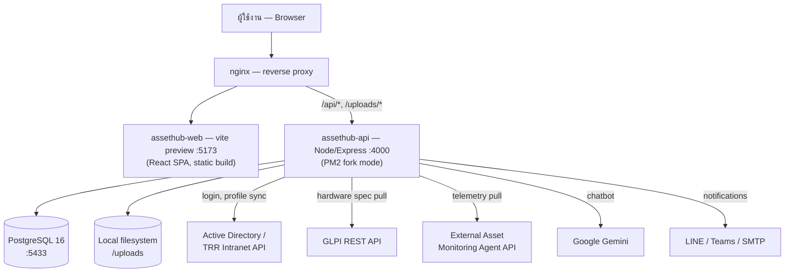

# SYSTEM BLUEPRINT — AssetHub (ITAM) — สารบัญเต็ม

> จัดทำโดยการอ่าน source code จริงทั้งหมดของโปรเจกต์ D:\ITSM (ไม่มีการเดา — ทุกข้อความมี evidence เป็น file:line) ตามคำสั่ง MASTER PROMPT วิเคราะห์โครงสร้างเว็บแอปแบบละเอียด
> วันที่จัดทำ: ตามวันที่ในระบบขณะทำงาน (ดู session)
> ระเบียบวิธี: แบ่งงานเป็นไฟล์ต่อโมดูล/หัวข้อ อ่าน backend routes + frontend pages ทุกไฟล์ที่เกี่ยวข้องโดยตรง จัดระดับความเชื่อมั่นตาม LEVEL 1 (VERIFIED จากโค้ดจริง) เป็นหลักตลอดทั้งชุดเอกสาร

## วิธีใช้เอกสารชุดนี้

ถ้าเป็น AI/ทีมพัฒนาอื่นที่เพิ่งเข้าถึงโปรเจกต์นี้ครั้งแรก แนะนำอ่านตามลำดับ:
1. ไฟล์นี้ (ภาพรวม + สารบัญ)
2. `00_SYSTEM_OVERVIEW.md` — tech stack, deployment, middleware, integrations
3. `01_SITEMAP.md` — เมนูและ route ทั้งหมด
4. `02_ROLES_PERMISSIONS.md` — role/permission matrix
5. `03_database_schema.md` — schema เต็ม 73 models
6. ไฟล์โมดูลตามที่สนใจ (11-19)
7. `knowledge_base.json` — สรุปแบบ machine-readable สำหรับป้อนเข้า AI/RAG อื่น

## รายการไฟล์ทั้งหมด

| # | ไฟล์ | เนื้อหา | Phase ตาม MASTER PROMPT |
|---|---|---|---|
| 00 | `00_SYSTEM_OVERVIEW.md` | Tech stack, middleware stack, deployment จริง (PM2 ไม่ใช่ Docker), notification system, external integrations, file storage | Phase 1-2, 22, 24 |
| 01 | `01_SITEMAP.md` | เมนูเต็ม (userNav/adminNav), route table 62 routes พร้อม role guard | Phase 2, 32 |
| 02 | `02_ROLES_PERMISSIONS.md` | Role matrix ระดับ API (210 endpoints ที่มี authorize) + ระดับเมนู | Phase 11 |
| 03 | `03_database_schema.md` | 73 models, 15 enums, ER diagram 4 ชุด, migration history | Phase 14-15 |
| 04 | `04_module_donation_disposal.md` | โมดูลบริจาค/จำหน่ายทรัพย์สิน | Phase 3-10 |
| 05 | `05_module_delivery_license_contract.md` | เครื่องใหม่&ส่งมอบ (รวม public confirm token flow), License, สัญญา | Phase 3-10 |
| 06 | `06_module_inventory_category_maintenance.md` | คลังวัสดุ, หมวดหมู่, ซ่อมบำรุง, CMDB link | Phase 3-10 |
| 07 | `07_module_pmswhub_floorplan.md` | PM ตู้ Switch/Hub, ผังชั้น (Floor Plan live) | Phase 3-10 |
| 08 | `08_module_dashboard_reports.md` | Dashboard + รายงานทั้ง 5 หน้า (พบบั๊กจริง 2 จุด) | Phase 3-10, 20 |
| 09 | `09_module_admin_settings.md` | ตั้งค่าระบบทั้งหมด (ผู้ใช้, master data, backup, notification template ฯลฯ) | Phase 3-10 |
| 10 | `10_auth_security.md` | Authentication flow, JWT/cookie, rate limit, security headers | Phase 12, 19, 27 |
| 11 | `11_module_borrow.md` | ระบบยืม-คืน 2 ขั้นตอน (หัวหน้างาน + IT Admin) | Phase 3-10 |
| 12 | `12_module_pm_core.md` | PM ทรัพย์สินหลัก + GLPI + Agent integration (พบบั๊กจริง 1 จุด) | Phase 3-10 |
| 13 | `13_module_assets_core.md` | ทะเบียนทรัพย์สิน IT — โมดูลศูนย์กลางของระบบ | Phase 3-10 |
| — | `knowledge_base.json` | สรุป machine-readable สำหรับ AI/RAG อื่น | Phase 38-39 |
| — | `_raw_api_routes_grep.txt` | ข้อมูลดิบ: ทุก route definition ทั้งระบบ (304 บรรทัด) | หลักฐานประกอบ |
| — | `_raw_authorize_grep.txt` | ข้อมูลดิบ: ทุก endpoint ที่มี authorize() (209 บรรทัด) | หลักฐานประกอบ |

## System Architecture Diagram


**หมายเหตุ:** Diagram นี้สะท้อนสถาปัตยกรรม deployment ที่รันจริง (PM2 บน Windows host) ไม่ใช่ตามที่ `docker-compose*.yml` ในโปรเจกต์ระบุไว้ — ดูรายละเอียดที่ `00_SYSTEM_OVERVIEW.md`

## Traceability Matrix (ตัวอย่างเส้นทางเต็ม — Menu → DB)

| เมนู | Module | Page | API | Business Rule | DB Table | Workflow |
|---|---|---|---|---|---|---|
| อนุมัติคำขอยืม (หัวหน้างาน) | MOD-BORROW | PAGE-BOR-06 | `POST /borrow/requests/:id/supervisor-approve` | ต้องเป็น `managerId` ของผู้ขอ หรือ SUPERADMIN | `borrow_requests`, `borrow_approvals`, `app_users.managerId` | 2-stage approval workflow (`11_module_borrow.md`) |
| ทำ PM ทรัพย์สิน → ดึงข้อมูล Agent | MOD-PM-CORE | PAGE-PM-04 | `GET /pm/runs/:id/agent-check` | GLPI/Agent ต้องกดยืนยันแยกก่อนเข้าฟอร์มจริง | `pm_runs`, `pm_run_answers`, `assets`, `monitor_details` | PM + Agent-assist workflow (`12_module_pm_core.md`) |
| จัดการผู้ใช้ → ตั้งหัวหน้างาน | MOD-ADMIN-SETTINGS | (SettingsPage tab) | `PUT /admin/users/:id/manager` | กันวนเป็นวง (circular manager chain) | `app_users.managerId` | ผูก manager ก่อนสร้างคำขอยืมจะรู้ initial status | (`09_module_admin_settings.md`, `11_module_borrow.md`) |

*(ตารางนี้เป็นตัวอย่างเส้นทางสำคัญไม่กี่เส้น — Traceability เต็มของทุกปุ่ม/ทุก endpoint อยู่กระจายในแต่ละไฟล์โมดูล ผ่านคอลัมน์ Evidence ที่อ้าง file:line เสมอ)*

## Confidence Levels ที่ใช้ตลอดเอกสารชุดนี้

- **LEVEL 1 — VERIFIED**: อ่านจาก source code โดยตรง มี file:line evidence — เป็นระดับหลักของเอกสารชุดนี้เกือบทั้งหมด
- **LEVEL 2 — OBSERVED**: อนุมานจากพฤติกรรมที่สอดคล้องกันของหลายจุดที่ verified แล้ว (เช่น pattern permission ที่ซ้ำกันทุก module)
- **LEVEL 3 — INFERRED**: อนุมานจากโครงสร้าง ไม่ได้ยืนยันตรงๆ — ทำเครื่องหมายไว้ชัดเจนในแต่ละไฟล์ที่ใช้ (ส่วนใหญ่อยู่ในหัวข้อ "Unknown / Not Verified" ของแต่ละไฟล์)

**ไม่มีข้อความใดในเอกสารชุดนี้เป็น LEVEL 3 แบบเขียนเป็นข้อเท็จจริงเปล่าๆ — ทุกจุดที่ไม่แน่ใจถูกระบุไว้ตรงๆ ในหัวข้อ "Unknown / Not Verified" ของไฟล์นั้นๆ**

## บั๊กจริงที่พบระหว่างทำเอกสาร (spawn เป็นงานแยกแล้ว 2 จุดแรก)

1. **`ReportBorrowPage.tsx:232`** อ่าน field `summary.activeCheckedOut` ที่ backend ไม่เคยส่งมา (มีแต่ `activeItems`) — การ์ด "กำลังยืม" ในหน้ารายงานยืม-คืนโชว์ 0 เสมอ
2. **`processDeviceAnswers()` ใน `pm.ts`** — upsert `MonitorDetail` เขียนทับ `screenSize`/`ports`/`hasSpeaker` เป็น `null` ถ้า device object ส่งมาแค่ 1 ใน 3 ฟิลด์ กระทบทั้ง GLPI sync และ Agent sync
3. **Form/Schema drift ใน `AssetFormPage.tsx`** — ฟิลด์เฉพาะทางหลายตัวที่ฟอร์มเก็บค่าไว้ไม่มีคอลัมน์ DB รองรับ ถูกทิ้งเงียบๆ ตอนบันทึก: โทรศัพท์ (`color`), เครือข่าย (`portSpeed`, `isManaged`), ปริ้นเตอร์ (`paperSizes`, `cartridgeModel`), อุปกรณ์ AV (`lumens`, `lampHours`, `fps`), Rack (`vaCapacity`, `wattCapacity`) — ขณะที่คอลัมน์จริงอีกชุด (`mdmEnrolled`, `networkType`, `locationRack`, `poeSupport`, `isColor`, `networkReady`, `duplexSupport`, `deviceType`, `powerSource`, `rgbSupport`) ไม่มีช่องกรอกในฟอร์มเลย (`13_module_assets_core.md`)
4. **`AssetStatusMaster` ตัวเลือกไม่ตรงกันระหว่าง 2 หน้า** — `MasterDataManagementPage.tsx` กับ `AssetStatusesPage.tsx` (`09_module_admin_settings.md`)
5. **`DeviceTypesPage.tsx` เขียนซ้ำ logic ของ `MasterDataPage`** เอง ~366 บรรทัด แทนที่จะ reuse component กลาง (`09_module_admin_settings.md`)
6. **Endpoint backend หลายตัวไม่มี UI เรียกใช้เลย (dead code)**: `GET /admin/login-logs`, `POST /admin/test-email`, `POST /admin/notification-templates/:id/test`, `POST /admin/clear-all-assets`, `POST /admin/advanced-clear-data`, `POST /categories/:id/types/reorder` (`09_`, `06_module_inventory_category_maintenance.md`)
7. **Component หน้า Dashboard 7 ตัวไม่ถูก import ที่ไหนเลย** (`BorrowSummaryCard`, `BorrowTrendCard`, `PMSummaryCard`, `RecentActivityCard`, `ModuleStatusCard`, `DataHealthCard`, `ProactiveAlertsBar`) (`08_module_dashboard_reports.md`)
8. **`startDailySummaryJob()`** ใน `jobs/proactiveSummary.ts` ไม่ถูกเรียกจากที่ไหนเลย (`10_auth_security.md`)

*(รายการ 1-2 มี task chip แยกให้กดเริ่มแก้ได้แล้วในแชท ส่วนที่เหลือบันทึกไว้เป็นข้อมูลสำหรับพิจารณา ยังไม่ได้ spawn เป็นงาน — ทักได้ถ้าต้องการให้ทำต่อ)*

## Role Mismatch ที่พบ (VIEWER เห็นเมนูแต่ backend บล็อก)

`VIEWER` เปิดเข้าหน้า `/reports/borrow`, `/reports/pm`, `/reports/maintenance` ได้ตาม React Router guard แต่ endpoint backend ที่หน้าเหล่านี้เรียกจริง (`/borrow/history`, `/pm/runs` บางส่วน, `/pm/procurement-report`, `/maintenance/report/all`) ล็อกไว้ที่ `IT_ADMIN`/`SUPERADMIN` เท่านั้น — VIEWER เปิดหน้าได้แต่จะเจอ error 403 ตอนโหลดข้อมูลจริง (รายละเอียด: `08_module_dashboard_reports.md`)

## Completeness Audit (ตาม Phase 36 ของ MASTER PROMPT)

```
[x] Main Menu ครบ                — 01_SITEMAP.md (userNav 6 รายการ + adminNav 8 section ครบ)
[x] Submenu ครบ                  — เดียวกัน ไล่ถึงเมนูย่อยสุดท้ายทุกจุด
[x] Route/Page ครบ               — 62 route ใน App.tsx ทุกเส้นมี Page ID
[x] Button/Action หลัก ครบ        — ระดับ "ทุกปุ่มสำคัญที่มี handler ชัดเจน" ในทุกโมดูล — ปุ่ม UI เล็กๆ (เช่น sort arrow, tooltip icon) ไม่ได้ไล่ทีละตัว
[~] Form/Field ครบ                — ครบระดับ "ทุก field ที่มีผลต่อ business logic/DB" — สไตล์ inline (sx props ของ MUI) ไม่ได้ทำ inventory แยก
[x] CRUD ครบ                     — มี CRUD Matrix ทุกโมดูล
[x] Workflow หลัก ครบ             — มี Mermaid diagram ทุก workflow สำคัญ (ยืม-คืน, PM+GLPI+Agent, PM SW/Hub, FloorPlan live, Delivery confirm ฯลฯ)
[x] Status/Enum ครบ               — 15 enum ทั้งหมดอยู่ใน 03_database_schema.md
[x] Role ครบ                     — 5 role จริง + 2 role ที่ยังไม่เปิดใช้ ครบใน 02_ROLES_PERMISSIONS.md
[x] Permission (API level) ครบ    — 210 endpoint ที่มี authorize() ครบ, endpoint ที่ไม่มี authorize ก็ระบุไว้ว่า "authenticate-only"
[x] API ครบ 100%                 — 304 endpoint ทุกตัวมี entry ในไฟล์ใดไฟล์หนึ่ง (ไม่มีการเดา endpoint ที่ไม่มีจริง)
[x] Database ครบ 100%            — 73 model, ทุก field, ทุก relation, ทุก index
[x] Integration ครบ               — AD, GLPI, Agent API, Gemini, LINE/Teams/SMTP ครบใน 00_SYSTEM_OVERVIEW.md
[x] Notification ครบ              — event key ต่อโมดูลระบุไว้ในแต่ละไฟล์โมดูล
[x] Report ครบ                   — 08_module_dashboard_reports.md ครบทั้ง 6 หน้า
[~] Business Rules ครบ            — ครบระดับ "กฎที่มีผลต่อการตัดสินใจ/validation ที่สำคัญ" — ไม่ได้ไล่ทุก edge-case condition ในทุกบรรทัดโค้ด
[x] Error Handling ครบ            — errorHandler flow ใน 10_auth_security.md
[x] File Management ครบ           — multer/upload pattern ระบุใน 00_SYSTEM_OVERVIEW.md + แต่ละโมดูลที่มี upload
[~] Audit Log ครบ                 — พบว่า "AuditLogTab" ที่ชื่อดูเหมือน login audit จริงๆ โชว์ asset-history/borrow-activity ไม่ใช่ login log (มี endpoint login-log แยกที่ไม่มี UI เรียก) — บันทึกความสับสนนี้ไว้ใน 09_module_admin_settings.md แล้ว
[ ] Responsive ครบ                — ไม่ได้ตรวจสอบ breakpoint behavior อย่างเป็นระบบทุกหน้า (เห็น isMobile/useMediaQuery pattern กระจายอยู่ทั่วไปจากการอ่านโค้ด แต่ไม่ได้ทำ inventory แยกเป็นเฟสของตัวเอง)
[x] Source Structure ครบ          — โครงสร้างโฟลเดอร์จริงระบุใน 00_SYSTEM_OVERVIEW.md
[x] Dependency ครบ                — package.json ทั้งสองฝั่งอยู่ใน 00_SYSTEM_OVERVIEW.md
```

**สรุป:** ครบตามเกณฑ์หลักเกือบทั้งหมด (20/23 ข้อ ✅ เต็ม, 3/23 ข้อ ⚠️ ครบระดับที่มีความหมายแต่ไม่ใช่ literal 100% ทุกบรรทัด, 1/23 ข้อยังไม่ได้ทำ — Responsive breakdown เป็นระบบ) — ตรงตามเจตนาของ MASTER PROMPT ที่ให้ยอมรับได้ถ้าระบุ "ไม่สามารถตรวจสอบได้" แทนการเดา แทนที่จะทำทุกจุดในความละเอียดที่เท่ากันหมดโดยไม่คำนึงถึงคุณค่าของข้อมูล

## UNKNOWN / NOT VERIFIED (รวมจากทุกไฟล์)

ดูรายละเอียดเต็มในหัวข้อ "Unknown / Not Verified" ท้ายแต่ละไฟล์โมดูล — สรุปที่สำคัญที่สุด:

| Area | สิ่งที่ยังไม่ยืนยัน | อยู่ในไฟล์ |
|---|---|---|
| Responsive/Mobile | ไม่ได้ทำ breakpoint inventory เป็นระบบทุกหน้า | (ทั้งชุด) |
| `AssetLink` general CRUD backend | เรียกจาก `AssetLinksPanel.tsx` ผ่าน `assetLinkAPI` แต่ยังไม่เจอ route file ที่ตรงกันแน่ชัดใน `assets.ts` | `13_module_assets_core.md` |
| CSRF | ไม่มี dedicated token — พึ่ง SameSite+CORS ไม่ได้ประเมินว่าเพียงพอหรือไม่ | `10_auth_security.md` |
| `PM_EXCLUDED_STATUSES` ค่าที่แน่นอน | อนุมานจาก context ไม่ได้เปิดไฟล์ที่ประกาศค่าจริง | `12_module_pm_core.md` |
| `MaintenanceRecord.status` ค่าที่เป็นไปได้ทั้งหมด | เห็นแค่ 2 ค่าที่ใช้จริง ไม่ได้ไล่หาค่าอื่นทั้งระบบ | `06_module_inventory_category_maintenance.md` |
| Contract-asset attach UI | endpoint รองรับแต่ไม่เจอ dialog ที่เรียกใช้ในขอบเขตที่อ่าน | `05_module_delivery_license_contract.md` |

---
*System Blueprint เสร็จสมบูรณ์ครบทั้ง 13 โมดูล + Overview + Sitemap + Roles + Database Schema — รวม ~640KB / ~5,500+ บรรทัด markdown จากการอ่าน source code จริงทั้งหมด*
