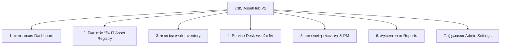
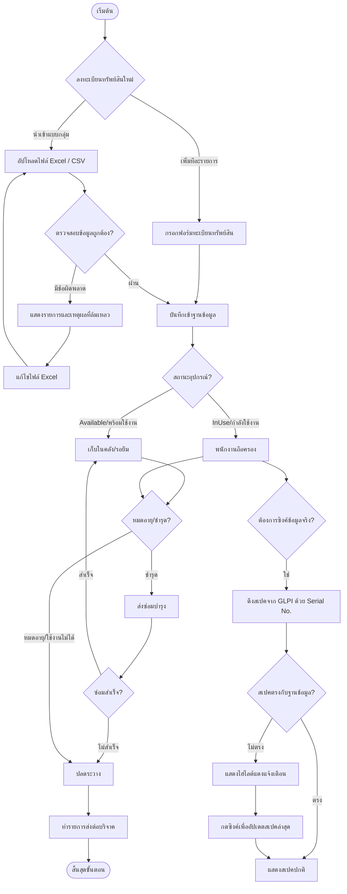
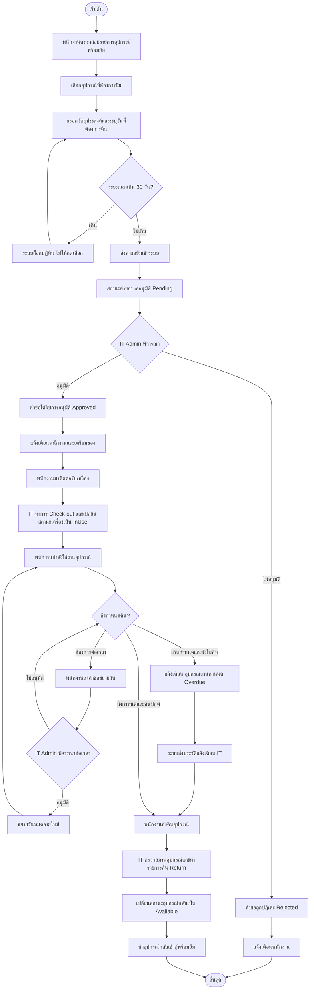
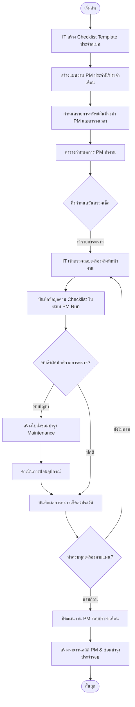
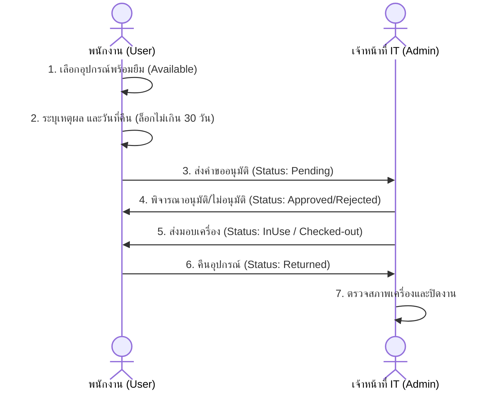

# รายงานขั้นตอนการทำงานและประวัติระบบ AssetHub V2 📋

**วันที่จัดทำรายงาน:** 22 มิถุนายน 2026  
**ผู้จัดทำ:** Antigravity AI Assistant  
**วัตถุประสงค์:** บันทึกโครงสร้างเมนู ขั้นตอนการทำงาน (Workflows) และสิทธิ์การใช้งานของทุกฟังก์ชันในระบบ AssetHub V2 เพื่อเก็บเป็นประวัติการพัฒนาและเอกสารคู่มือระบบ

---

## 🔍 ประวัติเอกสารคู่มือระบบในอดีต (ตรวจพบในระบบ)
จากการตรวจสอบในระบบ พบเอกสารประวัติและคู่มือเดิมดังนี้:
1. **[docs/user-manual.md](file:///d:/ITSM/docs/user-manual.md)**: คู่มือการเข้าสู่ระบบผ่านระบบ Active Directory (AD) และการจัดการผู้ใช้สำหรับผู้ใช้ภายนอก (Local User)
2. **[ASSET_DETAIL_PAGE_REVIEW.md](file:///d:/ITSM/ASSET_DETAIL_PAGE_REVIEW.md)**: รายงานการตรวจสอบโครงสร้างและโค้ดของหน้ารายละเอียดทรัพย์สิน (บันทึกเมื่อ 2 มิถุนายน 2026)
3. **[walkthrough.md](file:///C:/Users/VM-Watchara.kid/.gemini/antigravity/brain/d13dbac7-90d4-4e52-8a10-c478a064d55b/walkthrough.md)**: สรุปผลการอัปเดตระบบ Timeline Tracker และ Smart Date Picker ในระบบยืม-คืน

*รายงานฉบับนี้จะเป็นเอกสารฉบับรวมที่อธิบายครบทุกหน้าจอ ทุกเมนู และขั้นตอนการทำงาน (End-to-End Workflow) ของระบบทั้งหมด*

---

## 📂 โครงสร้างเมนูหลักของระบบ (System Menu Navigation)

ระบบแบ่งส่วนการแสดงผลตามระดับสิทธิ์ของผู้ใช้งาน โดยหลักการทำงานประกอบด้วย 7 หมวดหมู่หลักใน Sidebar:

---

## 📊 Flowcharts ขั้นตอนการทำงานของระบบ

### 1. วงจรการจัดการทะเบียนทรัพย์สิน IT (Asset Registry & Lifecycle)

### 2. ขั้นตอนการยืม-คืนอุปกรณ์ (Borrow-Return Lifecycle)

### 3. ขั้นตอนการตรวจซ่อมบำรุงรักษาและ PM (Preventive Maintenance)

---

## 🛠️ รายละเอียดและขั้นตอนการทำงานรายเมนู (Menu Walkthrough)

### 1. ภาพรวมระบบ (Dashboard)
*   **เส้นทาง (Path):** `/dashboard`
*   **ผู้มีสิทธิ์ใช้งาน:** IT Admin, SuperAdmin
*   **ฟังก์ชันการทำงาน:**
    *   แสดงการ์ดสรุปจำนวนทรัพย์สินแยกตามสถานะ: *พร้อมใช้งาน (Available), กำลังใช้งาน (InUse), กำลังยืม (Borrowed), ส่งซ่อม (Maintenance), ปลดระวาง (Retired), สูญหาย (Lost)*
    *   แผนภูมิรูปวงกลม (Pie Chart) แสดงสัดส่วนอุปกรณ์แยกตามหมวดหมู่
    *   รายการทรัพย์สินที่ได้รับการอัปเดตสเปคผ่านระบบ GLPI ล่าสุด
    *   รายการครุภัณฑ์หมดประกันและใกล้หมดประกัน (ในระยะ 30/60/90 วัน)
    *   **ขั้นตอนระบบ:** ดึงข้อมูลแบบเรียลไทม์จากฐานข้อมูลเพื่อสรุปและคำนวณกราฟเปรียบเทียบในแต่ละเดือน

---

### 2. ทะเบียนทรัพย์สิน IT (Asset Registry)
*   **เส้นทาง (Path):** `/assets`
*   **ผู้มีสิทธิ์ใช้งาน:** IT Admin, SuperAdmin (พนักงานทั่วไปจะเห็นเฉพาะอุปกรณ์ที่ "พร้อมยืม")
*   **ฟังก์ชันย่อยในเมนู:**
    *   *ทะเบียนทั้งหมด:* ค้นหา กรองข้อมูล และทำรายการเพิ่ม/แก้ไขทรัพย์สิน
    *   *คอมพิวเตอร์ / จอภาพ / เครื่องพิมพ์ / อุปกรณ์เครือข่าย / อุปกรณ์สื่อสาร / อุปกรณ์ต่อพ่วง / Rack & Infra:* กรองข้อมูลแยกตามประเภทอุปกรณ์โดยอัตโนมัติ เพื่อการตรวจเช็คที่รวดเร็ว
    *   *รายการบริจาค:* ทะเบียนทรัพย์สินที่มีสถานะส่งต่อบริจาคแก่องค์กรอื่น
*   **ขั้นตอนการทำงานหลัก (Workflow):**
    1.  **การเพิ่มทรัพย์สินใหม่ (Create):** ผู้ดูแลระบบกรอกข้อมูลทั่วไป (รหัสครุภัณฑ์, Serial No, ยี่ห้อ, รุ่น, วันจัดซื้อ, แผนกผู้ถือครอง) และข้อมูลฮาร์ดแวร์จำเพาะ จากนั้นระบบจะสร้างประวัติการสร้างอุปกรณ์โดยอัตโนมัติในตารางประวัติ (Asset History)
    2.  **การดึงข้อมูลสเปคจริงจากระบบ GLPI (GLPI Spec Sync):**
        *   ในหน้ารายละเอียดทรัพย์สิน หากเป็นเครื่องคอมพิวเตอร์ ระบบจะตรวจสอบสเปคจริงจากระบบ GLPI ผ่าน Serial No.
        *   ระบบจะนำสเปคในฐานข้อมูลมาเปรียบเทียบกับข้อมูลปัจจุบันจากระบบ GLPI (เช่น CPU, RAM, Storage, OS, Antivirus) และทำสีไฮไลต์แดง-เขียวหากข้อมูลไม่ตรงกัน
        *   **การกดซิงค์ (Sync):** ผู้ดูแลสามารถกดบันทึกเพื่อดึงสเปคล่าสุดจาก GLPI มาอัปเดตลงทะเบียนระบบ AssetHub ได้ทันทีด้วยการคลิกเพียงครั้งเดียว
    3.  **การดูประวัติการเปลี่ยนแปลง (Asset History):** ระบบบันทึกประวัติการเปลี่ยนตัวผู้ถือครอง (Owner), การย้ายที่ตั้ง (Location), และการเปลี่ยนสถานะ (Status) ทุกครั้งโดยระบุชื่อผู้ดำเนินการและเวลาอย่างละเอียด

---

### 3. ระบบจัดการคลัง (Inventory Management)
*   **เส้นทาง (Path):** `/inventory`
*   **ผู้มีสิทธิ์ใช้งาน:** IT Admin, SuperAdmin
*   **ฟังก์ชันการทำงาน:**
    *   จัดการและนับสต๊อกอุปกรณ์ที่เป็นวัสดุสิ้นเปลือง เช่น *สายสัญญาณ (Cables), วัสดุสิ้นเปลืองอื่นๆ (Consumables)*
    *   แจ้งเตือนสถานะสินค้าต่ำกว่าเกณฑ์ความปลอดภัย (Minimum Stock Alert)
*   **ขั้นตอนระบบ:** เมื่อมีการนำเข้าอุปกรณ์ใหม่หรือเบิกจ่ายไปใช้งาน ระบบจะคำนวณจำนวนคงเหลือ และหากต่ำกว่าเกณฑ์ขั้นต่ำจะขึ้นแจ้งเตือนสีแดงในระบบทันที

---

### 4. ระบบยืม-คืน (Borrow & Return System)
*   **เส้นทาง (Path):** ทุกระดับสิทธิ์การใช้งาน (หน้าการแสดงผลต่างกันระหว่าง User และ Admin)
*   **ขั้นตอนการทำรายการอย่างละเอียด (Workflow):**

*   **ฟังก์ชันเด่นในระบบยืม-คืน:**
    *   **Smart Date Picker (ระบบล็อกวันที่อัจฉริยะ):** ในหน้าสร้างคำขอยืม ระบบจำกัดขอบเขตวันที่ยืมสูงสุดไม่เกิน 30 วันโดยอัตโนมัติ เพื่อลดความเสี่ยงจากการพิมพ์วันที่ผิดพลาดและการยืมค้างไว้เกินกำหนดโดยไม่มีความจำเป็น
    *   **Timeline Status Tracker:** ระบบแสดงสถานะการยืมในมุมมองแบบแถบสถานะ (Timeline Step Bar) เหมือนแอปพลิเคชันส่งสินค้า เพื่อให้ผู้ใช้งานติดตามว่าคำขอยืมของตนอยู่ในขั้นตอนใด (ขออนุมัติ -> อนุมัติ -> รับของ -> คืนแล้ว)
    *   **ระบบคำนวณการยืมเกินกำหนด (Overdue Alert):** หากอุปกรณ์ไม่ได้รับการคืนตามกำหนด ระบบจะแจ้งเตือนพร้อมสัญลักษณ์แจ้งเตือนที่แถบเมนู และส่ง Notification ไปยัง IT Admin โดยตรง

---

### 5. งานซ่อมบำรุง & PM (Maintenance & Preventative Maintenance)
*   **เส้นทาง (Path):** `/pm` และ `/pm/sw-hub`
*   **ผู้มีสิทธิ์ใช้งาน:** IT Admin, SuperAdmin
*   **ฟังก์ชันการทำงาน:**
    1.  **PM ทรัพย์สิน IT:**
        *   สร้างแผนงาน PM รายปี/รายเดือน และกำหนดตารางนัดหมายผู้ใช้งานคอมพิวเตอร์
        *   สร้าง Checklist Template สำหรับใช้ตรวจเช็คเครื่อง (เช่น ตรวจสอบความร้อน, ความจุไดร์ฟ, ความปลอดภัยไวรัส)
        *   **การรัน PM (PM Run):** เจ้าหน้าที่สามารถทำรายการผ่านมือถือหรือคอมพิวเตอร์ในขณะตรวจเช็คเครื่องจริง บันทึกผล และสร้างประวัติประเมิน
    2.  **PM SW/Hub Room (ตู้กระจายสัญญาณ):**
        *   บันทึกการตรวจเช็คสภาพห้องเซิร์ฟเวอร์และอุปกรณ์ Hub Switch ในตู้แร็ค
        *   มี Template และระบบบันทึกความร้อน/ความชื้นภายในห้องประวัติ

---

### 6. รายงานระบบ (Reports)
*   **เส้นทาง (Path):** `/reports/...`
*   **ผู้มีสิทธิ์ใช้งาน:** IT Admin, SuperAdmin
*   **รายละเอียดตัวรายงาน:**
    *   *รายงานทรัพย์สิน:* สรุปจำนวนการครอบครอง อัตราค่าเสื่อมราคาและอายุการใช้งานเฉลี่ย
    *   *รายงานยืม-คืน:* สรุปความถี่ของอุปกรณ์ที่ถูกยืมบ่อย พนักงานที่ยืมบ่อย และอุปกรณ์ที่ค้างส่ง
    *   *รายงาน PM / รายงานซ่อมบำรุง:* อัตราผลสำเร็จการซ่อมบำรุงอุปกรณ์ประจำเดือน

---

### 7. ตั้งค่าผู้ดูแลระบบ (Admin Settings)
*   **เส้นทาง (Path):** `/assets/import-export`, `/assets/print-qr`, `/admin/...`
*   **ผู้มีสิทธิ์ใช้งาน:** IT Admin, SuperAdmin
*   **เครื่องมือหลักและขั้นตอนการทำงาน:**
    1.  **เครื่องมือ นำเข้า/ส่งออก ข้อมูล (Import / Export):**
        *   *ส่งออก:* โหลดข้อมูลทรัพย์สิน IT ทั้งหมดออกจากระบบ แยกแผ่นงาน (Sheet) ตามประเภททรัพย์สินสำหรับนำไปทำรายงาน
        *   *ดาวน์โหลดเทมเพลต:* ดาวน์โหลดไฟล์ Excel โครงสร้างมาตรฐานที่มีข้อมูลตัวอย่างเพื่อให้เตรียมไฟล์นำเข้าได้ง่าย
        *   *นำเข้า (Upsert):* รองรับการนำเข้าไฟล์ Excel และ CSV พร้อมกันเป็นกลุ่มใหญ่ (Bulk) ข้อมูลจะผ่านการตรวจสอบสิทธิ์และวิเคราะห์รูปแบบก่อนบันทึกจริง แถวที่ผ่านจะถูกบันทึก ส่วนแถวที่ล้มเหลวจะถูกแสดงรายการระบุแถวและเหตุผลชัดเจนในหน้าต่าง Dialog
    2.  **พิมพ์ QR สติ๊กเกอร์ (Print QR Sticker):**
        *   เครื่องมือสร้างสติ๊กเกอร์บาร์โค้ดและ QR Code ของอุปกรณ์ครุภัณฑ์
        *   สามารถพิมพ์สติ๊กเกอร์ขนาดสำหรับแปะที่ตัวเครื่องคอมพิวเตอร์ เพื่อให้เจ้าหน้าที่ใช้มือถือสแกนคิวอาร์โค้ดและดูประวัติ รายละเอียดสเปคเครื่อง หรือกดยืมเครื่องได้ทันทีที่หน้างาน
    3.  **จัดการ Master Data:** จัดการข้อมูลแผนก, บริษัทในเครือ, และข้อมูลสถานที่ตั้งของตึก/ห้อง
    4.  **ตั้งค่าผู้ใช้ระบบ (Users):**
        *   ดึงและซิงค์ข้อมูลผู้ใช้จาก Windows Active Directory
        *   กรณีเป็นพนักงานไม่มี AD สามารถสร้าง Local Account และกำหนดรหัสผ่านโดยตรงในระบบได้
    5.  **ระบบสำรองข้อมูล (Backup / Restore):**
        *   ปุ่มสั่งการ Dump ฐานข้อมูล PostgreSQL ออกมาเก็บไว้เป็นไฟล์ `.sql` โดยอัตโนมัติ เพื่อความปลอดภัยในการกู้คืนระบบหากฮาร์ดแวร์เสียหาย
    6.  **ระบบ Logs (Audit Logs):**
        *   ประวัติการเข้าทำงานของผู้ใช้ทุกคน (ใครทำอะไร เมนูไหน เวลาใด) เพื่อใช้ตรวจสอบย้อนหลังกรณีเกิดปัญหาด้านความปลอดภัย

---

## 📊 ตารางสรุปสิทธิ์การเข้าถึงเมนู

| รายชื่อเมนู | พนักงานทั่วไป (User) | เจ้าหน้าที่ IT (IT_ADMIN) | ผู้ดูแลระบบสูงสุด (SUPERADMIN) |
|---|:---:|:---:|:---:|
| **Dashboard** | ❌ | ✅ | ✅ |
| **รายการของพร้อมยืม** | ✅ (ดูได้เฉพาะสถานะ Available) | ✅ (ดู/จัดการทั้งหมด) | ✅ (ดู/จัดการทั้งหมด) |
| **ขอยืมอุปกรณ์ / คำขอของฉัน** | ✅ | ✅ | ✅ |
| **อนุมัติยืม-คืน / ส่งมอบ** | ❌ | ✅ | ✅ |
| **การจัดทำแผน & ตรวจ PM** | ❌ | ✅ | ✅ |
| **รายงานสถิติระบบ** | ❌ | ✅ | ✅ |
| **นำเข้า/ส่งออก ข้อมูล** | ❌ | ✅ | ✅ |
| **จัดพิมพ์ QR Code** | ❌ | ✅ | ✅ |
| **จัดการ Master Data** | ❌ | ✅ | ✅ |
| **จัดการผู้ใช้ / ตั้งค่าระบบ** | ❌ | ❌ | ✅ |
| **สั่ง Backup/Restore** | ❌ | ✅ | ✅ |
| **ตรวจสอบ Audit Logs** | ❌ | ✅ | ✅ |
